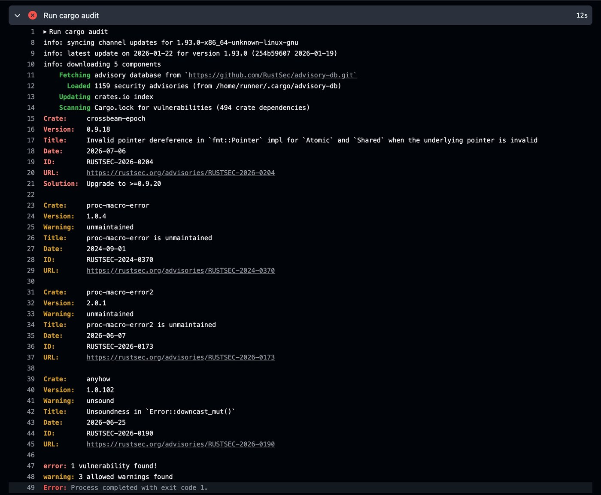

+++
title = "Hardening Rust Code For Production" 
date = 2026-07-21
draft = false
template = "article.html"
[extra]
series = "Idiomatic Rust"
resources = [
   "[Patterns for Defensive Programming in Rust](/blog/defensive-programming) -- enforcing invariants that Rust cannot check for you",
   "[Pitfalls of Safe Rust](/blog/pitfalls-of-safe-rust) -- common mistakes even safe Rust programmers make",
]
+++

We talked about [patterns for defensive programming in Rust](/blog/defensive-programming) before, in which implicit invariants that aren't enforced by the compiler lead to utter misery.
But being careful isn't enough!
Even valid code can fail at runtime in ways that are hard to predict and control.
That's what we're covering next.



- make your code resilient at runtime
- harden your Rust code for production 
- know how Rust code can fail in unexpected ways and how to recover from that



## Table of Contents

<details class="toc">
<summary>
Click here to expand the table of contents.
</summary>

- [Panic Semantics Are Part of Your API](#panic-semantics-are-part-of-your-api)
  - [Unwind vs. Abort](#unwind-vs-abort)
  - [Thread-Level vs. Process-Level Failures](#thread-level-vs-process-level-failures)
- [Observing Failures With Panic Hooks](#observing-failures-with-panic-hooks)
  - [Example Panic Hooks](#example-panic-hooks)
  - [Sanitizing Sensitive Data](#sanitizing-sensitive-data)
  - [Cleanup Operations](#cleanup-operations)
  - [Limitations](#limitations)
- [Stack Overflows And Runtime Behavior](#stack-overflows-and-runtime-behavior)
- [Release and Debug Builds Are Two Different Programs](#release-and-debug-builds-are-two-different-programs)
  - [Testing Release Behavior](#testing-release-behavior)
- [Supply-Chain Security](#supply-chain-security)
- [Secure Allocations With mimalloc](#secure-allocations-with-mimalloc)
- [Limit Your Runtime Attack Surface](#limit-your-runtime-attack-surface)
  - [Minimal Docker Images](#minimal-docker-images)
  - [Filesystem Sandboxing With Landlock](#filesystem-sandboxing-with-landlock)
  - [Drop Privileges and Capabilities](#drop-privileges-and-capabilities)
- [Miri: Detect Unsafe Code Issues](#miri-detect-unsafe-code-issues) 
- [Graceful Shutdown Handling](#graceful-shutdown-handling)
- [Circuit Breakers for External Dependencies](#circuit-breakers-for-external-dependencies)
- [Resource Limits](#resource-limits)
  - [Request Body Size Limits](#request-body-size-limits)
  - [Limit Queue Depth](#limit-queue-depth)
  - [Set Timeouts on Everything External](#set-timeouts-on-everything-external)
- [Health Checks and Self-Healing](#health-checks-and-self-healing)
- [Runtime Hardening Tooling](#runtime-hardening-tooling)

</details>

## Panic Semantics Are Part of Your API

What happens when a Rust program panics?
There is no single correct answer because `panic!` is not a "single behavior."

### Unwind vs. Abort

For starters, there's a difference between unwind and abort.

[`catch_unwind`](https://doc.rust-lang.org/std/panic/fn.catch_unwind.html) invokes a closure, which captures the cause of an unwinding panic.

```rust
let result = panic::catch_unwind(|| {
    panic!("oh no!");
});
```

But the [Rustonomicon](https://doc.rust-lang.org/nomicon/unwinding.html) has the following to say about unwinding panics:

> We would encourage you to only **do this sparingly**. In particular, Rust's current unwinding implementation is heavily optimized for the "doesn't unwind" case. If a program doesn't unwind, there should be no runtime cost for the program being ready to unwind.

The alternative to unwinding is aborting the entire process. That does what it says on the tin: the program immediately terminates without unwinding the stack or running destructors.
Halt and catch fire.
Weirdly enough, that's often the safer choice, especially when dealing with FFI boundaries or performance-critical code.
That's because unwinding across FFI boundaries is undefined behavior, and unwinding can be expensive in performance-sensitive code.

To enable aborting on panic, add the following to your `Cargo.toml`:

```toml
[profile.release]
panic = "abort"
```

And **even if** you did not explicitly configure this, catastrophic panics like stack overflows and out-of-memory errors **always abort the process**. That's because unwinding in these situations is unsafe and can lead to undefined behavior.

In practice, this shows up in two places:

- Panics that would unwind across an extern "C" boundary are defined to abort instead of unwinding, because [letting unwinding cross that boundary is undefined behavior](https://doc.rust-lang.org/nomicon/ffi.html#panic-can-be-stopped-at-an-abi-boundary).
- And if a `malloc` fails, [it aborts the process](https://news.ycombinator.com/item?id=11369457). If that's a problem, you need to proactively check for allocation sizes before allocating or avoid heap allocations altogether.

These failures are fundamentally different from ordinary panics in that they cannot be caught or recovered from.
To handle them gracefully, you need to know exactly how and where your program will run, and design accordingly.
For example, in the case of `malloc`, avoid unbounded user input that could lead to excessive allocations.

### Thread-Level vs. Process-Level Failures

Another difference is between thread-level failures and process-level crashes.

A common misunderstanding is that `panic` terminates the entire program, but in a multi-threaded application, that is not necessarily the case.
For example, a background worker thread can panic while the main thread continues running.
What sounds like a benefit can leave the system in a partially degraded state. 

This distinction becomes especially important in long-running systems (servers, workers, async runtimes,...).
A panic in a request-handling thread might only abort that one request, while the rest of the service remains available.
Here's a small example using scoped threads ([Playground](https://play.rust-lang.org/?version=stable&mode=debug&edition=2024&gist=309325417605cdb3cdd42e1b3e1a618d)):

```rust
use std::{thread, time::Duration};

fn handle_request(id: u32) {
    println!("request {id}: started");

    if id == 2 {
        panic!("request {id}: handler panicked");
    }

    thread::sleep(Duration::from_millis(100));
    println!("request {id}: finished");
}

fn main() {
    thread::scope(|s| {
        let requests: Vec<_> = (1..=3)
            .map(|id| (id, s.spawn(move || handle_request(id))))
            .collect();

        for (id, request) in requests {
            match request.join() {
                Ok(()) => println!("main: request {id} completed"),
                Err(_) => println!("main: request {id} failed, but the process is still alive"),
            }
        }
    });

    println!("main: service keeps running");
}
```

The interesting part of the output is this:

```text
request 1: finished
main: request 1 completed
main: request 2 failed, but the process is still alive
request 3: finished
main: request 3 completed
main: service keeps running
```

Request 2 panics, but requests 1 and 3 still finish. The panic belongs to the worker thread. The main thread gets notified on `join()` but keeps running. [^unwinding]

[^unwinding]: This only holds for unwinding panics. If you compile with `panic = "abort"`, or hit a stack overflow or out-of-memory failure, the whole process exits and `join()` never gets a chance to return `Err`.

Whether this is acceptable depends on the system's invariants.
If a panic indicates a violated assumption confined to a small scope, like a single request, letting the process continue may be reasonable.
But if it signals a global invariant violation, continuing execution can be outright dangerous.

Panic behavior is **part of your system's failure model**.
Treating all panics as equivalent hides important distinctions and leads to fragile assumptions.
Be explicit about whether a failure may take down a single task, a single thread, or the entire process. 

Never panic in an uncontrolled manner.

## Observing Failures With Panic Hooks

Now that you understand how panics work, let's talk about operational hardening.

When things go wrong, you want to know about it.
But by default, Rust panics just print to `stderr` and disappear into the void.
In production systems, that's not so great. 

You might prefer crash reporting, and/or centralized failure handling, and that's where panic hooks come in.
A panic hook is a function that gets called whenever a panic occurs, giving you a chance to record the failure before the program terminates or unwinds.
It will not make an invalid state safe again. Its job is to capture enough context to debug the failure, alert someone, and shut down cleanly when possible.

### Example Panic Hooks

Here's a simple example of setting a panic hook:

```rust
use std::panic;

fn main() {
    panic::set_hook(Box::new(|panic_info| {
        eprintln!("Panic occurred: {panic_info}");
        // Log to your monitoring system
        // Send crash reports
        // Clean up resources
    }));

    panic!("Something went wrong!");
}
```

And here's a panic hook that sends structured JSON data to a crash reporting service:

```rust
panic::set_hook(Box::new(|panic_info| {
    let panic_data = serde_json::json!({
        "message": panic_info.to_string(),
        "location": panic_info.location().map(|l| format!("{}:{}:{}", l.file(), l.line(), l.column())),
        "timestamp": chrono::Utc::now().to_rfc3339(),
        "version": env!("CARGO_PKG_VERSION"),
    });

    // Send to your crash reporting service
    crash_reporter::report(panic_data);
}));
```



The [`PanicInfo`](https://doc.rust-lang.org/core/panic/struct.PanicInfo.html) struct contains the panic message (via `.payload()`) and the source location where the panic occurred (via `.location()`). Be aware that both can leak sensitive information: file paths may reveal internal directory structure, and panic messages might contain interpolated user data.



And finally, here's [Sentry's panic hook handler](https://github.com/getsentry/sentry-rust/blob/625617015f2b64fabdf8264186911ca43873bb80/sentry-panic/src/lib.rs#L69-L77), which is even more sophisticated:

```rust
fn setup(&self, _cfg: &mut ClientOptions) {
    INIT.call_once(|| {
        let next = panic::take_hook();
        panic::set_hook(Box::new(move |info| {
            panic_handler(info);
            next(info);
        }));
    });
}
```

Sentry's panic hook:
- Logs the panic information 
- Preserves the previous panic hook behavior by calling `next(info)`
- Ensures the hook is only set once using `INIT.call_once`

There's a lot to learn from these few lines of code!

### Sanitizing Sensitive Data

Panic hooks are also your final opportunity to prevent information leaks.
The sensitive data can come from two places: the panic payload and the panic location. The payload is whatever your code passed to `panic!`, `unwrap`, `expect`, or an assertion. That means it can contain interpolated user input, internal state from `Debug` output, request headers, tokens, email addresses, IP addresses, customer IDs, or other identifiers. The location can expose source file paths, workspace names, or CI/build machine directory layouts.

A well-designed panic hook sanitizes these messages before they reach logs or crash reports. Better yet, avoid putting secrets or raw user data into panic messages in the first place. Prefer stable error codes, request IDs, or redacted domain types. Regexes can catch obvious patterns like email addresses and bearer tokens. UUIDs and IP addresses can also identify users. Treat those checks as your final fallback.

```rust
panic::set_hook(Box::new(|panic_info| {
    let sanitized_message = sanitize_panic_message(panic_info.to_string());
    log::error!("Application panic: {sanitized_message}");
}));
```

You can look into crates like [expunge](https://crates.io/crates/expunge) or [veil](https://github.com/primait/veil) to automatically redact sensitive information from structs:

```rust
use veil::Redact;

#[derive(Redact)]
pub struct Customer {
    id: u64,

    #[redact(partial)]
    first_name: String,

    #[redact(partial)]
    last_name: String,

    #[redact]
    email: Option<String>,

    #[redact(fixed = 2)]
    age: u32,

    #[redact(with = "[REDACTED]")]
    address: String,
}
```


### Cleanup Operations

Before the process terminates, you might want to flush logs, close network connections, or notify other systems that this instance is going down. 
Setting a hook is a great way to perform such cleanup operations.



Be careful: one of the subsystems you want to interact with might be the *cause* of the panic you're handling! For example, if your database connection pool panicked, trying to flush pending writes to that same pool will likely fail or hang. Keep cleanup operations fault-tolerant and avoid anything that can panic, block indefinitely, or depend on the subsystem that just failed.



### Limitations

Panic hooks only run for unwinding panics.
If your program aborts on panic, or if the panic is caused by a stack overflow or out-of-memory condition, your hook won't execute.

Never rely on panic hooks for correctness.

They're purely for observability and graceful degradation; don't try to recover from logic errors as it is very hard to rely on a system's fragile underpinnings at this stage. 

## Stack Overflows And Runtime Behavior

Okay, you handle errors gracefully and you know how your system behaves on panic.
Panic behavior isn't the only runtime failure mode you need to worry about.

Here's some simple recursive code.
What is wrong with it?

```rust
fn factorial(n: u64) -> u64 {
    if n == 0 {
        1
    } else {
        n * factorial(n - 1)
    }
}
```

The problem is that recursion can quickly exhaust stack space.

If you allow users to call this function with large inputs, it might crash your program.
[Rust does not guarantee tail-call optimization on stable Rust](https://weitzel.dev/blog/rustlang-trampoline/). Some compilers and languages can turn certain tail-recursive functions into loops, but you should not rely on that transformation in Rust. If recursion depth depends on user input or external data, rewrite the algorithm iteratively or put an explicit bound on the depth.

It requires some experience, but for recursive algorithms where you're not in control of the input size, it's often safer to use an iterative approach:

```rust
fn factorial(n: u64) -> u64 {
    let mut result = 1;
    for i in 1..=n {
        result *= i;
    }
    result
}
```


## Release and Debug Builds Are Two Different Programs

One of the most dangerous assumptions in Rust development is that debug and release builds are functionally equivalent.
They're not.
In many ways, you're shipping a different program than the one you tested.

The most obvious difference is integer overflow behavior. Debug builds panic on overflow, while release builds silently wrap around.
We covered that in [Pitfalls of Safe Rust](/blog/pitfalls-of-safe-rust/).

But the differences run deeper than arithmetics.
Release builds remove `debug_assert!` checks, enable optimizations, and may exercise different code paths behind `cfg(debug_assertions)`. Unsafe code and FFI boundaries are especially sensitive to this: undefined behavior can appear harmless in debug mode and break only once the optimizer starts relying on Rust's aliasing and validity rules.

Here is a trivial example:

```rust
fn apply_discount(price: u32, percent: u32) -> u32 {
    debug_assert!(percent <= 100);
    price - (price * percent / 100)
}
```

In a debug build, `apply_discount(100, 150)` trips the `debug_assert!`.
In a release build, the assertion is gone. The subtraction can underflow and wrap around, turning an invalid discount into a huge number.
If the check protects a real runtime invariant, use `assert!` or return a `Result` instead of relying on `debug_assert!`.

### Testing Release Behavior 

The fact that tests pass in debug mode does not prove that production behavior is correct.
Run normal debug tests as the fast default, and add release-mode tests for critical integration tests, arithmetic-heavy code, unsafe or FFI-heavy code, and anything whose behavior depends on optimization or release-only configuration.

```bash
# Add this to your CI pipeline alongside regular `cargo test`
cargo test --release
```

## Supply-Chain Security

Your code is only as safe as your dependencies.
You should regularly audit your dependencies for known vulnerabilities.
Two helpful tools for that are [`cargo-audit`](https://github.com/rustsec/rustsec/tree/main/cargo-audit) and [`cargo-deny`](https://embarkstudios.github.io/cargo-deny/).
It's recommended to run those as part of CI.



## Secure Allocations With mimalloc 

[mimalloc] is a drop-in global allocator built by Microsoft.
What's special about it is that it also has a **secure mode**, which adds mitigations like guard pages, randomized allocation, and encrypted free lists to make some heap-corruption bugs harder to exploit. [^mimalloc_safe]

Safe Rust already prevents most use-after-free and buffer-overflow bugs, and a secure allocator does not magically make memory-unsafe code safe.
This is mostly defense-in-depth for programs with unsafe code, custom allocators, C/C++ dependencies, or FFI-heavy boundaries.

To enable secure mode, put this in `Cargo.toml`:

```toml
[dependencies]
mimalloc = { version = "0.1", features = ["secure"] }
```

Then use it as your global allocator:

```rust
use mimalloc::MiMalloc;

#[global_allocator]
static GLOBAL: MiMalloc = MiMalloc;
```

Now, all heap allocations in your Rust program will use mimalloc's secure allocator. Measure the performance impact on your workload before rolling this out broadly; allocator choice can matter a lot for latency-sensitive services, games, packet processing, and other allocation-heavy programs.

[mimalloc]: https://github.com/microsoft/mimalloc
[^mimalloc_safe]: https://docs.rs/mimalloc-safe/latest/mimalloc_safe/

## Limit Your Runtime Attack Surface

Even well-written Rust code can be compromised through its dependencies, environment, or C FFI boundaries.
The idea is to reduce your blast radius.
Now, how you do that depends on your deployment environment, but generally people use Docker and Linux, so I thought I'd share some techniques for those; specifically, how to build minimal container images and filesystem sandboxing.

### Minimal Docker images

A minimal production image contains exactly what you put in it.
Even if your service is compromised, the attacker has very limited tools at their disposal to do further damage.

My recommendation is [Google's distroless images](https://github.com/GoogleContainerTools/distroless), but I recommend that you do your own research[^distroless] as I'm not an expert on this.

[^distroless]: Data sources I found useful for this topic include [this post](https://www.minimus.io/post/best-distroless-image-alternatives-2026) and [this comparison](https://safeguard.sh/resources/blog/distroless-vs-chainguard-vs-wolfi-base-images).

Distroless images are minimal Debian-based images stripped of everything unnecessary, while still including TLS certificates and a non-root user.
For a typical Rust web service, start with `gcr.io/distroless/cc-debian13:nonroot`: it includes the C runtime libraries that a normal Debian-built Rust binary may dynamically link against, but no shell or package manager.
(Check the latest version in the [distroless README](https://github.com/googlecontainertools/distroless))

Here is an example Dockerfile using [`cargo-chef`](https://github.com/LukeMathWalker/cargo-chef) for dependency caching:

```dockerfile
# syntax=docker/dockerfile:1

ARG RUST_VERSION=1.92

FROM rust:${RUST_VERSION}-bookworm AS chef
RUN cargo install cargo-chef --locked
WORKDIR /app

FROM chef AS planner
COPY . .
RUN cargo chef prepare --recipe-path recipe.json

FROM chef AS builder
COPY --from=planner /app/recipe.json recipe.json
RUN cargo chef cook --release --recipe-path recipe.json

COPY . .
RUN cargo build --locked --release --bin myapp

FROM gcr.io/distroless/cc-debian13:nonroot AS runtime
COPY --from=builder /app/target/release/myapp /bin/myapp
ENTRYPOINT ["/bin/myapp"]
```

Take this Dockerfile as a starting point, but please adapt it to your own project requirements. 

`cargo-chef` keeps dependency builds in a separate Docker layer, so changing your application code does not force all dependencies to rebuild. The important details are: use the same Rust version in all build stages, build with `--locked`, scope workspace builds with `--bin` when appropriate, and keep `target/`, `.git/`, and editor files out of the build context via `.dockerignore`. For a deep-dive on Docker images and build-time optimization, see [Tips For Faster CI Builds](/blog/tips-for-faster-ci-builds).

Keep the Debian suffix explicit instead of using the unversioned tag, and pin by digest if reproducible deploys matter to you.
If you deliberately build a fully static musl binary, then `gcr.io/distroless/static-debian13:nonroot` or even `scratch` can be a better fit. But don't mix the two approaches: a glibc-linked binary needs a runtime image that provides the libraries it links against.



Alpine base images are a well-known alternative, but they use musl instead of glibc. That can expose differences in DNS resolution, TLS/native dependencies, allocator behavior, and crates that assume a glibc-like environment.
([1](https://www.reddit.com/r/rust/comments/sq53vx/alpine_fails_to_run_my_app_what_steps_should_i/hwjloqz/)
[2](https://martinheinz.dev/blog/92)
[3](https://github.com/astral-sh/uv/issues/2732))

That doesn't mean Alpine or musl are wrong; just treat them as a deliberate target and test them like one. If you build on Debian and want a small runtime image, distroless `cc` is usually the less surprising default.



### Filesystem sandboxing with Landlock

Even inside a minimal container, your process *still* has access to any file the container mounts.
[Landlock](https://docs.kernel.org/userspace-api/landlock.html) is a Linux security module that lets a process restrict its own filesystem access.
If your service is ever exploited, the attacker can only reach the files you explicitly allowed. [^below]

[^below]: This approach would have prevented a [vulnerability in Meta's `below` crate](https://security.opensuse.org/2025/03/12/below-world-writable-log-dir.html), a tool for recording and displaying system data like hardware utilization and cgroup information on Linux.



Landlock is Linux-only and requires kernel support. It landed in Linux 5.13, but older enterprise kernels, custom cloud images, or container hosts may not enable it. Check your actual deployment target.

Also apply the sandbox only after you know which files your process needs. If your service executes helper binaries from `/usr/bin`, reads timezone data from `/usr/share/zoneinfo`, loads certificates, opens SQLite files, reads config from `/etc`, or writes uploads to `/var/data`, those paths must be allowed explicitly. On non-Linux targets, look for equivalent sandboxing mechanisms instead of copying this exact snippet.



```rust
use landlock::{
    Access, AccessFs, PathBeneath, PathFd, Ruleset, RulesetAttr,
    RulesetCreatedAttr, ABI,
};

fn sandbox() -> Result<(), Box<dyn std::error::Error>> {
    let abi = ABI::V3;

    Ruleset::default()
        .handle_access(AccessFs::from_read(abi))?
        .create()?
        // Allow read-only access to /etc for config files
        .add_rule(PathBeneath::new(PathFd::new("/etc")?, AccessFs::from_read(abi)))?
        // Allow read+write access to /var/data for your app's data
        .add_rule(PathBeneath::new(
            PathFd::new("/var/data")?,
            AccessFs::from_all(abi),
        ))?
        .restrict_self()?;

    Ok(())
}

fn main() {
    sandbox().expect("failed to apply landlock sandbox");

    // Your service starts here.
    // The service is now restricted to /etc (read) and /var/data (read/write)
    // Any attempt to open /tmp, /home, /proc etc. will be denied!
}
```

Call `sandbox()` as early as possible in `main`, before spawning threads or accepting connections.
The restrictions apply to the entire process from that point forward.

The two approaches really go hand in hand: 
- minimal images limit what's *in* the container
- Landlock limits what the process can *touch* at runtime.

### Drop Privileges and Capabilities

Don't run as root in production, even inside a container.
That's one reason distroless images provide a `nonroot` user and why the example above uses the `:nonroot` tag.
If your service only needs to listen for HTTP traffic, prefer a high port like `8080` over running as root just to bind to port `80`.

Linux capabilities are another useful lever.
Instead of giving a process full root privileges, grant only the specific capability it needs, such as `CAP_NET_BIND_SERVICE` for binding to low ports.
If a process needs elevated privileges only during startup, drop them before accepting requests.

The details vary by platform and orchestrator, so treat Linux containers as one concrete setup.
For systemd services, Kubernetes, FreeBSD jails, macOS sandboxing, or Windows services, look up the equivalent least-privilege and sandboxing features for that environment.

The big picture is that security hardening is about reducing the surface of things that can go wrong.
Every capability your process holds unnecessarily is a liability and everything your code manages that could be delegated to the OS, init system, or container runtime probably should be. 

## Miri: Detect Unsafe Code Issues

[Miri](https://github.com/rust-lang/miri) is an interpreter for Rust's mid-level intermediate representation (MIR) that can detect undefined behavior at runtime.

It works by executing your Rust code in a special environment that tracks memory accesses, pointer validity, and other low-level details to catch issues that the compiler can't statically guarantee against.

More people should know about Miri, because it is really helpful for tricky to detect race conditions in multi-threaded or async code; but it can do way more than that, of course.
It detected a lot of [real-world bugs](https://github.com/rust-lang/miri?tab=readme-ov-file#bugs-found-by-miri) already, even in the standard library.

Using it is as simple as running:

```bash
rustup +nightly component add miri
cargo +nightly miri test
```

This will run your tests under Miri's interpreter.

The docs also describe [how to add miri to CI](https://github.com/rust-lang/miri?tab=readme-ov-file#running-miri-on-ci):

```yaml
  miri:
    name: "Miri"
    runs-on: ubuntu-latest
    steps:
      - uses: actions/checkout@v4
      - name: Install Miri
        run: |
          rustup toolchain install nightly --component miri
          rustup override set nightly
          cargo miri setup
      - name: Test with Miri
        run: cargo miri test
```

(Make sure to check the latest instructions in the Miri repo, as the setup process may change over time.)

If you'd like to learn more about Miri, there is a research paper from 2026 that goes into the design and implementation details: [Miri: Practical Undefined Behavior Detection for Rust](https://research.ralfj.de/papers/2026-popl-miri.pdf).

## Graceful Shutdown Handling

A hardened service doesn't just crash.
Instead, it shuts down gracefully when asked.

Aim to finish in-flight requests, flush your buffers, and release resources cleanly before you exit.
The pattern is: listen for shutdown signals, stop accepting new work, drain existing work, then exit.

Framework like Axum have [built-in support for graceful shutdown](https://github.com/tokio-rs/axum/blob/main/examples/tls-graceful-shutdown/src/main.rs). Use it!

The key is handling signals like `SIGTERM` (sent by Kubernetes, systemd, or `docker stop`) and `SIGINT` (Ctrl+C).
Here's a minimal example using [tokio-graceful-shutdown](https://crates.io/crates/tokio-graceful-shutdown), which is a crate that provides good signal handling without much boilerplate.
It introduces a concept of "subsystems" that can run concurrently and listen for shutdown requests.

```rust
use tokio_graceful_shutdown::{SubsystemHandle, Toplevel};

async fn subsys1(subsys: &mut SubsystemHandle) -> Result<()>
{
    log::info!("Subsystem1 started.");
    subsys.on_shutdown_requested().await;
    log::info!("Subsystem1 stopped.");
    Ok(())
}

#[tokio::main]
async fn main() -> Result<()> {
    Toplevel::new(async |s: &mut SubsystemHandle| {
        s.start(SubsystemBuilder::new("Subsys1", subsys1))
    })
    .catch_signals()
    .handle_shutdown_requests(Duration::from_millis(1000))
    .await
    .map_err(Into::into)
}
```

## Circuit Breakers for External Dependencies

When an external service (database, API, cache) starts failing, you don't want to keep hammering it with requests.
A circuit breaker tracks failures and "trips" when a threshold is reached.

For production use, consider crates like [`failsafe`](https://crates.io/crates/failsafe)
or the more actively maintained [`recloser`](https://crates.io/crates/recloser), which is based on failsafe.

## Resource Limits

Unbounded resources are a common source of runtime failures.
Everybody who was oncall for a production service will tell you this.

**Set explicit limits on everything**.
SREs will thank you for it!
Limits make your service more predictable, and they make misconfigurations obvious sooner.

Common things you should limit include:
- Upper bound on any user input (upload file size, parameter bounds, etc.)
- request body size
- timeouts on external calls
- concurrent connections to external services
- queue depth for background jobs
- thread count and DB connection pool size

Here are some examples on how to do these in practice:

### Request body size limits

See [Axum's `DefaultBodyLimit`](https://docs.rs/axum/latest/axum/extract/struct.DefaultBodyLimit.html):

```rust
let app = Router::new()
    .route("/", post(|request: Request| async {}))
    .layer(DefaultBodyLimit::max(1024));
```

### Limit queue depth

Bound the number of items in every queue or channel in your system.

```rust
use tokio::sync::mpsc;
let (tx, rx) = mpsc::channel::<Job>(1000); // bounded channel, max 1000 pending
```

### Set timeouts on everything external

```rust
let client = reqwest::Client::builder()
    .connect_timeout(Duration::from_secs(5))
    .timeout(Duration::from_secs(30))
    .build()?;
```

Every unbounded resource is a potential DoS vector.
Explicit limits turn those catastrophic failures into (annoying but harmless) graceful rejections.

## Health Checks and Self-Healing

Ideally, your system should be able to recover from transient failures without human intervention.
Health checks let load balancers and orchestrators know when something is wrong, so they can react.

A typical setup has two endpoints, a liveness probe and a readiness probe.
The liveness probe checks if the process is alive at all, while the readiness probe checks if the process is healthy enough to handle traffic.

This could honestly be an entire article on its own, but here's a quick example using Axum to illustrate the concept:

```rust
use axum::{routing::get, Router, Json};
use serde::Serialize;

/// Status can be "healthy", "degraded", or "unhealthy"
#[derive(Serialize)]
enum Status {
    // Everything is good, all dependencies are healthy
    Healthy,
    // Some dependencies are degraded,
    // but the service can still handle requests
    Degraded,
    // Critical dependencies are down
    // Don't send any traffic
    Unhealthy,
}

/// This is our health status struct,
/// which we will return as JSON from
/// the readiness probe
#[derive(Serialize)]
struct HealthResponse {
    // Health status of the service
    status: Status,
    // Is the database connection healthy?
    database: bool,
    // Is the cache connection healthy?
    cache: bool,
    // What version of the service is running?
    // (Useful for debugging and monitoring.)
    version: &'static str,
}

// Liveness: "Is the process alive?"
// Should always return 200 if the server can respond at all
async fn liveness() -> &'static str {
    "OK"
}

// Readiness: "Can you handle traffic?"
// Check dependencies before saying yes
async fn readiness(
    db: Extension<DbPool>,
    cache: Extension<CachePool>,
) -> Json<HealthResponse> {
    let db_ok = db.ping().await.is_ok();
    let cache_ok = cache.ping().await.is_ok();
    
    let status = match (db_ok, cache_ok) {
        (true, true) => Status::Healthy,
        (false, false) => Status::Unhealthy,
        _ => Status::Degraded,
    };

    Json(HealthResponse {
        status,
        database: db_ok,
        cache: cache_ok,
        version: env!("CARGO_PKG_VERSION"),
    })
}

let app = Router::new()
    .route("/health/live", get(liveness))
    .route("/health/ready", get(readiness));
```

What's neat about it is that this maps directly to Kubernetes' health check system: 

```yaml
livenessProbe:
  httpGet:
    path: /health/live
    port: 8080
  initialDelaySeconds: 5
  periodSeconds: 10

readinessProbe:
  httpGet:
    path: /health/ready
    port: 8080
  initialDelaySeconds: 5
  periodSeconds: 5
```

Do we really need both probes? Yes, because they serve different purposes:

- Kubernetes stops sending traffic (graceful degradation) if the readiness probe fails. It does not yet kill the pod.
- Kubernetes restarts your pod if the liveness probe fails (it's self-healing!)

## Runtime Hardening Tooling

Finally, here are some more tools that help you catch problems before they hit production:

- [`cargo-fuzz`](https://github.com/rust-fuzz/cargo-fuzz) -- fuzz testing for Rust code
- [`honggfuzz`](https://github.com/google/honggfuzz) -- another fuzzer with Rust support
- [`cargo-geiger`](https://github.com/geiger-rs/cargo-geiger) -- detects usage of unsafe code
- [`cargo-valgrind`](https://github.com/jfrimmel/cargo-valgrind) -- runs Valgrind on Rust code to find memory errors
- [`cargo-tarpaulin`](https://github.com/xd009642/tarpaulin) -- code coverage analysis for Rust projects to identify untested code paths, which can help you find edge cases that might lead to runtime failures

The tools above help catch undefined behavior, memory safety issues, code coverage gaps, and performance bottlenecks.
They are dynamic analysis tools that complement Rust's static guarantees.
