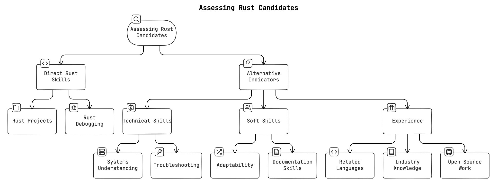

+++
title = "How to Hire Rust Developers"
date = 2024-07-24
template = "article.html"
[extra]
hero = "hero.svg"
series = "Rust Insights"
credits = [
  "<a href='https://www.freepik.com/free-vector/brainstorm-isometric-landing-page-online-service_5603461.htm'>Image by vectorpouch on Freepik</a>"
]
+++

## The Rust Hiring Mismatch

There's a curious mismatch in the Rust hiring market where some companies 
believe there's a shortage of qualified candidates, while many Rust programmers struggle to find jobs. Why is that?

Most Rust jobs are for senior roles, leaving newcomers and mid-level devs out in the cold. Many of whom would be a great fit for these roles with a little bit of training.

The crypto industry is a notable exception, where Rust developers are in high demand, but not everyone wants to work in that space.
On top of that, crypto companies have inflated Rust developer salaries to unsustainable levels, making it difficult for other industries to compete for talent.

It's not impossible, though! However, many companies want unicorns with years of Rust experience in an industry where that's rare. Meanwhile, eager developers worldwide are ready to work but face barriers like location restrictions (US only), job security concerns (contract work only), or lack of "professional" Rust experience. It's a classic case of supply and demand completely missing each other, with both sides frustrated and opportunities lost.

## But Isn't this just the dev job market in general?

Partially! However, I think it's more pronounced in Rust because it's a relatively new language and companies add it to their job ads because it generates interest.

The moment you try to get your foot in the door as a less experienced Rust developer, though, this mismatch becomes apparent. In tough market situations with fewer positions, companies tend to be more conservative and look for "safe bets" which means experts they are sure can hit the ground running &ndash; much to the detriment of less experienced developers.

## Why Write This Guide?

The broader consequence is that many companies are hesitant about adopting Rust and are therefore missing out on a rich ecosystem for building reliable and efficient services. This misconception is frustrating, as it often comes up when I talk to companies not yet using Rust. 

**A common statement I hear is: "The community is still too small."**

In reality, the Rust community has more than tripled in size over the past two years and currently has [3.7M users, of which 0.6M joined in the last six months alone.](https://www.developernation.net/resources/reports/state-of-the-developer-nation-24th-edition-q1-2023)

In contrast, companies that already use Rust in production rarely struggle with these issues and are generally very happy with their choice. 

Here are some of the quotes from the [season 1 finale of the 'Rust in Production' podcast](/podcast/s01e07-season-finale/?t=23%3A06):

> I announced that we're working on this new core of the database in November of 2020 in a talk I did. And I said we were hiring and basically like we got a bunch of inbound interestbecause of the fact that it was written in Rust.
> &ndash; Paul Dix, Founder and CTO of [InfluxData](https://www.influxdata.com/)

> Because as a small company, you can attract people because they want to work in Rust. And that's a big incentive to work for you.
> &ndash; Micah Wylde, Founder of [Arroyo](https://arroyo.dev/)

Because I saw many companies make the same mistakes over and over again, I wrote a guide to help companies find Rust talent.

If you are a hiring manager or a team lead looking to hire Rust developers, this guide is for you. Feel free to pass it on internally to help improve your hiring process.

## Setting Talent Expectations

#### Avoid Unrealistic Demands

Don't expect 10 years of Rust experience, as Rust is a relatively new language. (Rust 1.0 was released in 2015.)
Such exaggerated expectations can significantly (and unnecessarily) narrow your pool of potential candidates. Even worse, experienced developers might consider this a red flag as it shows a lack of understanding of the Rust community.

Instead, it might be enough to look for the *willingness* to learn Rust or, at most, non-production experience with the language.

#### Clearly Specify Tasks and Responsibilities

Don't just add 'Rust' as a keyword to attract more candidates. 
If you don't (plan to) use Rust in any meaningful way, this will reflect poorly on your company and waste the time of both the candidate and the hiring team.

Will the candidate have to work with other languages or technologies?
Outline the specific tasks and responsibilities that involve Rust.
Ideally, even mention the specific Rust libraries or frameworks you are using.
This helps candidates understand what is expected of them and which other ecosystems they might need to interact with. 

## Finding Candidates

Granted, the Rust job market is still relatively small compared to other languages like Python or JavaScript, but I found that most companies 
limit themselves by only looking for senior Rust developers. That's a mistake.

With some training, you can save a lot of time and money by hiring mid-level developers or smart juniors who are eager to learn Rust.
Yes, there is a learning curve, but it's probably less expensive to train a 
junior/mid-level developer in Rust compared to hiring a senior/staff Rust developer.

Currently, the best way to find Rust devs is 

1. in your company (if you have a training program).
2. through your network (ask around).

From experience, you probably won't have a lot of trouble finding interested candidates as many developers are trying to move into Rust.
However, constraints like location, salary, industry, and job security can be a deal-breaker for many.

For more experienced Rust developers, perks like remote work, flexible hours, and a focus on work-life balance are often as important as the salary. 
Being able to work on open source or attend conferences can also be a big bonus. 
These folks are in high demand and can afford to be picky.
If you can't pay crypto money, at least give them some of the other perks
and be willing to make compromises.

If you're looking for senior people or require a bigger pool of candidates, you might also want to consider sponsoring Rust-focused events, conferences, or [podcasts](/podcast). I found that sponsoring is a relatively underutilized channel with a lot of potential.

You can post job listings on Rust-specific job boards like [RustJobs.dev](https://rustjobs.dev/) and [RustJobs.fyi](https://www.rustjobs.fyi/), or boards with a dedicated Rust section,
like [Filtra.io](https://filtra.io/rust) and [RemoteOK](https://remoteok.com/remote-rust-jobs).
Also post in the monthly "who is hiring" threads on [Hacker News](https://news.ycombinator.com/) or [Reddit](https://www.reddit.com/r/rust/comments/182f6dv/official_rrust_whos_hiring_thread_for_jobseekers/).

## Assessing Candidates for Rust Roles 

Hiring itself is a very complex topic, so don't make it harder than it needs to be.

The number one mistake is to just look at raw Rust experience!
Instead, there are many other indicators that can help you identify great candidates who are a good fit for Rust work, even if they currently don't have much experience with the language.

Let's look at the points in more detail:

* **Adaptability:** Look for candidates who have a proven track record to quickly adapt and learn new technologies. For example, if they worked with many different languages and know more than one programming paradigm, they might be a good fit. 

* **Systems Understanding:** A strong grasp of fundamental concepts such as stack vs heap, threading, and data structures is a good indicator of a candidate who hits the ground running with Rust.

* **Evaluate Troubleshooting Skills:** A good proxy for Rust knowledge is the ability to debug and reason about code in general. Assess a candidates' ability to understand and resolve compile errors in Rust, focusing on common issues with ownership and borrowing. Provide scenarios that require light debugging and refactoring of Rust code.

* **Rust Reasoning:** For those without Rust experience, test their ability to reason about Rust code. Provide sample Rust code and ask them to explain what it does. Looking up documentation is allowed. Ask clarifying questions to gauge their interest and to see how quickly they can learn.

* **Ask to use the Rust documentation:** Rust takes documentation seriously. Show candidates some Rust documentation and ask follow-up questions to gauge their ability to understand basic concepts. Ask them to document a piece of code themselves or explain it in their own words.

* **Related Languages:** Be open to candidates transitioning from C++, Java, Kotlin, or TypeScript, which have an equally strong emphasis on enterprise-grade software development. Haskell, OCaml, and other functional programming languages can also be a good fit, because of their focus on the type system and correctness. Rust has [functional aspects](/blog/paradigms/), which are similar to these languages. 

* **Industry and Domain Knowledge:** Consider candidates with experience in Rust's key domains, such as backend development, infrastructure, real-time data processing, and systems programming. Depending on your niche, assess their expertise in these areas.

* **Open Source Work** (Optional): If a candidate mentions open source work, review the code quality and communication skills in issues and pull requests. Keep in mind that many great developers lack time for open source work, though.

## Takeaways

As a Rust consultant, it's in my best interest to grow the hiring pool for Rust developers: if we want to grow the real-world usage of Rust, we need to get way more developers into the ecosystem. There are signs that this is happening, but with some tweaking, the process can be highly accelerated.

**If you're a hiring manager** don't just look at raw Rust expertise; think outside the box and consider related skills and experience. The current hiring market is challenging, with an imbalance between eager developers and limited job opportunities. However, this presents a unique opportunity for forward-thinking companies to invest in talent. People exceed expectations when given trust and opportunity.

**If you're a professional Rust developer** looking to improve the situation, 
work with your hiring manager to help them understand how to hire more Rust devs. Perhaps this guide can get you started.

Good luck with your Rust hiring process!



Let me help you make the most of Rust.
I offer consulting services to get you up to speed with your Rust projects, from training your team to code reviews and architecture consulting. 
Check out my [services page](/services) to learn more.



