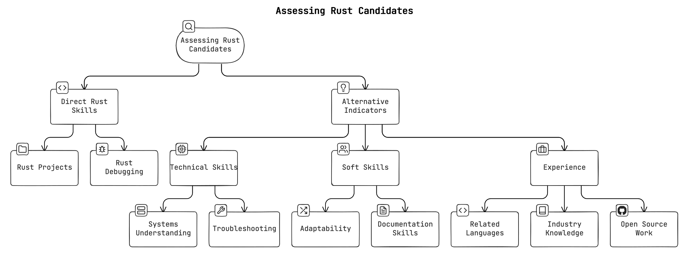

+++
title = "How to Hire Rust Developers"
date = 2024-07-24
updated = 2026-07-20
template = "article.html"
[extra]
hero = "hero.svg"
series = "Rust Insights"
credits = [
  "<a href='https://www.freepik.com/free-vector/brainstorm-isometric-landing-page-online-service_5603461.htm'>Image by vectorpouch on Freepik</a>"
]
+++

## The Rust Hiring Mismatch

Rust hiring has a weird split: companies say they cannot find qualified candidates, while Rust programmers say they cannot find Rust jobs.

A big reason is seniority. Most Rust openings target senior engineers. That leaves junior and mid-level developers on the sidelines, even when a few months of training would get them productive.

Crypto is the exception. Rust developers are in demand there, but not everyone wants to work in crypto. Those companies have also pushed salaries high enough that teams in other industries struggle to compete.

The result is frustrating for both sides. Companies ask for years of professional Rust experience in a language where that is still rare. Developers who want to work in Rust get filtered out because they are in the wrong location, need employee status instead of contract work, or have built Rust projects outside a paid job.

## Is This Just the Developer Job Market?

Partly. The same pattern exists elsewhere, but Rust makes it easier to see. The language is still young, and some companies add Rust to job ads because it attracts attention.

The problem shows up when less experienced Rust developers try to get hired. In a tight market, companies reach for safe bets. They want people who already look like experts and can start producing on day one. That caution makes sense for the company, but it shuts out developers who could do the job after a short ramp-up.

## Why Write This Guide?

When I talk to teams about Rust, one concern comes up again and again: "Can we even hire for this?" Behind that question is usually a fear that the community is too small.

I don't think that matches the data. The Rust community has more than tripled in size over the past two years and now has [3.7M users, with 0.6M joining in the last six months alone.](https://www.developernation.net/resources/reports/state-of-the-developer-nation-24th-edition-q1-2023)

The hiring problem is real, but I think companies often look in the wrong place. Teams that have not adopted Rust worry that nobody is available. Teams that already use Rust in production often find that Rust attracts engineers who want to work with the language. If you're still weighing Rust for your organization, see [Why Rust in Production](/blog/why-rust/).

The [season 1 finale of the Rust in Production podcast](/podcast/s01e07-season-finale/?t=23%3A06) had two examples. Paul Dix, Founder and CTO of [InfluxData](https://www.influxdata.com/), said InfluxData received a lot of inbound interest after announcing that its new database core was written in Rust. Micah Wylde, Founder of [Arroyo](https://arroyo.dev/), said Rust helped a small company stand out because people wanted to work with it.

I wrote this guide because I keep seeing companies make the same hiring mistakes. Hiring managers and team leads can use it to tighten job posts and interviews before concluding that Rust talent is impossible to find.

## Setting Talent Expectations

#### Avoid Unrealistic Demands

Don't ask for 10 years of Rust experience. Rust 1.0 shipped in 2015, so that requirement tells candidates you do not know the ecosystem well.

It also narrows the pool for no good reason. A strong engineer with non-production Rust experience, or a clear desire to learn it, may be a better hire than someone who only checks the exact keyword box.

#### Clearly Specify Tasks and Responsibilities

Don't add `Rust` to a job post just to attract more candidates. If the role will not use Rust in a meaningful way, say so. Otherwise you waste the candidate's time and your team's time.

Be specific about the work. Will the person write Rust every day, maintain an existing service, build new components, or work across several languages? Name the libraries and frameworks when you can. Candidates should know what Rust work they are signing up for and what other parts of the stack they will touch.

## Finding Candidates

The Rust job market is smaller than Python or JavaScript, but many companies make it smaller than it needs to be by only looking for senior Rust developers.

That is often the wrong tradeoff. Training a mid-level engineer, or a junior with strong fundamentals, can be cheaper than waiting for a senior Rust specialist. There is still [a learning curve](/blog/flattening-rusts-learning-curve/), but you can plan for it. For training material, see [Rust Learning Resources](/blog/rust-learning-resources-2026/).

Start close to home. Look inside your company if you have a training program, then ask your network. Many developers want to move into Rust, so interest is usually not the hard part.

The hard part is fit. Location rules and salary range can filter out otherwise good candidates. So can the industry, contract terms, or a strict office policy. Senior Rust developers can be especially selective. If you cannot match crypto salaries, compete on the parts of the job you can control: remote work, flexible hours, conference travel, open source time, and stable employment.

For a larger candidate pool, sponsor Rust-focused events, [conferences](/blog/rust-conferences-2025/), or [podcasts](/podcast). Sponsorship is still underused, and it puts your company in front of people who already care about Rust.

Post jobs where Rust developers already look. Good starting points are [Filtra.io](https://filtra.io/rust), [RustJobs.dev](https://rustjobs.dev/), [RustJobs.fyi](https://www.rustjobs.fyi/), and [RemoteOK](https://remoteok.com/remote-rust-jobs). The monthly "Who is hiring?" threads on [Hacker News](https://news.ycombinator.com/) and [Reddit](https://www.reddit.com/r/rust/comments/182f6dv/official_rrust_whos_hiring_thread_for_jobseekers/) can also work well.

## Assessing Candidates for Rust Roles

Hiring is already hard. Do not make it harder by treating raw Rust experience as the only signal.

Look for evidence that the candidate can learn the work in front of them.

Adaptability matters. A candidate who has learned several languages or moved between different kinds of systems has probably built the habits needed to learn Rust.

Systems knowledge matters too. Rust exposes concepts that other languages often hide, so check for comfort with memory layout, threading, data structures, and performance tradeoffs.

Use troubleshooting as an interview signal. Give candidates a small Rust compile error or ownership problem and ask them to reason through it. You are not only testing whether they know the rule already. You are also testing whether they can read the error, form a hypothesis, and make progress.

For candidates without Rust experience, ask them to explain a short Rust program. Let them use the documentation. Good Rust work involves reading docs, checking trait bounds, and understanding examples, so the interview should allow the same behavior.

Related language experience can transfer well. C++ and Java teach habits that map to parts of Rust. Kotlin or TypeScript can help with large application work. Haskell and OCaml can help with type-system instincts. Some candidates will bring systems knowledge. Others will bring API design instincts. Both can be useful.

Domain knowledge also counts. If your Rust work sits in backend systems, infrastructure, real-time data processing, or embedded software, experience in that domain may matter more than years of Rust syntax.

Open source work can help when it exists, but do not require it. If a candidate shares open source work, review the code and the surrounding communication in issues and pull requests. Many strong developers do not have time for public projects.

## Takeaways

Hiring managers should not reduce the search to years of paid Rust experience. Look for people who can learn Rust, reason about systems, and work in your domain. Then write job posts and interviews that test those things directly.

Rust developers can help too. If you want the market to improve, help your hiring manager understand these signals. A better hiring process gives more developers a path into Rust and gives companies a better chance of finding the people they need.

Good luck with your Rust hiring process!

{{ next_steps(context="Building out a Rust team and want to set them up for long-term success?") }}
