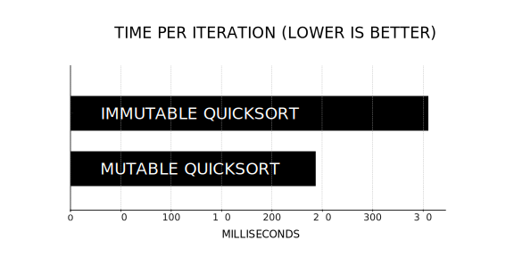

+++
title = "Aim for Immutability"
date = 2023-09-21
template = "article.html"
[extra]
series = "Idiomatic Rust"
+++

As programmers, we think a lot about state.
Is the user logged in? Can this edge-case ever occur?
Is the coffee pot empty again?

The problem is, that humans are pretty bad at keeping track of state.
That is, unless you're a Chess Grandmaster or the parent of a toddler, of course.

We forget things, we make mistakes, we get distracted...  
I personally get reminded of this every time I forget where I put my keys.

Rust has a few ways to make state handling easier.
One core principle is **immutability by default**, which is the topic of this article.

## Why Did Rust Choose Immutability By Default?

In Rust, variables are immutable by default, which means that once a
variable is bound to a value, it cannot be changed
(unless you [try excruciatingly hard to shoot yourself in the foot](https://stackoverflow.com/a/54242058/270334)).

```rust
let x = 42;
x = 23; // error: re-assignment of immutable variable `x`
```

Especially C and C++ programmers [tend to be surprised by that design
decision](https://users.rust-lang.org/t/is-immutability-by-default-worth-the-hassle/83668)
and their first Rust programs typically contain a lot of `mut` keywords.

In my opinion, **immutability is a great default**, because it helps reduce mental
overhead. If the default was mutability, you'd have to check every function
to see if it changes the value of a variable:

```rust
// Assume, Rust had mutability by default
let text = "Aloha, Hawaii!".to_string();
black_box(text)
// Is `text` still "Aloha, Hawaii!"? Who knows! Better double-check.
```

Rust is very explicit about mutability. It makes you write it out every time you
create or pass a mutable variable.

```rust
let mut text = "Aloha, Hawaii!".to_string();
black_box(&mut text);
// We know that this text is mutable so there is no guarantee that it will still
// be "Aloha, Hawaii!" after this call.
```

...and it even warns you if something is mutable, but needn't be!

```rust
fn main() {
    let mut x = 42;
    black_box(x);
}
```

```rust
warning: variable does not need to be mutable
 --> src/main.rs:4:9
  |
4 |     let mut x = 42;
  |         ----^
  |         |
  |         help: remove this `mut`
  |
  = note: `#[warn(unused_mut)]` on by default
```

To conclude, immutability by default in Rust is more than just a syntactic
choice; it's a strategic decision that promotes clarity and safety in code. It
nudges developers towards patterns that reduce ambiguities. By enforcing
explicit mutability, Rust ensures that developers are always aware of when and
where state is being modified, leading to more predictable and
easier-to-understand code.

## Immutable Doesn't Mean Slow

So why do people still use `mut`?

One reason why some people are hesitant of immutability is _performance_.
The story goes something like this:

> "Copying data requires allocations. Allocations cost time and memory.
> Therefore, you should avoid copying data."

It's true that if you have a large enough data structure, you don't want to copy
it every time you want to change something. Just _how big_ does a data structure
have to be before you should start worrying about copies? And how many copies do
you have to make for it to actually matter?

To test this, let's write a
[benchmark](https://doc.rust-lang.org/1.12.1/book/benchmark-tests.html) that
copies a vector with 1 million random values 100 times. Here is the code:

```rust
#![feature(test)]

extern crate test;

use test::{black_box, Bencher};
use rand::random;

#[bench]
fn copy_vector_100_times(b: &mut Bencher) {
    // Creating a vector of random values
    let vec: Vec<u32> = (0..1_000_000).map(|_| rand::random::<u32>()).collect();

    b.iter(|| {
        for _ in 0..100 {
            // Copy the vector and use black_box to avoid compiler optimizations
            let _copied_vec = black_box(vec.clone());
        }
    });
}
```

On my M1 Macbook Pro, this benchmark takes around 29,815,141 nanoseconds per iteration.
That's 29 milliseconds to copy a vector with 1 million values... 100 times in a row!
**This means that you can copy a vector with 1 million values over 3 million times
per second on a consumer laptop!**

Turns out, Computers are *pretty good* at copying things these days.

Granted, this is quite a synthetic example. To make it more realistic, how about
we look at something computers do all the time: sorting things.

## Quicksort: A Case Study In Immutability and Performance

Entire algorithms can be written without a single `mut` keyword.
To demonstrate this, let's look at the quicksort algorithm.

Quicksort is a sorting algorithm that works by recursively partitioning an array
around a pivot element. The pivot element is chosen arbitrarily and the
algorithm is usually implemented in-place, which means that it mutates the
original array.

Here is a quicksort implementation with a lot of mutations:

```rust
pub fn quicksort_mut<T: PartialOrd>(mut arr: Vec<T>) -> Vec<T> {
    if arr.len() <= 1 {
        return arr;
    }

    let pivot = arr.remove(0);
    let mut left = vec![];
    let mut right = vec![];

    for item in arr {
        if item <= pivot {
            left.push(item);
        } else {
            right.push(item);
        }
    }

    let mut sorted_left = quicksort_mut(left);
    let mut sorted_right = quicksort_mut(right);

    sorted_left.push(pivot);
    sorted_left.append(&mut sorted_right);

    sorted_left
}
```

Depending on your background, this code might either be idiomatic
and easy to understand or it might look like a a clown riding a unicycle on a
minefield: slightly irritating and unnecessarily dangerous.

Since the algorithm mutates the original array, the program's state changes
throughout its execution, which demands a lot of mental gymnastics from the reader.

Here is a _functional quicksort_ version that doesn't use `mut` at all:

```rust
pub fn quicksort_partition<T: PartialOrd + Clone>(array: &[T]) -> Vec<T> {
    if array.len() <= 1 {
        return array.to_vec();
    }

    let pivot = &array[0];
    let (higher, lower): (Vec<_>, Vec<_>) = array[1..].iter().cloned().partition(|x| x > pivot);

    [
        quicksort_partition(&lower),
        vec![pivot.clone()],
        quicksort_partition(&higher),
    ]
    .concat()
}
```

To me, this version is a lot easier to reason about. I don't have to chase
mutations of variables throughout the code or worry about indices and loops.

Instead, the above algorithm can be summarized in four simple steps:

1. If the array is empty or has only one element, it is already sorted.
2. Otherwise, pick the first element as the pivot.
3. Create two new arrays: One with all elements smaller than the pivot and one
   with all elements larger than the pivot.
4. Recursively sort the two new arrays and concatenate them with the pivot in
   the middle.

Just how much slower is the immutable version compared to the mutable one?
To test this, I created a [benchmark](https://github.com/mre/quicksort_bench)
that would run both versions on a vector with 1 million random values.
Here are the results:



Not surprisingly (or perhaps quite so!), the immutable version is about 50%
slower than the mutable version.

While the mutable approach is faster difference in performance is not as
dramatic as you might expect. After all, we clone the entire array in every
recursive call of the immutable version. This is a lot of copying!
But we learned earlier that computers are pretty okay with that.

A 112ms difference on a million values might seem notable, yet in many scenarios
the bottleneck is probably elsewhere.

However, the immutable version excels in clarity and maintainability. Its
functional style minimizes side effects and clarifies code intent.

## Immutability Makes Parallelism Easy

Besides! Another nice property of the immutable version is that it is trivial to
parallelize with [`rayon`](https://github.com/rayon-rs/rayon).

```rust
use rayon::prelude::*;

pub fn quicksort_par<T: PartialOrd + Clone + Sync + Send>(array: &[T]) -> Vec<T> {
    // ...
    let higher: Vec<T> = array[1..].par_iter().cloned().filter(|x| x > pivot).collect();
    let lower: Vec<T> = array[1..].par_iter().cloned().filter(|x| x <= pivot).collect();
    // ...
}
```

All we have to do is to use `par_iter` and add `Sync` and `Send` to the type
bounds of the generic type `T`. The `rayon` crate takes care of the rest.

With mutable data structures, this would be a lot more complicated as we'd need
to ensure that no two threads are trying to mutate the same piece of data
at once. This requires synchronization primitives like
[locks](https://doc.rust-lang.org/std/sync/struct.Mutex.html),
[semaphores](https://doc.rust-lang.org/std/sync/struct.Barrier.html),
or [atomic operations](https://doc.rust-lang.org/std/sync/atomic/index.html),
which can introduce both performance overhead and complexity.

For example, imagine you had a mutable array that multiple threads were
attempting to sort. If two threads tried to swap elements at the same time
without proper synchronization, you could end up with data races, where the
outcome is unpredictable and might even corrupt your data. This requires you to
sprinkle your code with locks, which in turn can lead to other issues like
deadlocks if not handled carefully.



**The key takeaway is the ease of parallelism when we sidestep concerns
about mutable and shared data.**

Just because you _can_ parallelize something, doesn't mean you _should_.

While the above code demonstrates the simplicity of parallelism thanks to
immutability, it's does not mean that there is a performance benefit.
The cost of launching threads and distributing tasks might outweigh the
benefits. 

In this case, the parallel version is actually slower than the sequential one.
**54 times slower**, to be precise! It took 19 seconds to sort the array
with rayon's default settings.
I attributed this to the overhead of launching threads and distributing tasks
having a much higher cost than copying data, but there's a good chance
I just made a mistake somewhere. My [benchmark code is on
GitHub](https://github.com/mre/quicksort_bench) if you want to take a look.

In any case, the point is that immutability makes these experiments cheap.



## Chaining Operations on Immutable Data Structures Is Efficient

As a nice bonus, you get code, which can be chained together neatly.
The Rust standard library provides a number of helpful combinators for iterators,
which play nicely with immutable data structures:

```rust
let v = vec![1, 2, 3].iter()
            .map(|x| x + 1)
            .filter(|x| x % 2 == 0)
            .collect::<Vec<_>>();
println!("{:?}", v); // v is [2, 4]
```

Under the hood, the `map` and `filter` methods create new iterators that operate on
the previous iterator and do not incur any allocations.
The actual computations (like adding 1 or filtering even
numbers) are only executed when the final iterator is consumed, in this case by
the `collect` method. The `collect` method makes a single allocation to store the
results in a new vector. The result is clean, readable, and efficient, which
is why you'll see this pattern a lot in idiomatic Rust code.

## Conclusion

In summary, immutability is a great default.

Immutable code is easier to test, parallelize, and reason about. It's also
easier to refactor, because you don't have to worry about side effects.

Don't worry about a few `.clone()` calls here and there. Instead,
focus on writing code that is easy to understand and maintain.

The use of `mut` should be the exception, not the rule.
