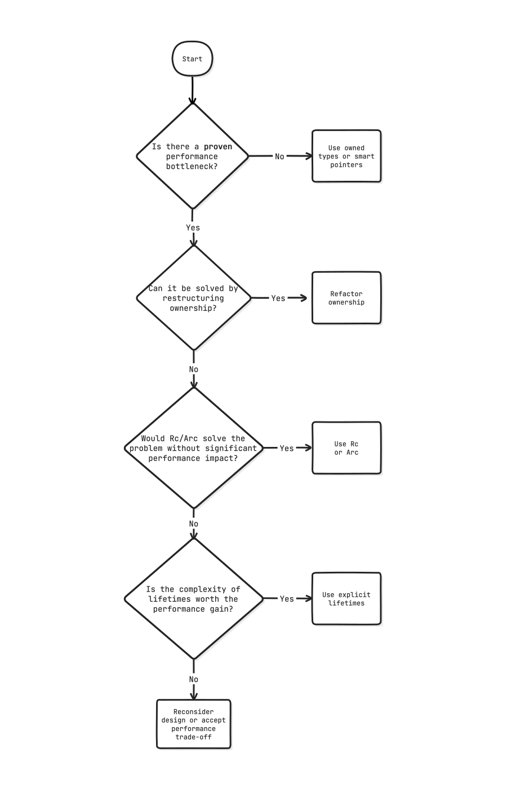

+++
title = "Don't Worry About Lifetimes"
date = 2024-05-29
template = "article.html"
[extra]
updated = 2024-07-19
series = "Idiomatic Rust"
resources = [
    "Go through the [Rustlings move semantics examples](https://github.com/rust-lang/rustlings/tree/main/exercises/06_move_semantics) to get a better understanding of lifetimes."
]
credits = [
  "Thanks to <a href='https://www.linkedin.com/in/grovesnl'>Josh Groves</a> for suggesting to mention Rc/Arc."
]
+++

When people say that learning Rust is hard, they often mention lifetimes. However, even after seven years of writing Rust, 95% of my code, probably more, doesn't have any lifetime annotations! It is one of the areas of the language that I definitely worried way too much about when learning Rust, and I see many beginners do the same.



The advice in this article is focused on common scenarios. There are cases where you *do* have to worry about lifetimes.

If you're working in areas like embedded systems, real-time applications, or other performance-critical environments, you might encounter scenarios where dealing with lifetimes is essential. In such cases, please consult the [section on lifetime elision in the Rustonomicon](https://doc.rust-lang.org/nomicon/lifetime-elision.html) for more detailed information.



## What are lifetimes?

Lifetimes tell the compiler how long a reference is valid.

```rust
fn foo<'a>(bar: &'a str) {
    // ...
}
```

Here, I'm telling the compiler: "this reference `bar` is valid for the lifetime `'a`." The compiler will then check that the reference is indeed not used after the lifetime `'a` ends. If this still sounds like gibberish to you, please continue reading.

Rust has a concept of lifetime *elision*, which means that you don't have to write lifetime annotations in most cases; the compiler will infer them for you.



The rules are simple:

1. Every input reference to a function gets a distinct lifetime.
2. If there's exactly one input lifetime, it gets applied to all output references.
3. If there are *multiple* input lifetimes but one of them is `&self` or `&mut self`, then the lifetime of `self` is applied to all output references.

That means you only have to write out the lifetimes yourself if you have more than one input lifetime and none of them are `&self` or `&mut self`.



In the example above, we have one input lifetime, so we don't have to write it out. This is equivalent (and easier on the eyes):

```rust
fn foo(bar: &str) {
    // ...
}
```

It turns out, lifetimes are *everywhere* in Rust, but they are just *implicit* most of the time. That's a good thing.

## Lifetimes are contagious!

The problem with lifetimes is that they spread in your codebase like a virus. Once you add a lifetime annotation, you have to add it to all the functions that call it, and all the functions that call those functions, and so on.

For example, let's say you have a struct that contains a `String`:

```rust
struct Foo {
    bar: String
}
```

And you want to optimize it by using a `&str` instead to avoid allocations:

```rust
struct Foo<'a> {
    bar: &'a str
}
```

Now you have to add the lifetime annotation to all the functions that use `Foo`:

```rust
fn foo<'a>(foo: &'a Foo) {
    // ...
}
```

This can get out of hand very quickly. The function signature is now more complex, and it is harder to understand what the function does. Refactoring gets harder because you have to carry over the lifetime annotations. Lifetimes are not free! It's easy to back yourself into a corner where making fundamental changes to your code becomes difficult. As such, explicit lifetimes should be treated as a last resort because they increase tech debt and alienate beginners.

## Reasons for lifetimes

Nowadays, I consider it an anti-pattern to prematurely add lifetime annotations to a piece of code without a good reason. There's really only two situations where you should add lifetime annotations:

1. **There is a performance bottleneck**: You found a slow piece of code in your hot path, and you have profiled it and determined that the bottleneck is indeed because of allocations. In this case, it could make sense to use lifetimes to avoid allocations. (The alternative is to refactor your code to use a better algorithm to avoid the hot path in the first place.)
2. **Code that you depend on requires lifetime annotations:** There's little you can do about this, other than to look for alternatives that don't require lifetimes.

## Don't Be Afraid Of Lifetimes Either

What if you depend on a library that requires lifetime annotations?

One example is Servo's [`html5ever`](https://github.com/servo/html5ever/), a high-performance HTML parser written in Rust. It uses lifetimes extensively to ensure memory safety and performance. When using such a library, you have to deal with lifetimes, whether you like it or not. However, understanding the basics of lifetimes can help you navigate these situations more effectively. Remember that lifetimes are there to help you write safe and efficient code. They are not something to be afraid of but rather a powerful tool in your Rust toolbelt.

It's wise to get comfortable with lifetimes even if you don't use them often.

## A Practical Example

Let's look at a practical example where lifetimes need to be explicitly added. Consider a function that returns the longest of two string slices.

```rust
fn longest(x: &str, y: &str) -> &str {
    if x.len() > y.len() {
        x
    } else {
        y
    }
}
```

If we tried to compile that, we'd get an error:

```
error[E0106]: missing lifetime specifier
 --> src/lib.rs:1:33
  |
1 | fn longest(x: &str, y: &str) -> &str {
  |               ----     ----     ^ expected named lifetime parameter
  |
  = help: this function's return type contains a borrowed value, but the signature does not say whether it is borrowed from `x` or `y`
help: consider introducing a named lifetime parameter
  |
1 | fn longest<'a>(x: &'a str, y: &'a str) -> &'a str {
  |           ++++     ++          ++          ++
```

What went wrong?

## Put Yourself Into the Shoes of the Compiler

To understand the error, imagine you are the Rust compiler. Your job is to ensure that references are always valid and that no reference outlives the data it points to. In this example, the function `longest` takes two string slices and returns one of them.

As the compiler, you see that the function signature promises to return a reference (`&str`), but it doesn't specify which input reference (`x` or `y`) it corresponds to. 
We face a dilemma:
Will the returned string live as long as `x` or `y`?


It depends on which of the two strings is longer and this can only be determined at runtime.

Without this knowledge, you can't confirm that the returned reference will be valid: You need to specify the *relationship* between the input and the output to make this guarantee. If you pick the wrong one, you might end up with a dangling reference. The ambiguity makes it impossible for the compiler to guarantee the safety of the returned reference.
You need to provide more information to the compiler to resolve this ambiguity.

To fix this, we need to add a lifetime parameter to the function signature:

```rust
fn longest<'a>(x: &'a str, y: &'a str) -> &'a str {
    if x.len() > y.len() {
        x
    } else {
        y
    }
}
```

By adding `'a`, we specify that both input references `x` and `y` have the same lifetime `'a`, and the returned reference will also have this lifetime. This makes it clear to the compiler that the returned reference is guaranteed to be valid as long as *both* input references are valid. Now, the compiler can safely check and ensure that the references are used correctly throughout the code.



"Hold on," you might say, "other programming languages don't require me to think about lifetimes. Why does Rust make it so complicated?"

The C programming language will happily let you access memory that has been freed, leading to undefined behavior. It will watch in silence as you walk off the edge of a cliff.

Dangling pointers are a common source of bugs, and this is what lifetimes in Rust aim to prevent. The Rust compiler makes you stop and think about the ambiguity in your code and forces you to make relationships between data explicit.

"But what about Python, PHP, or Java? We don't have to worry about lifetimes there, right?"

Yes, these languages have systems like reference counting or garbage collectors in place, which automatically manage memory for you. There is an overhead to these mechanisms, though. In some restricted environments, like embedded systems or real-time applications, automatic memory management is not even an option because it can introduce unpredictable garbage collector pauses or the environment doesn't provide a runtime.

Rust's lifetimes are a way to ensure memory safety without overhead at the small cost of being explicit about lifetimes in the face of ambiguity.



## Lifetimes As A Way To Convey Intent

Part of why lifetimes can look scary is that they are often named `'a`, `'b`, or `'c`. This makes them look like some kind of academic, mathematical notation. That's just a convention to make them quicker to write, though, and coming up with better names is hard!

It can be helpful to think of lifetimes as "labels" &mdash; [you can name them however you want](https://www.possiblerust.com/pattern/naming-your-lifetimes) to make your code more understandable. For instance:

```rust
// Now it is clear that the processed data is tied to the input data
fn process_input<'input>(data: &'input str) -> &'input str {
    // ...
}
```

Naming lifetimes can be quite helpful if you need to juggle multiple borrow sources
or when you want to express the origin of a reference more clearly. Serde uses this technique to great effect in its [`Deserialize`](https://docs.rs/serde/latest/serde/trait.Deserialize.html) trait:

```rust
fn deserialize<'de, D>(deserializer: D) -> Result<Self, D::Error>
where
    D: Deserializer<'de>,
{
    // ...
}
```

Here, `'de` means "this lifetime is tied to the deserializer"
or "this thing lives as long as the deserializer does."
Suddenly, that syntax makes a lot more sense!

If you're curious, see [serde's detailed explanation of deserializer lifetimes ](https://serde.rs/lifetimes.html).

Think of lifetimes as type signatures: most of the time, they can be inferred,
but at times it's clearer to spell them out to avoid mistakes. Plus, these
explicit annotations double as useful documentation.

## Avoiding Lifetimes With Smart Pointers

You might think thay you have to introduce a lifetime if you want to avoid
unnecessary copies; for example, when handling a big chunk of data.

However, you can also use smart pointers like [`Rc`](https://doc.rust-lang.org/std/rc/struct.Rc.html) (reference-counted) or [`Arc`](https://doc.rust-lang.org/std/sync/struct.Arc.html) (atomic reference-counted) to share ownership of the data. This way, you don't need to worry about explicit lifetimes while keeping the cost of cloning the data close to zero. It's a good trade-off in many situations.

```rust
// We only pay for the allocation once
let hello = Rc::new("Hello".to_string());

// This is a cheap operation
let hello2 = hello.clone();
```

Here's how you could use `Rc` to avoid lifetimes in the `longest` function:

```rust
use std::rc::Rc;

fn longest(x: Rc<String>, y: Rc<String>) -> Rc<String> {
    if x.len() > y.len() {
        x
    } else {
        y
    }
}
```

That's just a silly example (and you'd probably use `String` anyway in that case), but it shows how you can sidestep lifetimes by using reference-counted pointers.

## When To Use Lifetimes

Still confused if you should use lifetimes? Here's a simple flowchart to help you decide:




## Conclusion

All references (borrows) in Rust have lifetimes. The compiler tracks them,
whether they're explicit or not.

At the start of my Rust journey, I worried way too much about lifetimes. I
thought they were the key to understanding Rust and that I need to master them
to write idiomatic code. But it turns out you don't need to worry about
lifetimes all that much.

Nowadays, most of my code is free of explicit lifetimes.
I only have to add lifetimes in two kinds of situations: returning references from a function and storing a reference in a struct.

In all other cases, the compiler does a great job of inferring lifetimes
for you, and you should only add them when you have a good reason to do so, i.e.  when the compiler tells you to, when optimizing for performance, or
when you want to explicitly describe the relationships in your code to humans.
