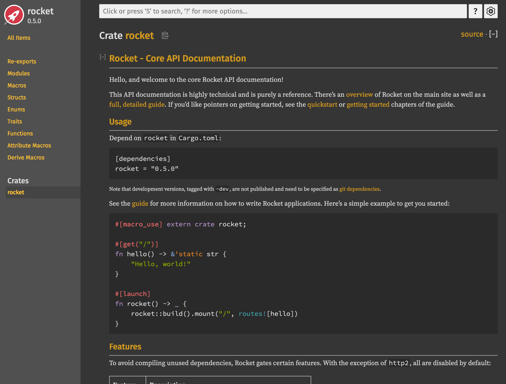
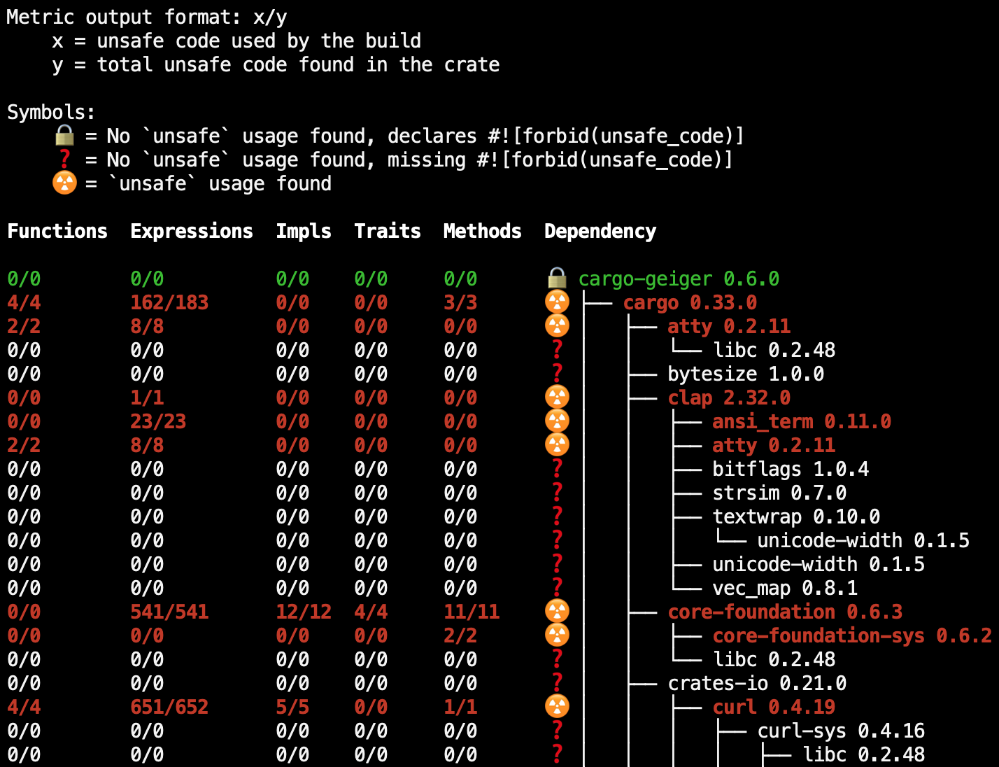
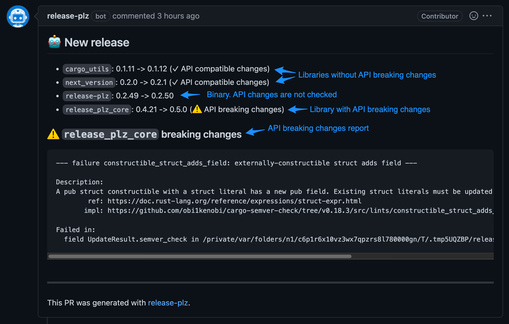

+++
title = "Long-term Rust Project Maintenance"
date = 2024-05-13
template = "article.html"
[extra]
updated = 2024-05-23
series = "Rust Insights"
hero = "maintenance.svg"
reviews = [
  { name = "Florian Bartels", url = "https://github.com/flba-eb" },
]
credits = [ 
  "<a href='http://www.freepik.com'>Hero image designed by vectorpouch / Freepik</a>" 
]
+++

Rust has reached a level of maturity where it is being used for critical
infrastructure, replacing legacy systems written in C or C++.
This means, some Rust projects need to be maintained for years or even decades to come.

By some estimates, the cost of maintaining a product is more than [90% of the
software's total cost](https://www.ncbi.nlm.nih.gov/pmc/articles/PMC3610582/).

Critical software demands minimal downtime and high reliability, so it is
reassuring that the Rust core team highlights its commitment to these values in
their post ["Stability as a
Deliverable."](https://blog.rust-lang.org/2014/10/30/Stability.html)

This guide is based on my experience assisting clients with medium to large Rust
projects and focuses on long-term Rust project maintenance. While much of the
advice may be applicable to other languages, I will emphasize aspects specific
to Rust.

<h2>Table of Contents</h2>

<details class="toc">
<summary>
Click here to expand the table of contents.
</summary>

- [Your Team Needs to be On Board](#your-team-needs-to-be-on-board)
- [Building for Rust Stability and Longevity](#building-for-rust-stability-and-longevity)
  - [Prefer Stable Rust Over Nightly](#prefer-stable-rust-over-nightly)
  - [Regularly Update Your Compiler](#regularly-update-your-compiler)
  - [Editions](#editions)
  - [Use Rust Language Features Conservatively](#use-rust-language-features-conservatively)
  - [Be Conservative About Async Rust](#be-conservative-about-async-rust)
- [Managing Dependencies](#managing-dependencies)
  - [Dependencies are a Liability](#dependencies-are-a-liability)
  - [Limit The Number Of Dependencies](#limit-the-number-of-dependencies)
  - [How To Choose Dependencies](#how-to-choose-dependencies)
  - [Do Not Pin Dependencies](#do-not-pin-dependencies)
  - [Stick to `std` Where Possible](#stick-to-std-where-possible)
  - [Use Stable Dependencies](#use-stable-dependencies)
  - [Disable Unnecessary Features](#disable-unnecessary-features)
- [Building Solid Foundations](#building-solid-foundations)
  - [Software Architecture](#software-architecture)
  - [API design](#api-design)
  - [Testing](#testing)
  - [Documentation](#documentation)
  - [About Unsafe Code](#about-unsafe-code)
- [Tooling and Infrastructure](#tooling-and-infrastructure)
  - [Use Boring Technology](#use-boring-technology)
  - [Use Linters and Formatters](#use-linters-and-formatters)
  - [Make Releases Boring](#make-releases-boring)
- [Invest in the Rust Ecosystem](#invest-in-the-rust-ecosystem)
- [Conclusion](#conclusion)
- [Further reading](#further-reading)


</details>

## Your Team Needs to be On Board

First, make sure that your team buys into the [decision to use
Rust](/blog/why-rust) and that they have the necessary skills to work with the
language.

Introducing Rust is often a disruptive change
and requires a long-term mindset. [It is important to have the backing of both the
team and leadership to make this transition successful.](https://mainmatter.com/blog/2023/12/13/rust-adoption-playbook-for-ctos-and-engineering-managers/)

On top of that, every language comes with its own set of tools,
libraries, and idioms. It takes time for a team to become proficient in
a new environment, and Rust is well-known for its steep learning curve.

Investing in Rust training and team-augmentation is a good way to accelerate
this process. While it means higher upfront costs, it will pay off in the long run, because the team will feel confident in their ability to maintain the codebase.


## Building for Rust Stability and Longevity

### Prefer Stable Rust Over Nightly

Rust has a stable release every six weeks, which brings new features and bug
fixes to the language.

The stable release is the most reliable and well-tested version of Rust.
In contrast, the nightly release is a daily snapshot of the Rust compiler
and is more likely to break your code.

For long-term maintenance, it's important to stick to the stable release
of Rust if at all possible. This ensures that your code will continue to compile and run without modification, even as the language evolves.

There are only very few cases where nightly Rust is still necessary
and you should carefully evaluate if the benefits outweigh the risks.

> If you are writing code that should live for a while, or a library that is
> aimed to be widely used, avoiding nightly features is likely your best bet.
> &mdash; Andre Bogus in [The nightly elephant in the room](https://www.getsynth.com/docs/blog/2021/10/11/nightly)

### Regularly Update Your Compiler

Dependencies can specify a minimum version of the Rust compiler they require. Keeping your compiler up-to-date ensures you can use the latest versions of your dependencies.

Additionally, continuous integration tools, like the [`dtolnay/rust-toolchain`](https://github.com/dtolnay/rust-toolchain) GitHub Action, default to the latest stable Rust version. Therefore, it's adivsable to keep your compiler current.

Updating your compiler toolchain is simple. Do it regularly:

```bash
rustup update
```

### Editions

An often underrated feature which is not found in other languages is Rust's [edition
system](https://doc.rust-lang.org/edition-guide/editions/). It ensures
[stability without
stagnation](https://blog.rust-lang.org/2014/10/30/Stability.html#the-plan):
every three years, a new edition is released, which allows the language to
evolve without breaking existing code. For example, the 2018 edition introduced
the `async` and `await` keywords, which are now widely used in Rust codebases;
but code written in the 2015 edition still compiles and runs without
modification. Mixing crates from different editions is
possible as well.

As a result, organizations have time to migrate their codebase to the new
edition at their own pace.

That said, try to keep your codebase up-to-date with the latest edition, as it
will make it easier to benefit from new features and improvements in the
language.

### Use Rust Language Features Conservatively

Rust comes with a wealth of powerful features, such as macros, traits,
generics, and lifetimes. While these features can make code more expressive and
efficient, they can also make code harder to read and maintain.

For long-term maintenance, it's important to be conservative about using
advanced language features. At times, this might come at the cost of
performance or verbosity, but the benefit is code that is easier to understand
by a larger part of the team.

Here are a few examples of conservative use of Rust language features:

- **Use macros only for boilerplate code**: Macros can be powerful tools for
  code generation, but can be hard to read and debug and take a toll on
  compile times. Use them sparingly and only for code that is repetitive.
  [Know When to Use Macros vs. Functions](https://earthly.dev/blog/rust-macros/)
- **Avoid complex trait bounds**: Traits are a common way to abstract over types
  in Rust, but complex [trait bounds](https://doc.rust-lang.org/rust-by-example/generics/bounds.html)
  can lead to hard-to-understand error messages and obfuscate business logic.
  Some code duplication is often preferable to complex trait bounds.
- **`clone` is fine**: While `clone` can be a performance bottleneck, it is
  often the simplest way to avoid lifetimes and keep code readable.
  In many cases, the performance overhead is negligible.
  If you are considering to introduce lifetimes to avoid `clone`, ask yourself
  if the added complexity is worth the performance gain.

I discussed these and other antipatterns in my talk [The Four Horsemen of Bad
Rust
Code](https://fosdem.org/2024/schedule/event/fosdem-2024-2434-the-four-horsemen-of-bad-rust-code/).

### Be Conservative About Async Rust

There is one point in particular that is worth calling out in the context of
long-term maintenance in Rust: **keep your core business logic synchronous**.

This ensures that you don't have to clutter your types with trait bounds like
`Send` and `Sync`, and that you can easily test your code without having to
deal with asynchronous runtimes.

Especially in core libraries, it's important to be conservative about exposing async functions in the public API. This ensures that your library can be used in both synchronous and asynchronous contexts and does not impose a specific runtime on the user.

To learn more about the tradeoffs of the async Rust ecosystem, I recommend reading
[The State of Async Rust](/blog/async/).

## Managing Dependencies

### Dependencies are a Liability

One of the most important aspects of long-term Rust maintenance is being
conservative about dependencies.

Rust has a very active ecosystem, with thousands of crates available on
[crates.io](https://crates.io/), but there is no guarantee that a crate will be
maintained in the long term; and even if it is, you need to [trust the team
behind it](https://tweedegolf.nl/en/blog/104/dealing-with-dependencies-in-rust).
Security fixes in dependencies could take a long time to be released, and [the API of a dependency could change in undesirable ways](https://github.com/marshallpierce/rust-base64/issues/213).

As a consequence, every dependency should be seen as a liability.

### Limit The Number Of Dependencies

Rust’s standard library is intentionally small to avoid issues like those in
Python’s extensive standard library, where certain parts are discouraged from
use:

> Python’s standard library is piling up with cruft, unnecessary duplication of
> functionality, and dispensable features. &mdash; [PEP 594](https://peps.python.org/pep-0594/)

Rust encourages using small, focused packages called crates, promoting modular development and simplifying the core library's
maintenance. However, over-reliance on many third-party packages can create
maintenance challenges. **Keep the number of dependencies low**.

Each dependency increases:

- Compile times
- Test times
- Complexity in build scripts and CI
- Documentation to read
- Attack surface
- Etc.

### How To Choose Dependencies

Now that we've established the importance of limiting dependencies, how do you
choose the right ones? Here are some factors to consider when choosing a crate:

- **Popularity**: The more popular a crate is, the more likely it is to be
  maintained. Check the number of downloads, the number of open
  issues, and the last commit date. Here is a list of [popular Rust
  crates](https://lib.rs/std).
- **License**: Make sure the crate's license is compatible with your project's
  license. The most common licenses in the Rust ecosystem are MIT and Apache 2.0,
  which are both permissive licenses. However, there are crates with more
  restrictive licenses, such as GPL or AGPL, which might not be suitable for
  your project.
- **Maintenance**: Check the crate's GitHub repository for signs of active
  maintenance. Are issues being addressed? Are pull requests being merged?
  Is the crate following best practices?
  Prefer crates from well-known community members or companies, who gained trust
  over time.
- **Security**: Make sure the crate has a good security track record and that the
  maintainers are responsive to security issues.
  Check [RustSec](https://rustsec.org/) for known vulnerabilities in Rust crates
  before adding them to your project.
  Run [cargo-audit](https://crates.io/crates/cargo-audit) for known vulnerabilities in your dependencies.

Take a look at [blessed.rs](https://blessed.rs/) for a list of recommended
crates in the Rust ecosystem. Use tools like
[cargo-tree](https://doc.rust-lang.org/cargo/commands/cargo-tree.html) and
[cargo udeps](https://github.com/est31/cargo-udeps) to find duplicate, outdated,
or unused dependencies.

For a case study on how to reduce the number of dependencies in a real-world
Rust project, read [Sudo-rs dependencies: when less is
better](https://www.memorysafety.org/blog/reducing-dependencies-in-sudo/) by
Ruben Nijveld from Prossimo.

### Do Not Pin Dependencies

A common reaction to hedge the risks of exposing your project to breaking
changes is to pin dependencies to a specific version. While this sounds like a
good idea, it can in fact result in the opposite: a project with outdated
dependencies that are no longer maintained and have known security
vulnerabilities. This is a big maintenance burden.

Instead, it is better to be proactive about keeping dependencies up-to-date:

- **Use [`cargo outdated`](https://github.com/kbknapp/cargo-outdated)**: This command shows you which
  dependencies are out of date. Run it regularly to keep track of new versions.
- **Automate dependency updates**: Use tools like [Dependabot](https://dependabot.com/)
  or [Renovate](https://www.mend.io/renovate/) to receive automated pull
  requests for dependency updates.
- **Regularly run [`cargo update`](https://doc.rust-lang.org/cargo/commands/cargo-update.html)**: It updates your dependencies
  to the latest version that matches the version constraints in your `Cargo.toml`.
- **Use [`cargo tree`](https://doc.rust-lang.org/cargo/commands/cargo-tree.html)**: This shows you a tree of your
  dependencies, to help you find duplicate- or outdated dependencies
  &mdash; including transitive dependencies.
- Try not to skip any major versions of your dependencies, as this can make it
  harder to upgrade in the future.
- Be proactive about replacing deprecated or unmaintained dependencies with a
  more recent alternative. 

For major dependencies (like the web framework or your async runtime) it's a good
idea to follow the release notes or blog posts to stay up-to-date with
upcoming changes. For example, you [can watch for new releases (including the changelog)
on GitHub](https://docs.github.com/en/account-and-profile/managing-subscriptions-and-notifications-on-github/managing-subscriptions-for-activity-on-github/viewing-your-subscriptions) or subscribe to the project's newsletter.

Keep in mind that it takes time for the broader ecosystem to catch up with new
releases of these major dependencies, so it can take a while before you can
safely upgrade. In such a case, it's a good idea to add regular reminders to
your calendar to handle the upgrade.

### Stick to `std` Where Possible

The Rust standard library is well-maintained and has a strong focus on backwards
compatibility. It is a good idea to stick to `std` where possible.

For example, the `std::collections` module provides a good selection of data
structures, such as `HashMap`, `Vec`, and `HashSet`, which are well-tested.
While there are great third-party crates that provide similar data structures,
which might be faster or have additional features, it is often better to stick
to the standard library, as it is used by a wide range of projects and
guaranteed to be maintained in the long term.

### Use Stable Dependencies

Crates which [follow
semver](https://doc.rust-lang.org/cargo/reference/semver.html) and reach version
1.0 are considered stable and should be preferred over non-stable crates. This
is because crates below version 1.0 are allowed to make breaking changes in
minor versions, which can lead to unexpected breakage in your project.

### Disable Unnecessary Features

Many crates offer optional features that can be enabled or disabled. These
features can add additional functionality to the crate, but they can also
increase compile times and the complexity of the crate. If you don't need a
feature, it's a good idea to disable it.
You can find the available features in the crate's `Cargo.toml` file or on the
crate's documentation page.
For example, [here are the `tokio` features](https://docs.rs/crate/tokio/latest/features).

## Building Solid Foundations

### Software Architecture

Conversely, maintaining a codebase for a long time doesn't mean you should leave
it untouched; quite the opposite: it requires constant effort and work.

Some of the most robust codebases in the world are continuously updated.
Projects like the Linux kernel, which has been in development for over 30 years,
are constantly being improved and refactored.

Here are some principles for durable software design:

1. Learn about [idiomatic Rust](/blog/idiomatic-rust-resources) and follow the best practices of the Rust community.
2. Heavily lean into the type system: prefer a type-first design, where you use the type system to enforce invariants and prevent bugs. For example, here is how to [use the typestate pattern to guarantee object behavior at compile-time](https://cliffle.com/blog/rust-typestate/).
3. Don't be afraid to take ownership: refactor and rewrite where necessary. Rust makes it _easy_ to refactor and you should take advantage of that.
4. Strive for [low coupling and high cohesion](https://stackoverflow.com/a/14000957/270334).
5. Learn about [design principles such as SOLID](https://rust-unofficial.github.io/patterns/additional_resources/design-principles.html).
6. Avoid premature optimization and over-engineering.
7. Consider [Domain-driven design](https://doc.rust-cqrs.org/theory_ddd.html). It is a way to express your business logic in a common business language that everyone on the team understands. 
8. [Study hexagonal architecture](https://alexis-lozano.com/hexagonal-architecture-in-rust-1/) (a.k.a onion Architecture or 'Ports and Adapters'). This architecture separates the core business logic from the infrastructure, making it easier to test and maintain.

### API design

Part of software architecture is API design, but it deserves its own section.

Software that gets maintained for a long time is often critical and heavily used
by other software. Changing an API can break downstream users and cause churn.
Defensive API design minimizes the risk of these breaking changes.

Here are some tips:

- **Minimize the public API surface**:
  It's very hard to remove features once they are public. Only expose what is
  absolutely necessary for users to interact with your system. While this sounds
  obvious, it's easy to expose too much in a public API. Keeping functions and
  structs private prevents implementation details from leaking out of modules,
  making future refactoring easier since you can change the internals without
  affecting the public API.
- **Make enums non-exhaustive**: When defining an enum, use the
  [`#[non_exhaustive]`](https://doc.rust-lang.org/reference/attributes/type_system.html)
  attribute to allow adding new variants in the future without breaking existing
  code. (Also see this [discussion in the hyperium/http
  crate](https://github.com/hyperium/http/issues/188).)
- **Hide implementation details behind own types**: Use the [newtype
  pattern](https://rust-unofficial.github.io/patterns/patterns/behavioural/newtype.html#motivation)
  to hide implementation details and prevent users from relying on them. For
  example, instead of exposing that you depend on a specific crate, wrap it in a
  newtype, so use `pub Request(reqwest::Request)` instead of exposing the
  dependency directly.
  Don’t be afraid to introduce your own types around basic types. E.g. `Miles(u64)` and `Kilometers(u64)` are both `u64` under the hood, but
  their explicit types make it harder to mix them up.
- **Use semver**: Follow the [Semantic Versioning](https://semver.org/) guidelines to communicate changes to your users. This will help them understand the impact of a new release and make it easier to upgrade. Consider using [cargo-semver-checks](https://github.com/obi1kenobi/cargo-semver-checks) to detect breaking changes in your code.

For more information, the Rust team has published a [Rust API Guidelines
Checklist](https://rust-lang.github.io/api-guidelines/checklist.html), which is
well worth a read.

### Testing

Tests are a form of documentation that gets verified automatically.
If you have a hard time writing tests, it's a sign that your code is too
complex and needs refactoring. If you can't explain what a struct or function
does, it might do too much. Split it up into smaller parts and test those parts
individually.

In Rust, unit tests reside alongside the code within the same module, which is
where the majority of testing should happen.

Make sure that the tests are easy to run without any manual setup (ideally, just
a `cargo test` should be enough), and that they run quickly (think seconds, not minutes)
and mostly without external dependencies. If tests are slow, they won't be run
as often, and you'll lose the benefits of having them. Integrate your tests into
a continuous integration pipeline on GitHub Actions or GitLab CI to ensure that
they run automatically on every commit.

### Documentation

Rust has great support for documentation.
You can write documentation as Markdown comments right next to your code, and
it gets rendered into a nice HTML page with `cargo doc`.
Make extensive use of this!

Here are some tips for writing good documentation:

- Don't expect to be around to explain your code. Even if you are, you might not
  remember why you wrote something a certain way.
- It's easiest to write documentation as soon as you start writing code. Update it as
  your mental model of the code evolves.
- Take the time to document, why certain optimizations were *not* done and the
  trade-offs of your design decisions.

Some tooling can help you with this:

- Enforce documentation for public functions and types with clippy's [`#![deny(missing_docs)]`](https://doc.rust-lang.org/rustdoc/write-documentation/what-to-include.html) lint.
- Run `cargo doc --open` from time to time to see how your documentation looks like
  and fill in the gaps.
- Add doctests to your documentation. This way, you can ensure that the examples
  in your documentation are correct and up-to-date.
- [Add mermaid diagrams to your documentation](https://frehberg.com/2022/12/docs-as-code-mermaid-inline-diagrams/) to visualize complex concepts.
- Use [doc-comment](https://github.com/GuillaumeGomez/doc-comment) to ensure that your examples in the `README.md` are up-to-date.

As an example, here is the documentation for the [Rocket web framework](https://api.rocket.rs/v0.5/rocket/), which is generated from comments in the code:

[](https://docs.rs/rocket/latest/rocket/)

Here are the things I like about this introduction:

- [X] It's approachable and easy to read.
- [X] It immediately shows how to use the library in a simple real-world scenario.
- [X] It hints at other forms of documentation, like guides and examples.

If you feel intrigued, [here is a great guide on how to write documentation in Rust](https://blog.guillaume-gomez.fr/articles/2020-03-12+Guide+on+how+to+write+documentation+for+a+Rust+crate).

### About Unsafe Code

Unsafe code relies on the author to ensure its correctness and adherence to
current and future rules. Due to the inherent complexity, errors in unsafe
code are typically difficult to detect and debug.

- Minimize the use of unsafe code and encapsulate it in a safe API. This way,
  the unsafe code can at least be isolated and its behavior can be more easily
  understood and tested.
- If you find yourself using unsafe code to improve performance, consider using
  better algorithms or data structures instead. Rust's performance is often
  competitive with C and C++ without resorting to unsafe code.
  See [this video on datastructures in the Zed Text Editor, which shows how
  `Rope`s and `SumTree`s get used for performant and safe code](https://www.youtube.com/watch?v=uUu9eFNNbjg).
- Use [cargo-geiger](https://github.com/geiger-rs/cargo-geiger) to check for
  unsafe code.



## Tooling and Infrastructure

### Use Boring Technology

Based on personal experience, the latest technology can be tempting, but for long-term codebase maintenance in a production environment, it's wise to use reliable, well-established tools like JSON and SQL. These tools offer abundant documentation and support, making it easier to find help when needed.

The same principle applies when choosing Virtual Machines or Containers over newer options like WebAssembly or Edge Computing, as the former have more providers and established ecosystems.

Overall, proven technologies change less frequently, allowing you to focus on your business rather than constantly chasing the latest trends.

### Use Linters and Formatters

There are a number of well-established tools that can help you maintain a
consistent code style and catch common errors:

- [rustfmt](https://github.com/rust-lang/rustfmt) formats your code according to
  the Rust style guidelines.
- [clippy](https://doc.rust-lang.org/clippy/) is a collection of lints to catch
  common mistakes and improve your code.
- We also maintain a [list of Rust static analysis tools](https://analysis-tools.dev/tag/rust).

### Make Releases Boring

Run your CI pipeline on a regular basis to ensure that your codebase is always
in a deployable state. The worst time to find out that something is broken is when
you're trying to deploy a fix. 

Look into [release-plz](https://github.com/MarcoIeni/release-plz) for release
automation. It can create pull requests for new releases, which you can review
and merge when you're ready.



If you are afraid of triggering a release, it's a sign that your release process
is too complex. Simplify it until you are confident that you can release at any
time.

## Invest in the Rust Ecosystem

If you depend on the Rust ecosystem for your business, it is in your best
interest to invest in it. Being an active member of the Rust community will ensure that your voice gets heard, and you can influence the direction of the language and ecosystem.

This can be done in a number of ways:

- Report bugs and contribute code to the crates you use.
- [Sponsor crates that you depend on](https://github.com/sponsors/explore?account=mre&ecosystems=RUST&sort_by=MOST_USED).
- Give talks and write blog posts about your experiences with Rust.
- Support the [Rust Foundation](https://foundation.rust-lang.org/) and core team members.
- Encourage your team to contribute to the Rust ecosystem.

## Conclusion


Maintaining a long-term codebase is challenging, regardless of the programming
language. However, Rust excels in this area due to its focus on safety, solid
tooling, and active community.

By following the principles outlined in this post, you can
ensure that your codebase remains robust and maintainable for years to come.



If you want to learn from top companies that have successfully adopted Rust,
consider subscribing to the [Rust In Production Podcast](/podcast).

In case your company is considering to adopt Rust for a new project, feel free to reach out for a [consultation](/#contact).



## Further reading

- [Cost of a Dependency - Lee Campbell](https://www.youtube.com/watch?v=Y7oqumBxWGo) &mdash; presentation on
  building maintainable architectures
- [Software Maintenance Costs - Vladislav Andreev ](https://maddevs.io/customer-university/software-maintenance-costs/) &mdash; Factors & ways to reduce software maintenance costs
