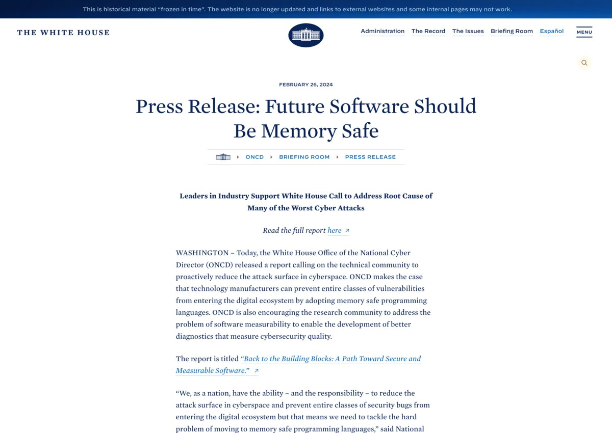
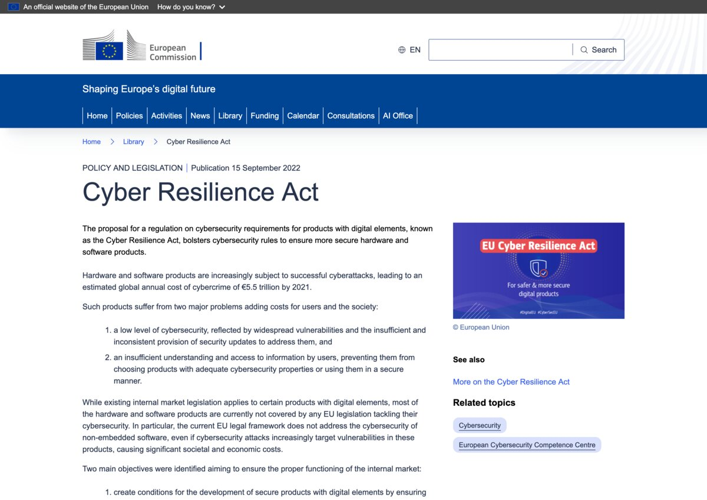

+++
title = "Memory-Unsafe Code Is a Liability"
date = 2026-02-27
updated = 2026-06-12
aliases = ["/blog/rust-supply-chain-security/"]
template = "article.html"
draft = false
[extra]
series = "Rust Insights"
excerpt = "Why governments (CISA, NSA, EU CRA, White House) now treat memory-unsafe code as a liability, and why Rust is the production-ready fix for systems software."
resources = [
  "[White House ONCD Report: Back to the Building Blocks](https://bidenwhitehouse.archives.gov/oncd/briefing-room/2024/02/26/press-release-technical-report/)",
  "[CISA Product Security Bad Practices](https://www.cisa.gov/resources-tools/resources/product-security-bad-practices)",
  "[CISA/NSA: Memory Safe Languages: Reducing Vulnerabilities in Modern Software Development](https://www.cisa.gov/resources-tools/resources/memory-safe-languages-reducing-vulnerabilities-modern-software-development)",
  "[CISA: The Case for Memory Safe Roadmaps](https://www.cisa.gov/resources-tools/resources/case-memory-safe-roadmaps)",
  "[NSA Cybersecurity Information Sheet on Software Memory Safety](https://media.defense.gov/2022/Nov/10/2003112742/-1/-1/0/CSI_SOFTWARE_MEMORY_SAFETY.PDF)",
  "[DARPA TRACTOR Program](https://www.darpa.mil/research/programs/translating-all-c-to-rust)",
  "[EU Cyber Resilience Act](https://digital-strategy.ec.europa.eu/en/library/cyber-resilience-act)",
  "[C++ to Rust Migration Guide](/learn/migration-guides/cpp-to-rust/)",
  "[Rust Case Studies](/learn/case-studies/)",
  "[Why Rust in Production?](/why-rust/)",
  "[Rust Business Adoption Checklist](/blog/successful-rust-business-adoption-checklist/)",
  "[Listen to the Rust in Production Podcast](/podcast)",
]
+++

If you are responsible for software that powers critical infrastructure, handles sensitive data, or ships to customers in regulated markets, you have to pay attention to the regulations forming around software security.

Governments around the world are converging on a single message: **memory-unsafe code is a liability**. New regulations, executive guidance, and procurement requirements are making it clear that organizations that don't act now will face increasing legal, financial, and reputational risk.

Rust eliminates the most common class of security vulnerabilities at compile time. That's not a marketing claim but a technical property of the language, [confirmed by Google](https://security.googleblog.com/2022/12/memory-safe-languages-in-android-13.html), [Microsoft](https://msrc.microsoft.com/blog/2019/07/we-need-a-safer-systems-programming-language/), and [the White House](https://bidenwhitehouse.archives.gov/oncd/briefing-room/2024/02/26/press-release-technical-report/).

This post lays out the regulations, the mounting pressure, and why acting now, with expert guidance, is the smartest insurance your organization can buy.

<!-- more -->

## The Regulatory Landscape at a Glance

Look at the pattern:

| Source                       | Action                                                                | Year         |
| ---------------------------- | --------------------------------------------------------------------- | ------------ |
| **Google/Microsoft** | Independently confirmed ~70% of CVEs are memory safety issues         | 2019–present |
| **NSA**                      | Published guidance recommending memory-safe languages                 | 2022         |
| **CISA / NSA**               | Published _The Case for Memory Safe Roadmaps_                          | 2023         |
| **Germany**                  | Funded Rust ecosystem through the Sovereign Tech Fund                 | 2023–present |
| **White House / ONCD**       | Called on industry to adopt memory-safe languages                     | 2024         |
| **DARPA**                    | Funded automated C-to-Rust translation (TRACTOR)                      | 2024         |
| **EU**                       | Enacted the Cyber Resilience Act; obligations phase in through 2027   | 2024–2027    |
| **CISA / FBI**               | Listed memory-unsafe languages as a product security bad practice     | 2024–2025    |
| **CISA / NSA**               | Published adoption guidance on memory safe languages                  | 2025         |
| **NIST**                     | Published SSDF; basis for federal procurement requirements            | Ongoing      |

This is a **global, bipartisan, cross-sector consensus** that memory-unsafe code is an **unacceptable risk** in critical systems.

The direction is clear. The question is not _whether_ your organization will need to address this, it's _when_, and whether you'll do so on your own terms or under external pressure.

## Memory Safety Vulnerabilities Are Everywhere

Before we talk about regulation, let's talk about the problem.

[**70% of all security vulnerabilities**](https://www.chromium.org/Home/chromium-security/memory-safety/) in large C and C++ codebases are memory safety issues: buffer overflows, use-after-free, null pointer dereferences, and similar bugs.

They are the root cause of some of the most consequential cyberattacks in history. The White House ONCD report puts it plainly:

> "Some of the most infamous cyber events in history, the Morris worm of 1988, the Slammer worm of 2003, the Heartbleed vulnerability in 2014, the Trident exploit of 2016, the Blastpass exploit of 2023, were headline-grabbing cyberattacks that caused real-world damage to the systems that society relies on every day. Underlying all of them is a common root cause: memory safety vulnerabilities. For thirty-five years, memory safety vulnerabilities have plagued the digital ecosystem, but it doesn't have to be this way."
>
> [Anjana Rajan, Assistant National Cyber Director for Technology Security](https://bidenwhitehouse.archives.gov/oncd/briefing-room/2024/02/26/press-release-technical-report/)

Even the most skilled programmers in the world, working on the most scrutinized code, cannot eliminate these bugs through discipline alone. As Jeremy Soller from [System76](https://system76.com/) put it on our [Rust in Production podcast](/podcast/s02e07-system76/):

> "I have so many examples of skilled programmers using the absolute top of the line. Just recently there was a glibc issue, and it can be exposed remotely through PHP code. A glibc issue can allow remote code execution. There is no library in the Linux ecosystem that is as heavily used as glibc. If there was a smart person who could apply some kind of technique to glibc, they have, they did, and yet for 24 years there was a vulnerability present. This is a fact of the language itself."
>
> [Jeremy Soller, Principal Engineer at System76](/podcast/s02e07-system76/)

That's [glibc](https://sourceware.org/glibc/), one of the most critical, most reviewed, most battle-tested libraries in computing. Written in C by exceptional engineers. And yet, a remote code execution vulnerability hid in plain sight for over two decades.

The tools are the problem, and fixing the tools is exactly what Rust was designed to do!
No amount of skill or review fixes this.

## The Regulatory Landscape: A Global Consensus Is Forming

What was once a niche concern for security researchers has become a mainstream policy priority. Governments and standards bodies across the world are now explicitly calling for a shift to memory-safe languages. Here is a timeline of how we got here.

### United States: White House Office of the National Cyber Director (2024)

In February 2024, the White House ONCD released a landmark report titled [_"Back to the Building Blocks: A Path Toward Secure and Measurable Software."_](https://bidenwhitehouse.archives.gov/oncd/briefing-room/2024/02/26/press-release-technical-report/)

The report makes the case that software manufacturers can **prevent entire classes of vulnerabilities** by adopting memory-safe programming languages. It explicitly frames memory safety as a matter of national security:

> "We, as a nation, have the ability and the responsibility to reduce the attack surface in cyberspace and prevent entire classes of security bugs from entering the digital ecosystem but that means we need to tackle the hard problem of moving to memory safe programming languages."
>
> Harry Coker, U.S. National Cyber Director

This reads less like aspiration than a policy directive.

### United States: NSA Guidance on Memory Safety (2022)

Even before the White House report, the **National Security Agency** published a Cybersecurity Information Sheet titled [_"Software Memory Safety"_](https://media.defense.gov/2022/Nov/10/2003112742/-1/-1/0/CSI_SOFTWARE_MEMORY_SAFETY.PDF) in November 2022.

The NSA recommends that organizations:

- Use memory-safe languages (such as Rust, Go, C#, Java, Swift, Python, and Ruby) where possible.
- Apply static and dynamic analysis tools to memory-unsafe code.
- Harden compilers and use exploit mitigations as intermediate measures.

Critically, the NSA identifies **Rust by name** as a memory-safe alternative for systems programming use cases where performance is paramount, a domain traditionally dominated by C and C++.

The document states:

> "NSA recommends that organizations use memory safe languages when possible and bolster protection through code-hardening defenses such as compiler options, tool options, and operating system configurations."

### United States: CISA Product Security Bad Practices (2024/2025)

The **Cybersecurity and Infrastructure Security Agency (CISA)** and FBI jointly published the [_Product Security Bad Practices_](https://www.cisa.gov/resources-tools/resources/product-security-bad-practices) guidance, updated in January 2025.

The very first "bad practice" listed under _Product Properties_ is unambiguous (emphasis mine):

> "The development of new product lines for use in service of critical infrastructure or NCFs **in a memory-unsafe language (e.g., C or C++) where readily available alternative memory-safe languages could be used** is dangerous and significantly elevates risk to national security, national economic security, and national public health and safety."

CISA further states that for existing products written in memory-unsafe languages, **not having a published memory safety roadmap is itself a bad practice**. The concept comes from an earlier CISA/NSA joint guide, [_The Case for Memory Safe Roadmaps_](https://www.cisa.gov/resources-tools/resources/case-memory-safe-roadmaps) (2023). Their recommendation:

> "Software manufacturers should publish a memory safety roadmap by the end of 2025, outlining their prioritized approach to eliminating memory safety vulnerabilities in priority code components written in memory unsafe languages."

If your organization produces software for critical infrastructure and you don't yet have a memory safety roadmap, you are already behind the curve.

### United States: CISA and NSA Joint Guide on Memory Safe Languages (2025)

On June 24, 2025, CISA and the NSA released a new joint guide, [_Memory Safe Languages: Reducing Vulnerabilities in Modern Software Development._](https://www.cisa.gov/resources-tools/resources/memory-safe-languages-reducing-vulnerabilities-modern-software-development)

Where earlier guidance made the case for _why_ organizations should adopt memory-safe languages, this document focuses on _how_. It identifies the main obstacles to adoption and offers practical approaches for overcoming them. The agencies are unambiguous about the destination:

> "Adopting memory safe languages (MSLs) offers the most comprehensive mitigation against this class of vulnerabilities and provides built-in safeguards that enhance security by design."

### United States: DARPA TRACTOR Program (2024)

The **Defense Advanced Research Projects Agency (DARPA)** launched the [TRACTOR](https://www.darpa.mil/research/programs/translating-all-c-to-rust) program: **Translating All C To Rust**.

DARPA's own summary doesn't mince words:

> "After more than two decades of grappling with memory safety issues in C and C++, the software engineering community has reached a consensus. It's not enough to rely on bug-finding tools. The preferred approach is to use 'safe' programming languages that can reject unsafe programs at compile time, thereby preventing the emergence of memory safety issues."

This is DARPA, the agency that funded the creation of the internet, pouring resources into automated C-to-Rust translation. The goal is to produce Rust code "of the same quality and style that a skilled Rust developer would produce, thereby eliminating the entire class of memory safety security vulnerabilities present in C programs."

When the U.S. Department of Defense is funding automated migration from C to Rust, the strategic direction could not be clearer.

### European Union: Cyber Resilience Act (2024)

The EU's [**Cyber Resilience Act (CRA)**](https://digital-strategy.ec.europa.eu/en/library/cyber-resilience-act) establishes mandatory cybersecurity requirements for all products with digital elements sold in the European market.

Under the CRA, manufacturers must:

- Ensure products are designed and developed with security in mind from the start.
- Provide security updates throughout the product lifecycle.
- Conduct conformity assessments for critical products.
- Report actively exploited vulnerabilities within 24 hours.

While the CRA does not mandate specific programming languages, its requirements around vulnerability management, secure development practices, and manufacturer liability create **strong economic incentives** to use memory-safe languages. When the regulation makes you liable for exploitable vulnerabilities, eliminating an entire class of them is good business.

The CRA applies to any product with digital elements placed on the EU market, regardless of where it was developed. If you sell software or connected hardware in Europe, this is already your reality.

And the deadlines are close. The CRA was adopted on October 10, 2024, and entered into force on December 11, 2024. The **vulnerability and incident reporting obligations** apply from **September 11, 2026**, and the **main obligations** apply from **December 11, 2027**.

### Germany: BSI NIS-2 Security Measures and the Sovereign Tech Fund

Germany has been one of the most proactive governments in supporting memory-safe software.

The German Federal Office for Information Security (**BSI**) published [security measures for NIS-2 regulated companies](https://www.bsi.bund.de/DE/Themen/Regulierte-Wirtschaft/NIS-2-regulierte-Unternehmen/NIS-2-Infopakete/NIS-2-Sicherheitsmassnahmen/NIS-2-Sicherheitsmassnahmen.html) that explicitly recommend **Rust by name** as an example of a memory-safe programming language. Under the "Development" section, the BSI recommends:

> "Verwendung speichersicherer Programmiersprachen, beispielsweise Rust."
> (Use of memory-safe programming languages, for example Rust.)

This is part of a broader set of security-by-design requirements that the BSI considers essential for NIS-2 compliance, including input validation, encryption, minimizing attack surfaces, and secure coding practices. When a national cybersecurity authority names Rust in its regulatory guidance, that tells you where this is heading.

On top of that, the [**Sovereign Tech Fund**](https://www.sovereigntechfund.de/), backed by the German Federal Ministry for Economic Affairs and Climate Action, has invested directly in [Rust ecosystem development](https://www.sovereigntechfund.de/news/on-rust-memory-safety-open-source-infrastructure).

### NIST: Secure Software Development Framework

The U.S. **National Institute of Standards and Technology (NIST)** maintains the [Secure Software Development Framework (SSDF)](https://csrc.nist.gov/projects/ssdf), which is referenced throughout U.S. government procurement. The SSDF recommends practices that naturally favor memory-safe languages: reducing vulnerability classes at the source, maintaining software bills of materials (SBOMs), and conducting rigorous code review and testing.

NIST's guidelines are the basis for [Executive Order 14028](https://www.nist.gov/itl/executive-order-14028-improving-nations-cybersecurity), which mandates that software sold to the U.S. federal government must comply with SSDF practices. Government contractors and vendors who produce software in memory-unsafe languages face an increasing burden to demonstrate that their software meets these requirements.

## Why Rust, Specifically?

{{ yt(id="AkBnXrKmcvw") }}

If you're a decision-maker, you might reasonably ask: "Why Rust? There are other memory-safe languages."

That's true. Java, Go, C#, Python: all are memory-safe. But they solve a different set of problems.

When you need **systems-level performance without a garbage collector**, when you need to interface with [existing C/C++ code](/learn/migration-guides/cpp-to-rust/), when you need to write code that runs on bare metal, in kernels, in embedded devices, or in latency-sensitive network infrastructure, there is exactly one production-ready memory-safe language: **Rust**.

As I wrote in a recent post on [choosing Rust](https://endler.dev/2025/choosing-rust/):

- The GNU coreutils have had multiple security vulnerabilities over the decades, including buffer overflows and path traversal issues. These are some of the most widely deployed, most reviewed C programs in existence.
- Even `ls` is five thousand lines of C, a significant attack surface for something that "just prints file names."
- Rust enables aggressive optimization without fear of introducing memory safety bugs. Developers are _more willing_ to improve and parallelize their code when the compiler catches their mistakes.

Google, Microsoft, Amazon, Meta, Cloudflare, and Discord have all independently arrived at the same conclusion and are investing heavily in Rust for their critical infrastructure. [Microsoft's CTO of Azure stated](https://x.com/markrussinovich/status/1571995117233504257) that new projects should be written in Rust rather than C or C++. Both the [Linux kernel](https://docs.kernel.org/rust/) and the [Windows kernel](https://x.com/markrussinovich/status/1656416376125538304) now contain Rust code.

If you're sceptical about Rust's long-term viability before committing to it, I wrote an [article on the ecosystem maturity, corporate investment, and funding structures that make Rust a sound long-term bet](/blog/rust-in-ten-years/).

## The Cost of Waiting

Some organizations look at all this and think: "We'll wait for the regulations to be finalized. We'll act when we have to."

This is a mistake.

[Bugs cost exponentially more to fix the later they are found.](/why-rust/) A vulnerability caught at compile time costs essentially nothing. One caught in production costs, on average, [$150,000 per CVE](https://www.youtube.com/watch?v=NQBVUjdkLAA&t=1s), according to Microsoft's own estimates. And that's before factoring in regulatory fines, breach notification costs, reputational damage, and lost customer trust.

Similarly, **migrating to a memory-safe language is not something you flip a switch on.** It requires:

- Building internal expertise over months or years.
- Identifying the right components to migrate first.
- Establishing interoperability between existing C/C++ code and new Rust code.
- Setting up tooling, CI/CD pipelines, and code review practices.
- Developing a memory safety roadmap, which CISA already recommends you should have published.

Organizations that start now will be ready when the regulatory hammer falls. Those that wait will be scrambling, paying premium rates for scarce Rust expertise, and missing compliance deadlines.

As we discuss in [_"Why Rust in Production?"_](/why-rust/), Rust doesn't just prevent bugs. It reduces on-call burden, improves developer confidence, and lowers long-term maintenance costs. In [a Google survey](https://opensource.googleblog.com/2023/06/rust-fact-vs-fiction-5-insights-from-googles-rust-journey-2022.html), **85% of developers reported higher confidence in their team's Rust code** compared to code in other languages. That means on top of all the security benefits, your company gains in velocity, which results in faster time to market and lower development costs.



I've spent 10 years working with Rust and have helped teams across industries, from cloud infrastructure to embedded systems, bring it to production. The difference between a smooth adoption and a painful one almost always comes down to having someone who's done it before.

If you're weighing a migration, building a roadmap, or training your first Rust team, **[let's talk](/#contact)**. A single conversation can save you months of wrong turns.



## What a Memory Safety Roadmap Looks Like

If CISA recommends every software manufacturer publish a memory safety roadmap by end of 2025, what should it contain?

At a minimum:

1. An inventory of memory-unsafe code in your products, prioritized by risk (network-facing code, cryptographic operations, data parsing).
2. A plan for new development in a memory-safe language.
3. A migration strategy for high-risk existing components, potentially through [incremental Rust rewrites](/learn/migration-guides/) using the FFI (Foreign Function Interface).
4. Interim mitigations for code that won't be migrated soon (compiler hardening, fuzzing, static analysis).
5. A timeline with milestones showing a credible, prioritized reduction of memory safety vulnerabilities.

(For a complete guide on the organizational side, see our [Rust Business Adoption Checklist](/blog/successful-rust-business-adoption-checklist/).)

## You Don't Have to Do This Alone

Making this transition on your own, on top of an already overwhelming workload, is hard. But the Rust ecosystem is mature, the tooling is excellent, and there is a growing body of industry experience to draw from.

I've documented real-world Rust adoption through the [**Rust in Production podcast**](/podcast/), where companies like [Microsoft](/podcast/s04e01-microsoft/), [Cloudflare](/podcast/s05e03-cloudflare/), [1Password](/podcast/s04e06-1password/), [Volvo](/podcast/s03e08-volvo/), and [many others](/podcast/) share their experiences. I also write about long-term Rust adoption on this blog, from [flattening the learning curve](/blog/flattening-rusts-learning-curve/) to [long-term maintenance strategies](/blog/long-term-rust-maintenance/) to [Rust for foundational software](/blog/foundational-software/).

## Next Steps

The pressure to make software safer is a structural shift in how governments, industries, and standards bodies think about software liability. Memory safety is the lowest-hanging fruit, and Rust is the only production-ready language that delivers it without sacrificing performance.

Here's what I recommend:

1. **Assess your exposure.** Identify the memory-unsafe code in your products, especially anything network-facing or handling sensitive data.
2. **Draft a memory safety roadmap.** Even if you're not yet subject to explicit regulation, having one positions you ahead of competitors and procurement requirements.
3. **Start small.** Pick one component, one module, one service. Write it in Rust. Learn what works for your organization.
4. **Get expert guidance.** The difference between a successful Rust adoption and a frustrating one almost always comes down to having someone who's done it before.

I'd love to help you with any or all of the above.

{{ next_steps(context="Evaluating Rust or building a memory safety roadmap for compliance?") }}

## Frequently Asked Questions


[
  {
    "q": "Is Rust required by law in 2026?",
    "a": "No single regulation mandates Rust by name. But the rules now point firmly toward memory-safe languages. CISA lists the use of memory-unsafe languages for new critical-infrastructure software as a \"bad practice,\" and in June 2025 CISA and the NSA followed up with a joint guide on how to adopt memory-safe languages. The EU Cyber Resilience Act holds manufacturers liable for exploitable vulnerabilities, with reporting obligations applying from September 2026 and the main obligations from December 2027. Germany's BSI names Rust directly in its NIS-2 guidance. You are free to choose any memory-safe language, but Rust is the only production-ready option for systems programming where performance and zero-cost abstractions matter."
  },
  {
    "q": "What is a memory safety roadmap, and do I need one in 2026?",
    "a": "A memory safety roadmap is a documented plan showing how your organization will reduce memory safety vulnerabilities over time. The idea comes from CISA and the NSA's 2023 guide, The Case for Memory Safe Roadmaps, and CISA recommended that software manufacturers publish one by the end of 2025. In 2026, not having a roadmap reads as a compliance gap, especially if you sell software to government agencies or operate in critical infrastructure sectors. A credible roadmap includes an inventory of memory-unsafe code, a plan for new development in a memory-safe language, a migration strategy for high-risk components, and a timeline with milestones."
  },
  {
    "q": "Why Rust instead of Go, Java, or another memory-safe language?",
    "a": "Go, Java, C#, and Python are all memory-safe, but they require a garbage collector and a runtime. When you need bare-metal performance, direct hardware access, kernel-level code, or tight integration with existing C/C++ codebases, those languages are not viable replacements. Rust is the only memory-safe language in 2026 that operates at the same level as C and C++ without a garbage collector, which is why it has been adopted by Google, Microsoft, Amazon, the Linux kernel, and the Windows kernel for their most performance-sensitive components."
  },
  {
    "q": "How long does it take to adopt Rust in an existing organization?",
    "a": "It depends on team size, codebase complexity, and the scope of migration. Typically, getting a small team productive in Rust takes 2 to 4 months with proper training and mentorship. A first production component can ship within 3 to 6 months. Building out a full memory safety roadmap and executing on it is a multi-year effort for most organizations, which is exactly why starting in 2026 rather than waiting matters. The organizations that begin now will have institutional Rust expertise when compliance deadlines tighten further."
  },
  {
    "q": "Can I migrate from C or C++ to Rust incrementally?",
    "a": "Yes. Rust's Foreign Function Interface (FFI) lets you call Rust from C/C++ and vice versa. You can migrate one module or component at a time without rewriting your entire codebase. Most successful Rust adoptions start with a high-risk, network-facing component and expand from there. DARPA's TRACTOR program is even funding research into automated C-to-Rust translation, a sign of how seriously this migration path is being taken."
  },
  {
    "q": "What does a Rust consultant actually do?",
    "a": "A Rust consultant helps you skip the expensive trial-and-error phase of adoption. This includes assessing which parts of your codebase to migrate first, training your existing developers, establishing Rust coding standards and CI/CD practices, designing FFI interoperability layers, reviewing architecture decisions, and helping you build a memory safety roadmap that satisfies regulatory requirements. The goal is to make your team self-sufficient in Rust, not to create a permanent dependency on outside help."
  },
  {
    "q": "How do I evaluate whether a Rust consultancy can actually deliver?",
    "a": "Look for a public track record. Can you read their technical writing and judge the depth yourself? Have they worked with companies you recognize? Do they publish code you can inspect? A consultancy that operates in the open, through blog posts, open-source contributions, conference talks, or a podcast, gives you far more signal than a sales deck ever could. You should also ask how many Rust projects they have shipped to production and whether their past clients became self-sufficient afterward."
  },
  {
    "q": "What is the advantage of working with a solo Rust expert over a large consultancy?",
    "a": "With a large consultancy, you rarely know who will show up. The person in the sales meeting is not the person writing your code. A solo expert means the person who assessed your architecture is the same one reviewing pull requests, mentoring your developers, and answering questions on Slack. There is no handoff, no knowledge lost in translation, and no junior developer learning on your budget. The tradeoff is capacity: a solo expert can only work with a limited number of clients at a time, which tends to mean higher commitment to each engagement."
  }
]

