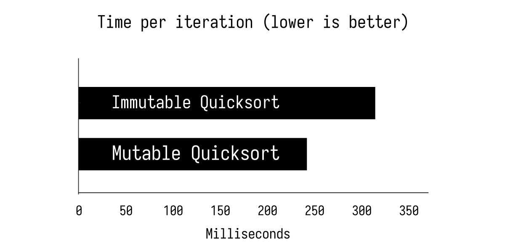

+++
title = "Mixing Programming Paradigms in Rust"
date = 2023-11-12
template = "article.html"
draft = true
[extra]
series = "Idiomatic Rust"
reviews = [ { link = "https://www.hannobraun.com/", name = "Hanno Braun" } ]
+++

Rust is a multi-paradigm programming language, accommodating imperative,
object-oriented, and functional programming styles. The choice of style often
hinges on a developer's background and the specific problem they're addressing.

With Rust attracting developers from varied backgrounds like C++, Java, Python,
and Haskell, it has shaped its own unique set of styles and idioms. This
diversity is a strength, but it can also spark a question: 
*How do I decide which programming paradigm to use when?*

As the [Rust Book explains](https://doc.rust-lang.org/book/ch17-00-oop.html):
> Many competing definitions describe what Object-Oriented Programming
> is, and by some of these definitions Rust is object-oriented.

Rust is certainly influenced by object-oriented programming concepts.
One factor that sets it apart from other object-oriented languages is that it
is composition based as opposed to inheritance based. Its trait system is

It is not a pure functional programming language either, because it permits
side effects everywhere, and doesn't strictly enforce [referential
transparency](https://en.wikipedia.org/wiki/Referential_transparency) (the
ability to replace an expression with its value without changing the program's
behavior).

That said, Rust's design encourages patterns that align closely with functional
programming principles: immutability, iterator patterns, algebraic data types,
and pattern matching, so some guidance around the use of functional patterns can
be helpful for developers coming from other languages. This article delves into
some of the functional aspects of Rust.
It is *not* meant as a full reference, but rather as a starting point for
demonstrating how to craft clean and efficient code that combines different
paradigms.

> No matter what language you work in, programming in a functional style provides
> benefits. You should do it whenever it is convenient, and you should think hard
> about the decision when it isn't convenient. &mdash; [John Carmack](https://www.gamasutra.com/view/news/169296/Indepth_Functional_programming_in_C.php)

## Starting Small

There is nothing wrong with simple `for` loops in Rust.

```rust
let mut sum = 0;
for i in 0..10 {
    sum += i;
}
```

But even in this short example, we can see a discrepancy between the problem
we're trying to solve and the code we're writing:
The intermediate values of `sum` are irrelevant! We only care about the final
value.

Compare that to the more functional version:

```rust
let sum: u32 = (0..10).sum();
```

Both approaches allow the compiler to optimize the code and compute the sum
during compilation, making the solutions effectively the same. However, I have
observed that many experienced Rust developers lean towards the functional
style, even in straightforward scenarios.

In small examples like this, it might not matter much, but when we start working
with nested loops, we see that in the imperative approach, more lines are
dedicated to bookkeeping than to the actual problem. This causes the code's
accidental complexity to rise quickly.

## Nested Loops And Bookkeeping

Let's consider a slightly bigger example. Imagine you had a list of programming
languages, their supported paradigms, and the number of production users for
each language. The task is to find the top five languages that support
functional programming and have the most users.

```rust
// All data is made up for the sake of this example! We love you, Haskell.
let languages = vec![
    Language::new("Rust", vec![Paradigm::Functional, Paradigm::ObjectOriented], 100_000),
    Language::new("Go", vec![Paradigm::ObjectOriented], 200_000),
    Language::new("Haskell", vec![Paradigm::Functional], 5_000),
    Language::new("Java", vec![Paradigm::ObjectOriented], 1_000_000),
    Language::new("C++", vec![Paradigm::ObjectOriented], 1_000_000),
    Language::new("Python", vec![Paradigm::ObjectOriented, Paradigm::Functional], 1_000_000),
];
```

Here is a *painfully* explicit solution using nested `for` loops:


```rust
// Filter languages to keep only the functional ones
let mut functional_languages = vec![];
for language in languages {
    if language.paradigms.contains(&Paradigm::Functional) {
        functional_languages.push(language);
    }
}

// Sort the functional languages by the number of users in descending order
for i in 1..functional_languages.len() {
    let mut j = i;
    while j > 0 && functional_languages[j].users > functional_languages[j - 1].users {
        functional_languages.swap(j, j - 1);
        j -= 1;
    }
}

// Keep only the top 5 languages
while functional_languages.len() > 5 {
    functional_languages.pop();
}
```

([Rust Playground](https://play.rust-lang.org/?version=stable&mode=debug&edition=2021&gist=d7c7bb1438a5dfb54c4b624a031f6fa6))

This is a *very verbose*, imperative solution. We mutate the vector in-place and
destroy the intermediate results in the process. While it's not incorrect, I
would argue that it's not the most idiomatic Rust code either.

In practice, you would probably reach for a few more helper methods from the
standard library:

```rust
let mut top_languages = vec![];
for language in languages {
    if language.paradigms.contains(&Paradigm::Functional) {
        top_languages.push(language);
    }
}

// Sort our languages in descending order of popularity.
// This line is already somewhat functional in nature.
top_languages.sort_by_key(|lang| std::cmp::Reverse(lang.users));

top_languages.truncate(5);
```

([Rust Playground](https://play.rust-lang.org/?version=stable&mode=debug&edition=2021&gist=f9b28b96acde1f9d11e8dd5957539826))

That's more concise already, but it still requires a
mutable variable to keep track of the intermediate result.
Now compare that to a more functional approach:

```rust
let mut top_languages = languages.clone();
top_languages.sort();

let top_languages: Vec<Language> = top_languages
    .into_iter()
    // Only keep functional languages
    .filter(|language| language.paradigms.contains(&Paradigm::Functional))
    // Keep only the top 5 languages
    .take(5)
    // Collect the results into a vector
    .collect();
```

Or, if external crates are allowed, we could use `sorted_by_key` from [`itertools`](https://docs.rs/itertools/latest/itertools/trait.Itertools.html#method.sorted_by) to chain all intermediate operations:

```rust
let top_languages: Vec<Language> = languages
    .iter()
    // Only keep functional languages
    .filter(|language| language.paradigms.contains(&Paradigm::Functional))
    // Sort our languages in descending order of popularity.
    .sorted_by_key(|lang| Reverse(lang.users))
    // Keep only the top 5 languages
    .take(5)
    // Collect the results into a new vector
    .collect();
```

([Rust Playground](https://play.rust-lang.org/?version=stable&mode=debug&edition=2021&gist=8c1d45de856b6a7980ea48ebeaf43290))

To me, this solution is easier to read and understand. I do admit, however, that
it takes some getting used to, especially if you're not familiar with functional
programming patterns.

One could say that I hand-picked a problem that is well-suited for functional
programming and that is certainly the case. The truth is, that this way of
method chaining will feel natural after a while &mdash; especially for data
transformations.

There are a few reasons for this:

* **Readability**: The steps are neatly aligned below each other.
* **Immutability**: The Rust standard library provides many helpful combinators for iterators,
  which play nicely with immutable data structures.
* **Efficiency**: Under the hood, methods like `map` and `filter` create new 
  iterators that operate on the previous iterator and do not incur any allocations.
  The actual computations (like adding 1 or filtering even numbers) are only 
  executed when the final iterator is consumed, in this case by
  the `collect` method. The `collect` method makes a single allocation to store the
  results in a new vector. Our higher-level abstractions incur no runtime
  overhead.
* **Parallelism**: The functional approach makes it easy to parallelize the
  computation in the future with [`rayon`](https://github.com/rayon-rs/rayon).

The result is clean, readable, and efficient code, which is why you'll see this
pattern a lot. 

## Quicksort

As we established before, Rust is not a pure functional programming language,
but it is still possible to leverage most of the benefits of functional
programming in Rust.

Entire (useful!) algorithms can be written in a functional style and without a
single `mut` keyword in Rust. To illustrate the differences, we can compare
quicksort implementations both with and without mutation.

Quicksort is a sorting algorithm that works by recursively partitioning an array
around a pivot element (the "comparison" element), which gets arbitrarily chosen.
Elements smaller than the pivot are moved to the left of the pivot and elements
larger than the pivot are moved to the right of the pivot. This is repeated
until the array is sorted.


### Imperative Quicksort

Here is a typical quicksort implementation, which mutates its input:

```rust
pub fn quicksort<T: PartialOrd>(mut arr: Vec<T>) -> Vec<T> {
    if arr.len() <= 1 {
        return arr;
    }

    let pivot = arr.remove(0);
    let mut left = vec![];
    let mut right = vec![];

    for item in arr {
        if item <= pivot {
            left.push(item);
        } else {
            right.push(item);
        }
    }

    let mut sorted_left = quicksort(left);
    let mut sorted_right = quicksort(right);

    sorted_left.push(pivot);
    sorted_left.append(&mut sorted_right);

    sorted_left
}
```

Since the algorithm mutates the original array, the program's state changes
throughout its execution, which demands a lot of mental gymnastics from the reader.

Based on your experience, this code may seem either clear and simple, or it
might look like a clown on a unicycle navigating a minefield: overly risky and
somewhat perplexing.

Nonetheless, it is completely okay to write a quicksort implementation like that.
It's a very direct translation of what the algorithm **does** on a lower level,
which is what I was used to from other languages.

### Functional Quicksort

Here is a more functional version which doesn't require mutation at all:

```rust
pub fn quicksort<T: PartialOrd + Clone>(array: &[T]) -> Vec<T> {
    if array.len() <= 1 {
        return array.to_vec();
    }

    let pivot = &array[0];
    let (higher, lower): (Vec<_>, Vec<_>) = array[1..]
        .iter()
        .cloned()
        .partition(|x| x > pivot);

    [
        quicksort(&lower),
        vec![pivot.clone()],
        quicksort(&higher),
    ]
    .concat()
}
```

It looks a lot more like what you'd expect from a functional programming
language. In fact, the first time I encountered this version was in a great book about
Haskell, titled [Learn You a Haskell for Great Good!](http://learnyouahaskell.com/recursion).

Cynics will rightfully point out that this variant is not true quicksort
implementation, [because it is not in-place](https://www.informit.com/articles/article.aspx?p=1407357&seqNum=3).

The point I'm trying to make is that this version is a lot easier to *reason*
about: I don't have to chase mutations of variables throughout the code or worry
about indices and loops. Less code to understand means less room for bugs.

Coincidentally, it is also the version that is closer to
what the algorithm **does** on a higher level. It's a direct translation of the
algorithm's description:

1. If the array is empty or has only one element, it is already sorted.
2. Otherwise, pick the first element as the pivot.
3. Create two new arrays: One with all elements smaller than the pivot and one
   with all elements larger than the pivot.
4. Recursively sort the two new arrays and concatenate them with the pivot in
   the middle.

It is a very literal translation of the algorithm into code.
As such, there is an inherent beauty to this version.

### Performance Comparison

Maybe the functional version made you a little uneasy. After all, we clone the
entire array in every recursive call. That's a lot of copying!
Isn't that inefficient?

In general, this is a valid concern. Before we completely dismiss the functional
approach however, we should carefully consider the trade-offs.

You might be wondering:
Just how much slower is the immutable version compared to the mutable one?

To test this, I created a quick [benchmark](https://github.com/mre/quicksort_bench)
that would run both versions on a vector with 1 million random values.
Here are the results:



As you can see, the performance is about the same. Generally speaking,
functional code isn't inherently slower than its imperative counterpart. Resist
the urge to use iterative style purely for performance reasons. Instead, give
Rust the chance to optimize the code for you. 

[Haskell has a tendency to look unfamiliar real quick if you try to maximize
performance.](https://softwareengineering.stackexchange.com/a/131860).
In contrast to that, Rust demonstrates more uniformity in this aspect, even when
optimized for performance. In Rust, readable code is often fast code.

An thanks to the powerful compiler, Rust's functional abstractions incur no
runtime performance cost, maintaining efficiency on par with hand-written code.
The generated code might look very similar to the imperative version.

One other, commonly lauded, benefit of functional programming is that it makes
parallelization easier. In the case of the above example, we could use the
`rayon` crate to convert the sequential computation into a parallel one.

In fact, they show a [parallel quicksort implementation in their
documentation](https://docs.rs/rayon/latest/rayon/fn.join.html):

```rust
fn quick_sort<T:PartialOrd+Send>(v: &mut [T]) {
   if v.len() > 1 {
       let mid = partition(v);
       let (lo, hi) = v.split_at_mut(mid);
       rayon::join(|| quick_sort(lo),
                   || quick_sort(hi));
   }
}

// Partition rearranges all items `<=` to the pivot
// item (arbitrary selected to be the last item in the slice)
// to the first half of the slice. It then returns the
// "dividing point" where the pivot is placed.
fn partition<T:PartialOrd+Send>(v: &mut [T]) -> usize {
    let pivot = v.len() - 1;
    let mut i = 0;
    for j in 0..pivot {
        if v[j] <= v[pivot] {
            v.swap(i, j);
            i += 1;
        }
    }
    v.swap(i, pivot);
    i
}
```

Notice how the first part looks eerily similar to the functional version above,
but now it's parallel! The `rayon::join` method takes two closures and executes
them at the same time.

The `partition` function is a bit more imperative. It mutates the input array
in-place. However, we did not have to come up with from the beginning, but
only after we decided to parallelize the algorithm. We were able to
start with the functional version and then optimize it for parallel execution later.
It is one of the big advantages of functional programming: it's easier than mutable, imperative code
to make faster if needed.

## Real-World Example: Filtering a List of Files

How often do you really implement a sorting algorithm?
It's a nice exercise, but for any real-world application, you'd probably use the
standard library's `sort` method.

Functional paradigms are useful beyond synthetic examples and algorithms, though.
I like to use them a lot for data transformations. That is, the input and the output
are both data structures, and the function converts between them.

Take this example: find all XML files in a directory and return their names.
Before you continue, try to implement this yourself. See which style you would
naturally gravitate towards.

### Imperative Style

Here is an imperative solution:

```rust
fn xml_files(p: &Path) -> Result<Vec<PathBuf>> {
    let mut files = Vec::new();
    for f in fs::read_dir(p)? {
        // This line is necessary, because the file could have
        // been deleted between the call to read_dir and here
        let f = f?;
        if f.path().extension().and_then(OsStr::to_str) == Some("xml") {
            files.push(f.path());
        }
    }
    Ok(files)
}
```

It's not bad, but it's a bit noisy. We have to do some bookkeeping,
and there are some minor papercuts like `let f = f?;` and the bit about
`OsStr::to_str`. This is due to the inherent complexity of the problem:
We have to deal with the possibility of errors and the fact that the file
extension might not be valid UTF-8 on all platforms.

As the [documentation for `OsStr`](https://doc.rust-lang.org/std/ffi/struct.OsString.html) explains:

* On Unix systems, strings are often arbitrary sequences of non-zero bytes, in
  many cases interpreted as UTF-8.
* On Windows, strings are often arbitrary sequences of non-zero 16-bit values,
  interpreted as UTF-16 when it is valid to do so.

The version above is still relatively readable, and maintainable, but it's not
too *pretty*.

### Functional Style

Let's see how we can solve this problem in a more functional style:

```rust
fn xml_files(p: &Path) -> Result<Vec<PathBuf>> {
    Ok(fs::read_dir(p)?
        .filter_map(Result::ok)
        .map(|entry| entry.path())
        .filter(|path| path.extension() == Some(OsStr::new("xml")))
        .collect())
}
```

It's again a matter of taste, but I find this version a lot more readable.
We map an entry to its path, filter out all non-XML files, and collect the
results into a vector. No more temporary `mut` variable, and no conditional
branching.

That said, the solution also has its drawbacks. The `filter_map(Result::ok)`
method stands out as a sore thumb. We use it to filter out all errors, which is
a common pattern in Rust. In production code, we would probably propagate the
errors to the caller.

So far, I would still prefer the functional version, but I could see how the
scale might tip towards the imperative version at this point.

### Making Filtering More Generic

Let's take this a step further: what if we wanted to filter for arbitrary file
conditions? For instance, we might want to find all files with a given prefix
or any given extension.
We could introduce a new parameter, `valid`, which would be a function that
takes a `Path` and returns a `bool`. (This is also sometimes called a predicate in
functional world.)

```rust
fn filter_files<F>(p: &Path, valid: &F) -> Result<Vec<PathBuf>>
where
    F: Fn(&Path) -> bool,
{
    Ok(fs::read_dir(p)?
        .filter_map(Result::ok)
        .map(|entry| entry.path())
        .filter(|path| valid(path))
        .collect())
}
```

This is a very generic function that can be used for many different use cases.
Higher-order functions like this are a typical pattern in functional programming
and are also available in Rust.

The imperative version looks quite similar:

```rust
fn filter_files(p: &Path, valid: &impl Fn(&Path) -> bool) -> Result<Vec<PathBuf>> {
    let mut files = Vec::new();
    for f in fs::read_dir(p)? {
        let f = f?;
        if valid(&f.path()) {
            files.push(f.path());
        }
    }
    Ok(files)
}
```

I would still gravitate towards the functional version here, because it is a bit
more concise, but so far there is no clear winner.

### Recursively Filtering Directories For Files

Let's go one more step further.

So far, our solutions only work for a single directory. What if we wanted to
*recursively* filter a directory and all its subdirectories for files?

First, the imperative version:

```rust
fn filter_files<F>(p: &Path, valid: &F) -> Result<Vec<PathBuf>>
where
    F: Fn(&Path) -> bool,
{
    let mut files = Vec::new();
    for f in fs::read_dir(p)? {
        let f = f?;
        if f.path().is_dir() {
            files.extend(filter_files(&f.path(), valid)?);
        } else if valid(&f.path()) {
            files.push(f.path());
        }
    }
    Ok(files)
}
```

The inherent complexity of the problem is starting to show. We have one more level of
nesting. Still, the imperative version holds up reasonably well.

Now, the functional version:

```rust
fn filter_files<F>(p: &Path, valid: &F) -> Result<Vec<PathBuf>>
where
    F: Fn(&Path) -> bool,
{
    Ok(fs::read_dir(p)?
        .filter_map(Result::ok)
        .flat_map(|entry| {
            let path = entry.path();
            if path.is_dir() {
                filter_files(&path, valid).unwrap_or_else(|_| Vec::new())
            } else if valid(&path) {
                vec![path]
            } else {
                Vec::new()
            }
        })
        .collect::<Vec<PathBuf>>())
}
```

We're dealing with an iterator of iterators here, so we need to flatten it to
get a single iterator of paths. We use `flat_map` for that, to flatten the
nested structure. However, this also means that we need to return a vector of
paths in all cases, even if it's empty. Not so pretty.
The `unwrap_or_else` is another, unrelated, wart.

This is usually the point where I would look for more structure in the code.
We can easily transition to a more object-oriented style here and create
a nice symbiosis between different paradigms.

### "Hybrid" Style

Let's create a struct that encapsulates the filtering logic:


## Pure Functional Programming

What if you wanted to go all-in on functional programming?

It can be helpful to strive for a pure functional style &mdash; especially when dealing
with data transformations. Chances are, it will help make your code more
understandable. For example, you could only look at a function's signature and
know exactly what it does:

```rust
fn split_even(numbers: &[u32]) -> (Vec<u32>, Vec<u32>)
```

or, in the case of our file filtering example:

```rust
fn filter_files(p: &Path, valid: &impl Fn(&Path) -> bool) -> Result<Vec<PathBuf>>
```

It's all in the signature!
This does not always work, but it can be a helpful rule of thumb. Give this
approach a try and see if it works for you. Perhaps you'll find that your code
gets easier to test as well.


## Summary

Rust is a multi-paradigm language. Mixing object-oriented programming and
functional programming is not only possible, but encouraged. The question is
where to draw the line between different programming paradigms.

Here are my personal rules of thumb:

* **Leverage functional patterns for data transformations.** Especially within
  smaller scopes like functions and closures, functional methods such as
  mapping, filtering, or reducing can make your code both concise and clear.
* **Embrace Object-oriented patterns for organization .** For organizing larger
  applications, consider object-oriented constructs. Using structs or
  enums can encapsulate related data and functions, providing a clear structure.
* **Use imperative style for granular control.** In scenarios where you're
  working close to the hardware, or when you need explicit step-by-step
  execution, the imperative style is often a necessity. It allows for precise
  control over operations, especially with mutable data. This style can be
  particularly useful in performance-critical sections or when interfacing with
  external systems where exact sequencing matters. However, always weigh its
  performance gains against potential readability trade-offs. If possible,
  encapsulate imperative code within a limited scope.
* **Prioritize readability and maintainability.** Regardless of your chosen
  paradigm, always write code that's straightforward and easy to maintain. It
  benefits not only your future self but also your colleagues who might work on
  the same codebase.

Lastly, avoid bias towards any particular paradigm. Don't prematurely
optimize for performance at the cost of readability. The real bottleneck 
might be elsewhere. Measure first, then optimize.
It's not unusual for the most elegant solution to also be the fastest.
