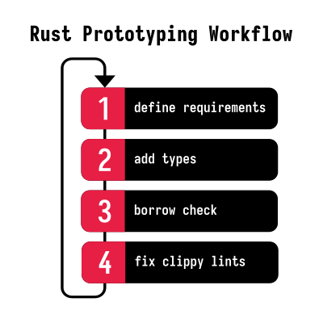
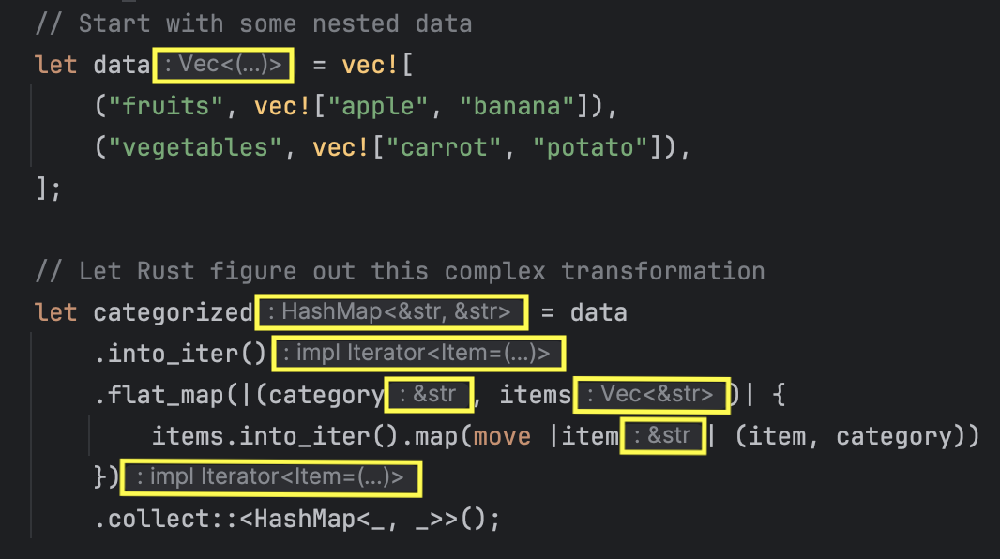
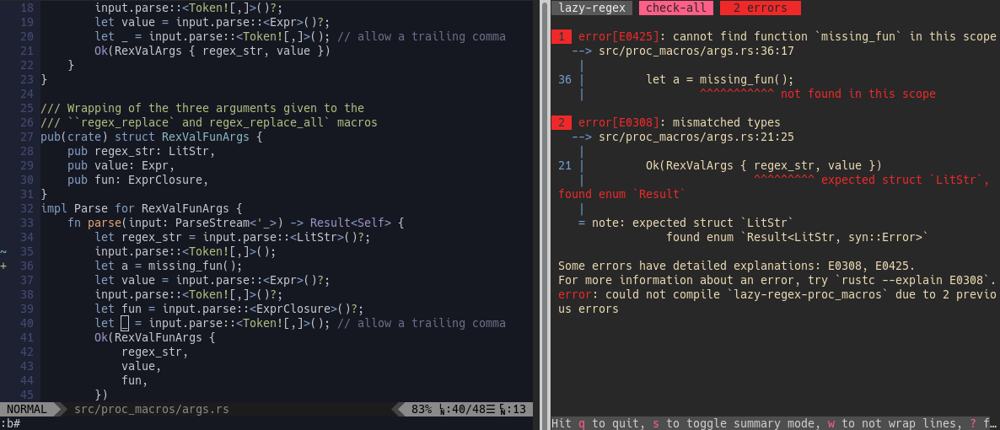

+++
title = "Prototyping in Rust"
date = 2024-12-03
draft = false
template = "article.html"
[extra]
# hero = "hero.svg"
series = "Idiomatic Rust"
resources = [
    "[Throw away code - Vorner's blog](https://vorner.github.io/2020/09/20/throw-away-code.html)",
    "[RustConf 2021 - The Importance of Not Over-Optimizing in Rust by Lily Mara](https://www.youtube.com/watch?v=CV5CjUlcqsw)",
    "[Rust Nation UK - Easy Mode Rust by Andre Bogus](https://www.youtube.com/watch?v=33FG6O3qejM)",
]
reviews = [
    { name = "Theodor-Alexandru Irimia", url = "https://github.com/tirimia" },
]
+++

Programming is an iterative process - as much as we like to come up with the perfect solution from the start, it rarely works that way.

Whether you're writing games, CLI tools, or designing library APIs, prototyping helps tremendously in finding the best approach before committing to a design.
It helps reveal the patterns behind more idiomatic code.

Contrary to popular belief, Rust is a joy for building prototypes.

For all its explicitness, Rust is surprisingly ergonomic when iterating on ideas.

You don't need to be a Rust expert to be productive - in fact, many of the techniques we'll discuss specifically help you *sidestep* Rust's more advanced features.
If you focus on simple patterns and make use of Rust's excellent tooling, even less experienced Rust developers can quickly bring their ideas to life.

## Why People Think Rust Is Not Good For Prototyping

The common narrative goes like this:

> When you start writing a program, you don't know what you want and you change your mind pretty often.
> Rust pushes back when you change your mind because the type system is very strict.
> On top of that, getting your idea to compile takes longer than in other languages, so the feedback loop is slower.

That's why people believe that Rust isn't a good fit for prototyping.

I've found that developers from other languages and Rust beginners often share this preconception about Rust.
These developers stumble over the strict type system and the borrow checker while trying to sketch out a solution.
They believe that with Rust you're either at 0% or 100% done (everything works and has no undefined behavior) and there's nothing in between.

Here are some typical misbeliefs: 

1. "Memory safety and prototyping just don't go together."
2. "Ownership and borrowing take out the fun of prototyping."
3. "You have to get all the details right from the beginning."
4. "Rust always requires you to handle errors."

These are all [common misconceptions](https://medium.com/@victor.ronin/love-hate-relationship-with-rust-language-part-2-c36f57d5485d) and they are not true. 

**It turns out you can avoid all of these pitfalls and still get a lot of value from prototyping in Rust.**

## What Makes Rust Great for Prototyping?

### Solid Foundation From The Beginning

In an ideal world, you'd have plenty of time to perfect your code, but in reality, deadlines are tight and you have to make compromises.

Eventually management will say "ship it" and you'll have to live with the code you wrote.
If that's the case, a rewrite is often not an option.

Rust allows you to have a solid foundation from the start.
Even the first version is often good enough for production.

### Strong Safety Guarantees 

Rust allows you to avoid many pitfalls by being very explicit about error conditions, but also by providing escape hatches in case you choose to ignore them for a while.
This saves you a lot of time hunting down bugs later on.

### Single Language for Everything

To me, it's super nice to have a single language I know well and can use for all stages of a project. 
A language that I can learn and understand all the way down to the implementation of the standard library itself (simply by reading to the source code).
Other languages are often written in C/C++, and it's hard to understand what's going on under the hood.

### Great Teaching Tool

I prototype in Rust frequently when I need to explain systems-level concepts to clients or sketch out a prototype for a new project of my own.
It's a great way to test my assumptions before I invest too much time in a flawed design. 

## Problems with Prototyping in Other Languages

If you're happy with a scripting language like Python, why bother with Rust?

That's a fair question!
After all, Python is known for its quick feedback loop and dynamic type system, and you can always rewrite the code in Rust later.

Yes, Python is a great choice for prototyping.
But I've been a Python developer for a long time, and I find that I very quickly grow out of the "prototype" phase – which is when the language falls apart for me.

One thing I found particularly challenging in Python was hardening my prototype into a robust, production-ready codebase.
I've found that the really hard bugs in Python are often type-related: deep down in your call chain, the program crashes because you passed the wrong type to a function. 
Because of that, I find myself wanting to switch to something more robust as soon as my prototype starts to take shape. 

The problem is that switching languages mid-project is a *huge* undertaking.
Maybe you'll have to maintain two codebases simultaneously for a while.
On top of that, Rust follows different idioms than Python, so you might have to rethink the software architecture.
And to make matters worse, you have to change build systems, testing frameworks, and deployment pipelines as well.

Wouldn't it be nice if you could use a single language for prototyping and production?

## What A Solid Rust Prototyping Workflow Looks Like

If you start with Rust, you get a lot of benefits out of the box:

1. A robust codebase right from the start
2. Strong type system that catches errors early and helps with refactoring
3. Built-in linting (rustc and [clippy]) to gradually improve code quality
4. The ability to ship prototypes for early feedback

[clippy]: https://doc.rust-lang.org/clippy/

All without having to change languages mid-project!
It saves you the context switch between languages once you're done with the prototype.



Python has a few good traits that we can learn from:

- fast feedback loop
- changing your mind is easy
- it's simple to use if you ignore the edge cases
- there is very little boilerplate
- it's easy to experiment and refactor
- you can do something useful in just a few lines
- no compilation step 

The goal is to get as close to that experience in Rust as possible while staying true to Rust's core principles.
Let's make changes quick and painless and rapidly iterate on your design without painting ourselves into a corner.

## Tips And Tricks For Prototyping In Rust

### Start small

There's some overlap between prototyping and "[easy Rust](https://www.youtube.com/watch?v=33FG6O3qejM)."

Allow yourself to ignore some of the best practices for production code for a while.

It's possible, but you need to switch off your inner critic who always wants to write perfect code from the beginning.
Rust enables you to comfortably defer perfection.
You can make the rough edges obvious so that you can sort them out later.
Don't let perfect be the enemy of good.

One of the biggest mistakes I observe is an engineer's perfectionist instinct to jump on minor details which don't have a broad enough impact to warrant the effort.
It's better to have a working prototype with a few rough edges than a perfect implementation of a small part of the system.

Remember: you are exploring!
Use a coarse brush to paint the landscape first.
Try to get into a flow state where you can quickly iterate.
Don't get distracted by the details too early.
During this phase, it's also fine to throw away a lot failed attempts. 

### Use Simple Types

Even while prototyping, the type system is not going away.
There are ways to make this a blessing rather than a curse.

Use simple types like `i32`, `String`, `Vec` in the beginning.
We can always make things more complex later if we have to -- the reverse is much harder.

Here's a quick reference for common prototype-to-production type transitions:

| Prototype        | Production          | When to switch                                                                     |
| ---------------- | ------------------- | ---------------------------------------------------------------------------------- |
| `String`         | `&str`              | When you need to avoid allocations or store string data with a clear lifetime      |
| `Vec<T>`         | `&[T]`              | When the owned vector becomes too expensive to clone or you can't afford the heap  |
| `Box<T>`         | `&T` or `&mut T`    | When `Box` becomes a bottleneck or you don't want to deal with heap allocations    | 
| `Rc<T>`          | `&T`                | When the reference counting overhead becomes too expensive or you need mutability  | 
| `Arc<Mutex<T>>`  | `&mut T`            | When you can guarantee exclusive access and don't need thread safety               |

These owned types sidestep most ownership and lifetime issues, but they do it by allocating memory on the heap - just like Python or JavaScript would.

You can always refactor when you actually need the performance or tighter resource usage, but chances are you won't.

### Make use of type inference

Rust is a statically, strongly typed language.
It would be a deal-breaker to write out all the types all the time if it weren't for Rust's type inference.

You can often omit (also called "elide") the types and let the compiler figure it out from the context.

```rust
let x = 42;
let y = "hello";
let z = vec![1, 2, 3];
```

This is a great way to get started quickly and defer the decision about types to later.
The system scales well with more complex types, so you can use this technique even in larger projects.

```rust
let x: Vec<i32> = vec![1, 2, 3];
let y: Vec<i32> = vec![4, 5, 6];

// Rust can infer the item type of z
let z = x.iter().chain(y.iter()).collect::<Vec<_>>();
```

Here's a more complex example which shows just how powerful Rust's type inference can be: 

```rust
use std::collections::HashMap;

// Start with some nested data
let data = vec![
    ("fruits", vec!["apple", "banana"]),
    ("vegetables", vec!["carrot", "potato"]),
];

// Let Rust figure out this complex transformation
let categorized = data
    .into_iter()
    .flat_map(|(category, items)| {
        items.into_iter().map(move |item| (item, category))
    })
    .collect::<HashMap<_, _>>();

// categorized is now a HashMap<&str, &str> mapping items to their categories
println!("What type is banana? {}", categorized.get("banana").unwrap());
```

([Playground](https://play.rust-lang.org/?version=stable&mode=debug&edition=2021&gist=fac339eecef40b69b919a1670a0a53df))

It's not easy to visualize the structure of `categorized` in your head, but Rust can figure it out. 

### Use A Good IDE

There is great IDE support for Rust.

IDEs can help you with code completion and refactoring, which keep you in the flow and help you write code faster.
Autocompletion is so much better with Rust than with dynamic languages because the type system gives the IDE a lot more information to work with.

As a corollary to the previous section, be sure to use enable inlay hints (or inline type hints) in your editor.
This way, you can quickly see the inferred types right inside your IDE and make sure the types match your expectations.
There's support for this in most Rust IDEs, including [RustRover](https://www.jetbrains.com/help/rust/viewing-reference-information.html#inlay-hints) and [Visual Studio Code](https://code.visualstudio.com/docs/typescript/typescript-editing#_inlay-hints).



### Use the Rust Playground

You probably already know about the [Rust Playground](https://play.rust-lang.org).
The playground doesn't support auto-complete, but it's still great when you're on the go or you'd like to share your code with others. 

I find it quite useful for quickly jotting down a bunch of functions or types to test out a design idea. 

### Use `unwrap` Liberally

It's okay to use `unwrap` in the early stages of your project.
An explicit `unwrap` is like a stop sign that tells you "here's something you need to fix later."
You can easily grep for `unwrap` and replace it with proper error handling later when you polish your code.
This way, you get the best of both worlds: quick iteration cycles and a clear path to robust error handling.

```rust
use std::fs;
use std::path::PathBuf;

fn main() {
    // Quick and dirty path handling during prototyping
    let home = std::env::var("HOME").unwrap();
    let config_path = PathBuf::from(home).join(".config").join("myapp");
    
    // Create config directory if it doesn't exist
    fs::create_dir_all(&config_path).unwrap();
    
    // Read the config file, defaulting to empty string if it doesn't exist
    let config_file = config_path.join("config.json");
    let config_content = fs::read_to_string(&config_file)
        .unwrap_or_default();
    
    // Parse the JSON config
    let config: serde_json::Value = if !config_content.is_empty() {
        serde_json::from_str(&config_content).unwrap()
    } else {
        serde_json::json!({})
    };
    
    println!("Loaded config: {:?}", config);
}
```

See all those unwraps?
To more experienced Rustaceans, they stand out like a sore thumb -- and that's a good thing!

Compare that to languages like JavaScript which can throw exceptions your way at any time.
It's much harder to ensure that you handle all the edge-cases correctly.
At the very least, it costs time. Time you could spend on more important things.

While prototyping with Rust, you can safely ignore error handling and focus on
the happy path without losing track of improvement areas. 

### Use `bacon` for quick feedback cycles

Rust is not a scripting language; there is a compile step!

However, for small projects, the compile times are negligible.
Unfortunately, you have to manually run `cargo check` every time you make a change 
or use [rust-analyzer](https://rust-analyzer.github.io/) in your editor to get instant feedback.

To fill the gap, you can use external tools like [`bacon`](https://github.com/Canop/bacon) which automatically recompiles and runs your code whenever you make a change.
This way, you can get *almost* the same experience as with a REPL in, say, Python or Ruby.

The setup is simple:

```sh
# Install bacon
cargo install --locked bacon

# Run bacon in your project directory
bacon
```

And just like that, you can get some pretty compilation output alongside your code editor.



Oh, and in case you were wondering, `cargo-watch` was another popular tool for
this purpose, but it's since been [deprecated](https://github.com/watchexec/cargo-watch#maintenance).

### `cargo-script` is awesome

Did you know that cargo can also run scripts?

For example, put this into a file called `script.rs`:

```rust
#!/usr/bin/env cargo +nightly -Zscript

fn main() {
    println!("Hello prototyping world");
}
```

Now you can make the file executable with `chmod +x script.rs` and run it with `./script.rs` which it will compile and execute your code!
This allows you to quickly test out ideas without having to create a new project.
There is support for dependencies as well.

At the moment, `cargo-script` is a nightly feature, but it will be released soon on stable Rust.
You can read more about it in the [RFC](https://rust-lang.github.io/rfcs/3424-cargo-script.html).

### Don't Worry About Performance

You have to try really really hard to write slow code in Rust.
Use that to your advantage: during the prototype phase, try to keep the code as simple as possible.

I gave a talk titled ["The Four Horsemen of Bad Rust Code"](https://github.com/corrode/four-horsemen-talk) where I
argue that premature optimization is one of the biggest sins in Rust. 

Especially experienced developers coming from C or C++ are tempted to optimize too early.

Rust makes code perform well by default - you get memory safety at virtually zero runtime cost. When developers try to optimize too early, they often run up against the borrow checker by using complex lifetime annotations and intricate reference patterns in pursuit of better performance.
This leads to harder-to-maintain code that may not actually run faster.

Resist the urge to optimize too early!
You will thank yourself later. [^1]

[^1]: In the talk, I show an example where early over-optimization led to the wrong abstraction and made the code slower. The actual bottleneck was elsewhere and hard to uncover without profiling.

### Use `println!` and `dbg!` for debugging 

I find that printing values is pretty handy while prototyping.
It's one less context switch to make compared to starting a debugger.

Most people use `println!` for that, but [`dbg!`](https://doc.rust-lang.org/std/macro.dbg.html) has a few advantages:

- It prints the file name and line number where the macro is called. This helps you quickly find the source of the output.
- It outputs the expression as well as its value.
- It's less syntax-heavy than `println!`; e.g. `dbg!(x)` vs. `println!("{x:?}")`.
- It's only active in debug builds, so it has no performance impact for releases. 

Where `dbg!` really shines is in recursive functions or when you want to see the intermediate values during an iteration:

```rust
fn factorial(n: u32) -> u32 {
    // `dbg!` returns the argument, 
    // so you can use it in the middle of an expression
    if dbg!(n <= 1) {
        dbg!(1)
    } else {
        dbg!(n * factorial(n - 1))
    }
}

dbg!(factorial(4));
```

The output is nice and tidy:

```rust
[src/main.rs:2:8] n <= 1 = false
[src/main.rs:2:8] n <= 1 = false
[src/main.rs:2:8] n <= 1 = false
[src/main.rs:2:8] n <= 1 = true
[src/main.rs:3:9] 1 = 1
[src/main.rs:7:9] n * factorial(n - 1) = 2
[src/main.rs:7:9] n * factorial(n - 1) = 6
[src/main.rs:7:9] n * factorial(n - 1) = 24
[src/main.rs:9:1] factorial(4) = 24
```

If you're interested, here are [more details on how to use that handy `dbg!` macro](https://edgarluque.com/blog/rust-dbg-macro/).

### Design Through Types

Quite frankly, the type system is one of the main reasons I love Rust.
It feels great to express my ideas in types and see them come to life.
I would encourage you to heavily lean into the type system during the prototyping phase.

In the beginning, you won't have a good idea of the types in your system.
That's fine!
Start with *something* and quickly sketch out solutions and gradually add constraints to model the business requirements.
Don't stop until you find a version that feels just right.
You know you've found a good abstraction when your types "click" with the rest of the code. [^2]
Try to build up a vocabulary of concepts and own types which describe your system. 

[^2]: I usually know when I found a good abstraction once I can use all of Rust's features like expression-oriented programming and pattern matching together with my own types.

Wrestling with Rust's type system might feel slower at first compared to more dynamic languages, but it often leads to fewer iterations overall.
Think of it this way: in a language like Python, each iteration might be quicker since you can skip type definitions, but you'll likely need more iterations as you discover edge cases and invariants that weren't immediately obvious.
In Rust, the type system forces you to think through these relationships up front. Although each iteration takes longer, you typically need fewer of them to arrive at a robust solution.

This is exactly what we'll see in the following example.

Say you're modeling course enrollments in a student system. You might start with something simple:

```rust
struct Enrollment {
    student: StudentId,
    course: CourseId,
    is_enrolled: bool,
}
```

But then requirements come in: some courses are very popular.
More students want to enroll than there are spots available,
so the school decides to add a waitlist.

Easy, let's just add another boolean flag!

```rust
struct Enrollment {
    student: StudentId,
    course: CourseId,
    is_enrolled: bool,
    is_waitlisted: bool, // 🚩 uh oh
}
```

The problem is that both boolean flags could be set to `true`!
This design allows invalid states where a student could be both enrolled and waitlisted.

Think for a second how we could leverage Rust's type system to make this impossible...

Here's one attempt:

```rust
enum EnrollmentStatus {
    Active {
        date: DateTime<Utc>,
    },
    Waitlisted {
        position: u32,
    },
}

struct Enrollment {
    student: StudentId,
    course: CourseId,
    status: EnrollmentStatus,
}
```

Now we have a clear distinction between an active enrollment and a waitlisted enrollment.
What's better is that we encapsulate the details of each state in the enum variants.
We can never have someone on the waitlist without a position in said list.

Just think about how much more complicated this would be in a dynamic language
or a language that doesn't support tagged unions like Rust does.

In summary, iterating on your data model is the crucial part of any prototyping phase.
The result of this phase is not the code, but a *deeper understanding of the problem domain itself*.
You can harvest this knowledge to build a more robust and maintainable solution.

It turns out you can model a surprisingly large system in just a few lines of code.

So, never be afraid to play around with types and refactor your code as you go.

### The `todo!` Macro

One of the cornerstones of prototyping is that you don't have to have all the answers right away.
In Rust, I find myself reaching for the [`todo!`](https://doc.rust-lang.org/std/macro.todo.html) macro to 
express that idea.

I will just scaffold out the functions or a module and then fill in the blanks later.

```rust
// We don't know yet how to process the data
// but we're pretty certain that we need a function
// that takes a Vec<i32> and returns an i32
fn process_data(data: Vec<i32>) -> i32 {
    todo!()
}

// There exists a function that loads the data and returns a Vec<i32>
// How exactly it does that is not important right now
fn load_data() -> Vec<i32> {
    todo!()
}

fn main() {
    // Given that we have a function to load the data
    let data = load_data();
    // ... and a function to process it
    let result = process_data(data);
    // ... we can print the result
    println!("Result: {}", result);
}
```

We did not do much here, but we have a clear idea of what the program should do.
Now we can go and iterate on the design.
For example, should `process_data` take a reference to the data?
Should we create a struct to hold the data and the processing logic?
How about using an iterator instead of a vector?
Should we introduce a trait to support algorithms for processing the data?

These are all helpful questions that we can answer without having to worry about the details of the implementation. 
And yet our code is typesafe and compiles, and it is ready for refactoring. 

### Avoid Generics

Chances are, you might not know which parts of your application should be generic in the beginning.
Therefore it's better to be conservative and use concrete types instead of generics until necessary. 

So instead of writing this:

```rust
fn foo<T>(x: T) -> T {
    // ...
}
```

Write this:

```rust
fn foo(x: i32) -> i32 {
    // ...
}
```

If you need the same function for a different type, feel free to just copy and paste the function and change the type. 
This way, you avoid the trap of settling on the wrong kind of abstraction too early.
Maybe the two functions only differ by type signature for now, but they might serve a completely different purpose.
If the function is not generic from the start, it's easier to remove the duplication later. 

Only introduce generics when you see a clear pattern emerge in multiple places.

Also avoid "fancy" generic type signatures:

```rust
fn foo<T: AsRef<str>>(x: T) -> String {
    // ...
}
```

Yes, this allows you to pass in a `&str` or a `String`, but at the cost of readability. 

Just use an owned type for your first implementation:

```rust
fn foo(x: String) -> String {
    // ...
}
```

Chances are, you won't need the flexibility after all.

In summary, generics are powerful, but they can make the code harder to read and write.
Avoid them until you have a clear idea of what you're doing. 

### Avoid Lifetimes

One major blocker for rapid prototyping is Rust's ownership system.
If the compiler constantly reminds you of borrows and lifetimes it can ruin your flow. 
For example, it's cumbersome to deal with references when you're just trying to get something to work.

```rust
// First attempt with references - compiler error!
struct Note<'a> {
    title: &'a str,
    content: &'a str,
}

fn create_note() -> Note<'_> {  // ❌ lifetime error
    let title = String::from("Draft");
    let content = String::from("My first note");
    Note {
        title: &title,
        content: &content
    }
}
```

This code doesn't compile because the references are not valid outside of the function.

```rust
   Compiling playground v0.0.1 (/playground)
error[E0106]: missing lifetime specifier
 --> src/lib.rs:7:26
  |
7 | fn create_note() -> Note<'_> {  // ❌ lifetime error
  |                          ^^ expected named lifetime parameter
  |
  = help: this function's return type contains a borrowed value, but there is no value for it to be borrowed from
help: consider using the `'static` lifetime, but this is uncommon unless you're returning a borrowed value from a `const` or a `static`, or if you will only have owned values
  |
```

([Playground](https://play.rust-lang.org/?version=stable&mode=debug&edition=2021&gist=7274f20a06226316c93d9984f1d66b5f))

A simple way around that is to [avoid lifetimes altogether](/blog/lifetimes).
They are not necessary in the beginning.
Use owned types like `String` and `Vec`.
Just `.clone()` wherever you need to pass data around. 

```rust
// Much simpler with owned types
struct Note {
    title: String,
    content: String,
}

fn create_note() -> Note {  // ✓ just works
    Note {
        title: String::from("Draft"),
        content: String::from("My first note")
    }
}
```

If you have a type that you need to move between threads (i.e. it needs to be `Send`), you can use an `Arc<Mutex<T>>` to get around the borrow checker.
If you're worried about performance, remember that other languages like Python or Java do this implicitly behind your back.

```rust
use std::sync::{Arc, Mutex};
use std::thread;

let note = Arc::new(Mutex::new(Note {
    title: String::from("Draft"),
    content: String::from("My first note")
}));

let note_clone = Arc::clone(&note);
thread::spawn(move || {
    let mut note = note_clone.lock().unwrap();
    note.content.push_str(" with additions");
});
```

([Playground](https://play.rust-lang.org/?version=stable&mode=debug&edition=2021&gist=4b93a53ebc1d7ee6bc2b39c91543fba7))

If you feel like you have to use `Arc<Mutex<T>>` too often, there might be a design issue.
For example, you might be able to avoid sharing state between threads.

### Keep A Flat Hierarchy

`main.rs` is your best friend while prototyping. 

Stuff your code in there -- no need for modules or complex organization yet. This makes it easy to experiment and move things around.

#### First draft: everything in main.rs 

```rust
struct Config {
    port: u16,
}
fn load_config() -> Config {
    Config { port: 8080 }
}
struct Server {
    config: Config,
}
impl Server {
    fn new(config: Config) -> Self {
        Server { config }
    }
    fn start(&self) {
        println!("Starting server on port {}", self.config.port);
    }
}
fn main() {
    let config = load_config();
    let server = Server::new(config);
    server.start();
}
```

Once you have a better feel for your code's structure, Rust's `mod` keyword becomes a handy tool for sketching out potential organization. You can nest modules right in your main file.


#### Later: experiment with module structure in the same file

```rust
mod config {
    pub struct Config {
        pub port: u16,
    }
    pub fn load() -> Config {
        Config { port: 8080 }
    }
}

mod server {
    use crate::config;
    pub struct Server {
        config: config::Config,
    }
    impl Server {
        pub fn new(config: config::Config) -> Self {
            Server { config }
        }
        pub fn start(&self) {
            println!("Starting server on port {}", self.config.port);
        }
    }
}
```

This inline module structure lets you quickly test different organizational patterns.
You can easily move code between scopes with cut and paste, and experiment with different APIs and naming conventions.
Once a particular structure feels right, you can move modules into their own files.

The key is to keep things simple until it calls for more complexity.
Start flat, then add structure incrementally as your understanding of the problem grows.

See also [Matklad's article on large Rust workspaces](https://matklad.github.io/2021/08/22/large-rust-workspaces.html).

## Summary

The beauty of prototyping in Rust is that your "rough drafts" have the same memory safety and performance as polished code.
Even when I liberally use `unwrap()`, stick everything in `main.rs`, and reach for owned types everywhere, the resulting code 
is on-par with a Python prototype in reliability, but outperforms it easily.
This makes it perfect for experimenting with real-world workloads, even before investing time in proper error handling.

Let's see how Rust stacks up against Python for prototyping:

| Aspect                    | Python                                                                                                                             | Rust                                                                                                                      |
| ------------------------- | ---------------------------------------------------------------------------------------------------------------------------------- | ------------------------------------------------------------------------------------------------------------------------- |
| Initial Development Speed | ✓ Very quick to write initial code<br>✓ No compilation step<br>✓ Dynamic typing speeds up prototyping<br>✓ File watchers available                             | ⚠️ Slightly slower initial development<br>✓ Type inference helps<br>✓ Tools like `bacon` provide quick feedback            |
| Standard Library          | ✓ Batteries included<br>✓ Rich ecosystem                                                                                           | ❌ Smaller standard library<br>✓ Growing ecosystem of high-quality crates                                                   |
| Transition to Production  | ❌ Need extensive testing to catch type errors<br>❌ Bad performance might require extra work or rewrite in another language | ✓ Minimal changes needed beyond error handling<br>✓ Already has good performance<br>✓ Memory safety guaranteed             |
| Maintenance               | ❌ Type errors surface during runtime<br>❌ Refactoring is risky                              | ✓ Compiler catches most issues<br>✓ Safe refactoring with type system              |
| Code Evolution            | ❌ Hard to maintain large codebases<br>❌ Type issues compound                                                                      | ✓ Compiler guides improvements<br>✓ Types help manage complexity                                                          |


Quite frankly, Rust makes for an excellent prototyping language if you embrace its strengths.
Yes, the type system will make you think harder about your design up front - but that's actually a good thing!
Each iteration might take a bit longer than in Python or JavaScript, but you'll typically need fewer iterations to reach a solid design.

I've found that my prototypes in other languages often hit a wall where I need to switch to something more robust.
With Rust, I can start simple and gradually turn that proof-of-concept into production code, all while staying in the same language and ecosystem.


If you have any more tips or tricks for prototyping in Rust, [get in touch](/about) and I'll add them to the list!