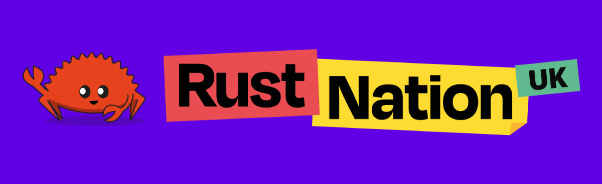
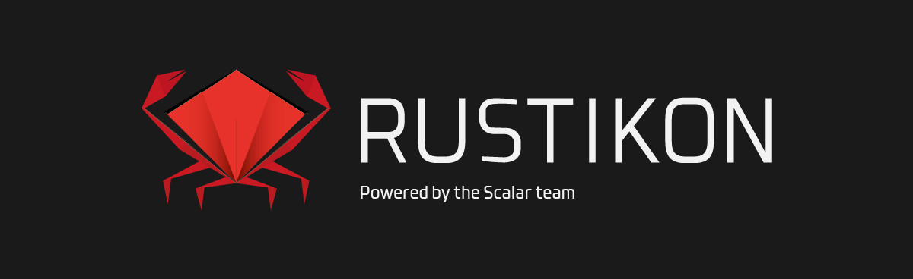
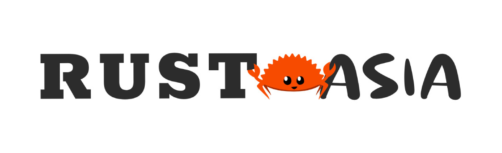
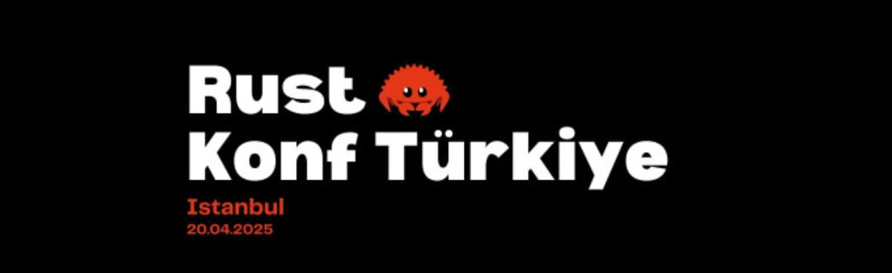
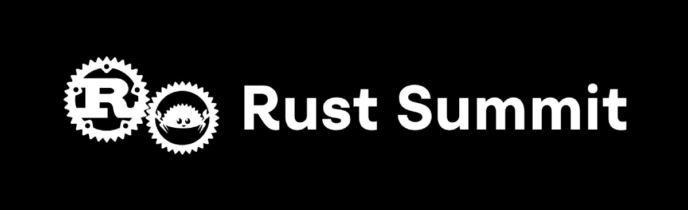
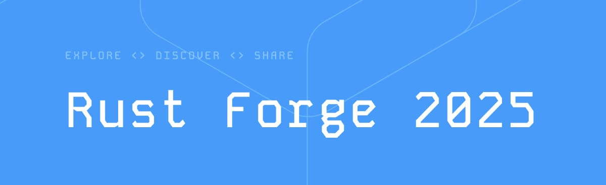
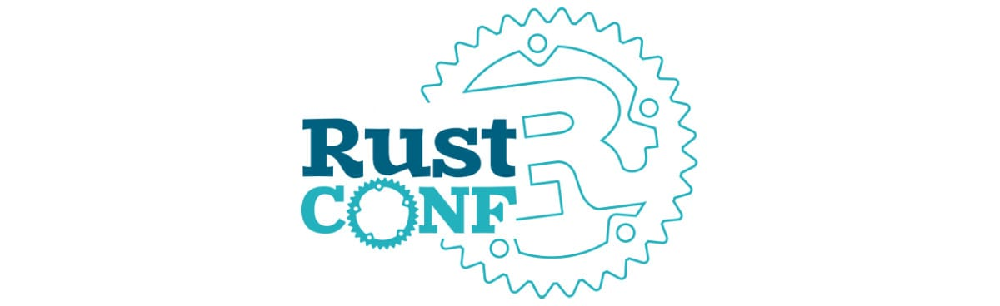
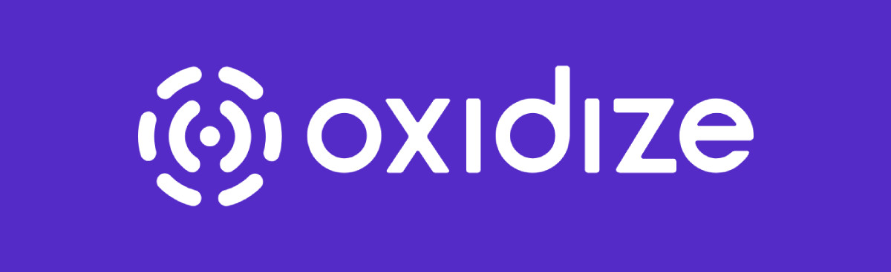
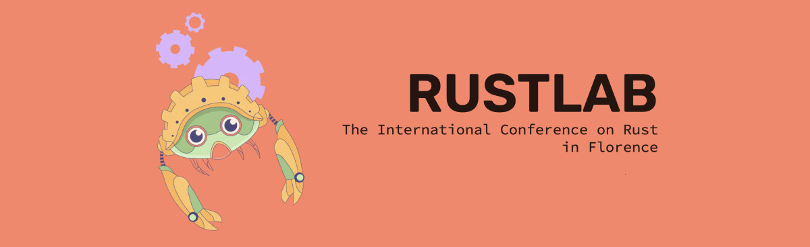

+++
title = "Rust Conferences 2025"
date = 2024-12-03
updated = 2025-01-06
template = "article.html"
draft = false
[extra]
excerpt = "A list of all major Rust conferences happening around the world in 2025. Find dates, locations, ticket prices, CFP deadlines, and more."
hero = "teaching.svg"
series = "Rust Insights"
+++


Here's a list of all major Rust events happening around the world. Find dates,
locations, ticket prices, CFP deadlines, and more.


Rustaceans like to mingle, learn, and share their knowledge at conferences.
With 10-12 conferences happening in 2025, it will be a busy year for the Rust community.
To make it easier to keep track of all the events, we've compiled a list of all Rust conferences in 2025.
Come say hi if you see us at any of these events! (We'll bring [Rust in Production](/podcast) stickers.) 

Oh, and in case the call for proposals (CFP) is still open, why not submit a
talk or workshop proposal?

## Subscribe For Updates 

Stay up to date with all Rust conferences in 2025 by subscribing to this Google calendar.

<iframe src="https://calendar.google.com/calendar/embed?height=600&wkst=1&ctz=Europe%2FBerlin&showPrint=0&src=ZjAwNDE4Mzk3YzJiN2Q4MTkwNjk3NDJhMTBkMjQyOGE4OGFlZjE3MzU5NWNjYmU2ZTVmYjVlOGY1MDlmNjEzMkBncm91cC5jYWxlbmRhci5nb29nbGUuY29t&color=%23AD1457&mode=AGENDA" style="border:solid 1px #777" width="800" height="600" frameborder="0" scrolling="no"></iframe>

Or download the static calendar file and import it into your favorite calendar application.
Check back periodically for updated versions as new conferences are announced.

  <button class="button" onclick="window.location.href='rust-conferences-2025.ics'" style="display: inline-block; padding: 20px 40px">Download Calendar File (ICS)</button>

## Q1 2025

### Rust Nation (London, UK)

Rust Nation has evolved into a staple event in the Rust community.
The organization, speaker lineup, and recordings are always top-notch.
It's a great conference for Rust developers of all levels.
As per tradition, they kick off the year of Rust conferences. 

- **When**: February 19-20, 2025
- **Where**: [The Brewery, 52 Chiswell Street, London, EC1Y 4SD, UK](https://maps.app.goo.gl/QakezC3gjkyo7sNr9)
- **Format**: 2 days (workshops + conference)
- **Focus**: Rust ecosystem and community
- **Pricing**: 
  - Conference: $304 (early bird)
  - Workshops: Starting at $300
- **CFP**: Closed
- **Links**: [Website](https://www.rustnationuk.com/) | [Schedule](https://www.rustnationuk.com/schedule) | [Past Talks](https://www.youtube.com/channel/UCLksRXfBiEITZMUo2ssjSdA)
- **Social**: [Twitter](https://x.com/rustnationuk) | [Mastodon](https://hachyderm.io/@Rustnationuk)

### Rust in Paris (France)

"When Safety Meets Elegance" is the tagline for Rust in Paris.
It features 12 speakers, 1 day of talks, and 250 attendees.

- **When**: March 14, 2025
- **Where**: [Maison.A Verso, 52 rue de la victoire, 75009 Paris - France](https://maps.app.goo.gl/VDAktMFd8KHMeZ36A)
- **Format**: 1 day conference
- **Focus**: Building secure, high-performing software with Rust
- **Pricing**: 
  - Standard: $311 (early bird)
  - Student: $124
- **CFP**: [Closed](https://docs.google.com/forms/d/e/1FAIpQLSdamzdbUi3EIGBrmEw0-Na4myXP0088kvxVmVT4YU-1BEiyCg/viewform)
- **Links**: [Website](https://rustinparis.com/) | [Schedule](https://rustinparis.com/schedule)

### RUSTMEET (Gliwice, Poland)

An event in Poland, actively co-created by Rust enthusiasts.

- **When**: March 15-16, 2025
- **Where**: [Gliwice, Poland](https://maps.app.goo.gl/38cqAgQBnDG7nNvM7)
- **Format**: 2 days (talks + workshops)
- **Focus**: Rust programming language
- **Pricing**: 
  - Standard: $120
  - Student: $20
- **CFP**: [Open until January 10, 2025](https://rustmeet.confreg.pl/events/30-rustmeet-2025)
- **Links**: [Website](https://rustmeet.eu/) 
- **Social**: [LinkedIn](https://www.linkedin.com/company/rustmeet/) | [Mastodon](https://c.im/@rustmeet) | [BlueSky](https://bsky.app/profile/rustmeet.bsky.social) | [Discord](https://discord.com/invite/CsVnFrYVzm)

### Rustikon (Warsaw, Poland)

Aims to bring together Rust developers from the region and beyond.
Expect a developer-friendly atmosphere with ~15 expert talks in a single-track format, perfect for staying connected and engaged. After a day of learning, unwind with us in a local pub and network with fellow devs. 

- **When**: March 26, 2025
- **Where**: [POLIN Conference Centre, Warsaw](https://maps.app.goo.gl/XKR76zuE2D8XbZMp6)
- **Format**: 1 day conference
- **Focus**: Rust adoption in Poland and beyond
- **Pricing**:
  - Standard: $172
  - Student: $12
- **CFP**: Closed 
- **Links**: [Website](https://www.rustikon.dev/) | [Tickets](https://www.rustikon.dev/tickets) | [Announcement](https://softwaremill.com/why-attend-a-rust-conference-for-developers-rustikon/)
- **Social**: [Twitter](https://x.com/rustikonconf) | [Mastodon](https://mastodon.social/@Rustikon)

### RUSTAsia (Hong Kong)

Another first-time event, RUSTAsia is a conference for Rust developers in Asia.  
After many years without a Rust conference in Asia (the last one being RustCon Asia in 2019), the community is excited to have a new event in Hong Kong.

- **When**: March 28, 2025
- **Where**: [InnoCentre, Kowloon Tong, Hong Kong](https://maps.app.goo.gl/fcQqo9YCpnDgjjnP6)
- **Format**: Hybrid (in-person + online)
- **Focus**: Rust in Asia
- **Pricing**:
  - Online: $68
  - Standard: $245 (early bird)
  - VIP: $375
  - Corporate: $450
- **CFP**: [Closed](https://rustasiaconf.com/proposals)
- **Links**: [Website](https://rustasiaconf.com/)
- **Social**: [Twitter](https://x.com/rustconasia)

## Q2 2025

### Rust Konf Türkiye (Istanbul)

The first-ever Rust conference in Turkey, bringing together Rust developers and enthusiasts
for a day of technical talks, workshops, and networking. The event will feature in-depth
technical sessions on low-level programming, performance optimization, system-level
development, and eBPF.

- **When**: April 20, 2025
- **Where**: Istanbul, Turkey (venue TBA)
- **Format**: 1 day (talks + workshops)
- **Focus**: Low-level programming, system development, and Rust ecosystem
- **Pricing**: Free
- **CFP**: Closed 
- **Links**: [Website](https://kommunity.com/turkiye-rust-community/events/rust-konf-turkiye-91f7b3a6)
- **Social**: [Twitter](https://x.com/turkiyerustcom)

### RustWeek (Utrecht, Netherlands)

RustWeek is a week-long event that combines talks, workshops, and social events.
It's located in cozy Utrecht, the fourth-largest city in the Netherlands.
This is organized by the team behind RustNL. RustWeek takes place during the 10 year
anniversary of Rust 1.0. All Rustaceans are welcome to attend and submit talks.

- **When**: May 12-17, 2025
- **Where**: [Kinepolis Utrecht](https://maps.app.goo.gl/NfdQrMmPHEpy3ZZMA)
- **Format**: Full week (2 days talks + 1 day workshops + social events)
- **Focus**: Broad, open to everyone
- **Pricing** (Early Bird):
  - Standard: $197
  - Company: $390
  - Conference + Workshop: $343 (Individual) / $592 (Company)
  - Student: $31
- **CfP**: [Open until January 12, 2025](https://www.papercall.io/rust-week)
- **Links**: [Website](https://rustweek.org/) | [Past Talks](https://www.youtube.com/@rustnederlandrustnl)
- **Social**: [BlueSky](https://bsky.app/profile/rustnl.bsky.social) | [Mastodon](https://fosstodon.org/@rustnl) | [LinkedIn](https://www.linkedin.com/company/rustnl/) | [Twitter](https://x.com/Rust_NL) 

### Rust Summit (Belgrade, Serbia)

The first conference for Rust blockchain professionals.

The Rust Summit is first-of-its-kind chain-agnostic conference, featuring expert
talks, workshops, and networking opportunities for Rust blockchain
professionals. It is open to all Rust developers active in the web3 and
blockchain sectors and those who are interested in it.

- **When**: June 7, 2025
- **Where**: Belgrade, Serbia
- **Format**: 1 day conference
- **Focus**: Blockchain
- **Pricing**: $73 (General Admission)
- **CFP**: [Open](https://forms.gle/3VTuvYHhXmzwTLeU9)
- **Links**: [Website](https://rustsummit.com/)
- **Social**: [Twitter](https://x.com/rust_summit)

## Q3 2025

### RustForge (Wellington, New Zealand)

RustForge is the first conference in the Asia/Pacific region that focuses on Rust.

- **When**: August 27-30, 2025
- **Where**: [Shed 6, Wellington, New Zealand](https://maps.app.goo.gl/PDbFTB5Gqs5iVmeNA)
- **Format**: 4 days (2 days workshops + 2 days conference)
- **Focus**: Community-focused conference with emphasis on hallway track
- **Pricing**: $300 (estimated)
- **CFP**: TBA
- **Links**: [Website](https://rustforgeconf.com/)
- **Social**: [Twitter](https://x.com/rustforgeconf) | [LinkedIn](https://www.linkedin.com/company/rustforgeconf/) | [Instagram](https://www.instagram.com/rustforgeconf/) 

### RustConf (TBA)

RustConf is the official Rust conference organized by the Rust Foundation.
It's a great place to meet the Rust core team and other community members.
The last edition was held in Montreal, Canada and the 2025 edition will be announced soon.

- **When**: September 2-5, 2025
- **Where**: TBA
- **Format**: 4 days (1 day workshops + 3 days talks)
- **Focus**: Official Rust conference
- **Pricing**: TBA
- **CFP**: TBA
- **Links**: [Website](https://rustconf.com/) | [Past Talks](https://www.youtube.com/@rustfoundation)
- **Social**: [Twitter](https://x.com/rustconf)

### Oxidize (Berlin, Germany)

Two days of applied Rust insights from industry innovators.
Topics range from cross-platform GUI development to Rust in safety-critical systems.

- **When**: September 16-18, 2025
- **Where**: [Tagungswerk, Berlin, Germany](https://maps.app.goo.gl/Q3SzoU7EDJv4kxnHA)
- **Format**: 3 days (1 day workshops + 2 days talks)
- **Focus**: Applied Rust insights
- **Pricing**: TBA
- **CFP**: TBA
- **Links**: [Website](https://oxidizeconf.com/) | [Past Talks](https://www.youtube.com/@OxidizeConf)
- **Social**: [Twitter](https://x.com/OxidizeConf) | [Mastodon](https://social.ferrous-systems.com/@oxidize)

## Q4 2025

### EuroRust (Paris, France)

One of the largest Rust conferences in Europe and a well-established event in
the Rust community. It's a 2 day conference that covers all things Rust: from
Rust patterns and idioms to system programming and CLI tooling, servers WASM and
embedded systems.

The conference travels to a different European city each year.
This time, it's in Paris, France. 🥖

- **When**: October 9-10, 2025
- **Where**: Paris, France
- **Format**: 2 days talks
- **Focus**: Rust patterns, idioms, system programming, CLI tooling, servers, WASM, embedded systems
- **Pricing**: TBA
- **CFP**: TBA
- **Links**: [Website](https://eurorust.eu/) | [Past Talks](https://www.youtube.com/@eurorust)
- **Social**: [Twitter](https://x.com/euro_rust) | [Mastodon](https://fosstodon.org/@eurorust)

## Other events (To Be Announced)

### RustLab (Florence, Italy)

The Italian Rust conference traditionally takes place in Florence.
It's lovingly organized featuring delicious italian food and a great community.

- **When**: November 2025
- **Where**: [Grand Hotel Mediterraneo Lungarno del Tempio, 44, 50121 Florence, Italy](https://goo.gl/maps/8ZRuugSHEfebowwi7)
- **Format**: 3 days (1 day workshops + 2 days talks)
- **Focus**: Rust in Italy and beyond
- **Pricing**: TBA
- **CFP**: TBA
- **Links**: [Website](https://rustlab.it/) | [Past Talks](https://www.youtube.com/@rustlabconference3671)
- **Social**: [Twitter](https://x.com/rustlab_conf) | [Mastodon](https://mastodon.uno/@rustlab)

### RustFest

- **When**: June 2025 (TBA)
- **Where**: TBA
- **Format**: TBA
- **Focus**: Libraries, tools, frameworks, idioms, and patterns
- **Previous Location**: Zürich, Switzerland
- **Status**: To be announced
- **Links**: [Website](https://rustfest.ch/) 
- **Social**: [Twitter](https://x.com/rustfest)

---

So there you have it, our complete guide to all Rust developer conferences, workshops, and community meetups happening around the world in 2025. Whether you're interested in blockchain, embedded systems, or web development with Rust, there's an event for every Rustacean out there. 
Let us know if we missed any events or if you have any updates to share. 
You can directly propose changes by editing the list [here](https://github.com/corrode/corrode.github.io/edit/master/content/blog/rust-conferences-2025/index.md). We'll see you at the next Rust conference!

*Note: This list will be updated as more information becomes available. Some conferences are yet to announce their exact dates, venues, or ticket prices.*

