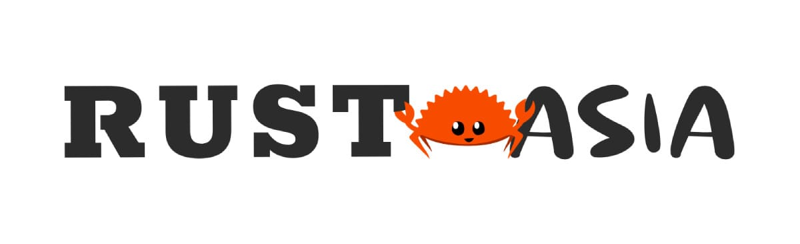
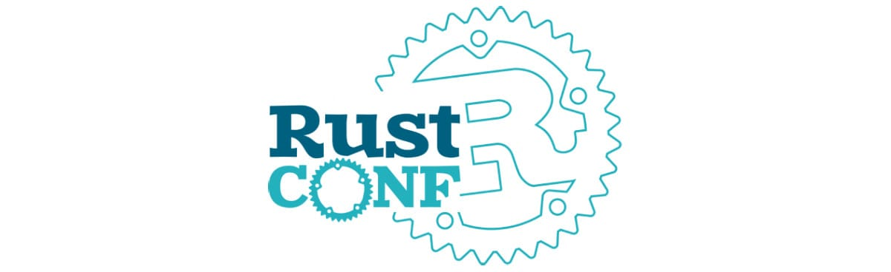

+++
title = "Rust Conferences 2026"
date = 2025-10-15
updated = 2026-01-01
template = "article.html"
draft = false
[extra]
excerpt = "A list of all major Rust conferences happening around the world in 2026. Find dates, locations, ticket prices, CFP deadlines, and more."
hero = "teaching.svg"
series = "Rust Insights"
+++

The Rust community continues to grow, and with it, the number of conferences around the world.
While some 2026 conferences haven't announced their dates yet, we're tracking what's confirmed so far.
Come say hi if you see us at any of these events! (We'll bring [Rust in Production](/podcast) stickers.) 

Oh, and in case the call for proposals (CFP) is still open, why not submit a
talk or workshop proposal?

  <button class="button filter-btn active" data-filter="all">All Conferences</button>
  <button class="button filter-btn" data-filter="cfp-open">CFP Open</button>
  <button class="button filter-btn" data-filter="announced">Dates Announced</button>

## Q1 2026

### Rust Nation (London, UK) 

Rust Nation has evolved into a staple event in the Rust community.
The organization, speaker lineup, and recordings are always top-notch.
As per tradition, they kick off the year of Rust conferences. 

- **When**: February 18-19, 2026
- **Where**: [1 America Square (Workshops) & The Brewery (Main Conference), London, UK](https://www.rustnationuk.com/)
- **Format**: 2 days (workshops + conference)
- **Focus**: Rust ecosystem and community
- **Pricing**: [£220.00 + £44.00 VAT](https://www.rustnationuk.com/tickets) 
- **CFP**: Closed
- **Links**: [Website](https://www.rustnationuk.com/) | [Tickets](https://www.rustnationuk.com/tickets)
- **Social**: [Twitter](https://x.com/rustnationuk) | [Mastodon](https://hachyderm.io/@Rustnationuk)

### Rust in Paris (France)

"When Safety Meets Elegance" is the tagline for Rust in Paris.

- **When**: March 27, 2026 
- **Where**: [L'Apollo Théâtre 18, Rue du Faubourg du Temple, 75011 Paris – France](https://www.google.com/maps/place/Apollo+Th%C3%A9%C3%A2tre/@48.8682435,2.3637481,17z/data=!3m2!4b1!5s0x47e66e084be9ac71:0x5452be83db948318!4m6!3m5!1s0x47e66e0852167e43:0xa259bf31ee319054!8m2!3d48.86824!4d2.366323!16s%2Fg%2F120z_cmr?entry=ttu)
- **Format**: 1 day conference
- **Focus**: Crafting safe & efficient futures
- **Pricing**: [€120](https://ti.to/xperhub/rust-in-paris-2026)
- **CFP**: [Open until 15th of January](https://docs.google.com/forms/d/e/1FAIpQLSfuNFQNFcLorqGE4VnjFcE7OmsEQWkWnkr-SCpoIOeFb6HVWw/viewform) 
- **Links**: [Website](https://rustinparis.com/) | [Past Talks](https://www.youtube.com/@rustinparis)

### RUSTMEET (Gliwice, Poland) Dates TBA

An event in Poland, actively co-created by Rust enthusiasts.

- **When**: TBA (typically March)
- **Where**: Gliwice, Poland
- **Format**: 2 days (talks + workshops)
- **Focus**: Rust programming language
- **Pricing**: TBA
- **CFP**: TBA
- **Links**: [Website](https://rustmeet.eu/)
- **Social**: [LinkedIn](https://www.linkedin.com/company/rustmeet/) | [Mastodon](https://c.im/@rustmeet) | [BlueSky](https://bsky.app/profile/rustmeet.bsky.social) | [Discord](https://discord.com/invite/CsVnFrYVzm)

### Rustikon (Warsaw, Poland)

Aims to bring together Rust developers from the region and beyond.
Expect a developer-friendly atmosphere with expert talks in a single-track format, perfect for staying connected and engaged.

- **When**: March 19-20, 2026 
- **Where**: [POLIN Conference Centre, Warsaw, Poland](https://maps.app.goo.gl/tPT7GzRc7kUh4d3s5)
- **Format**: 2 day conference
- **Focus**: Rust adoption in Poland and beyond
- **Pricing**: [€300](https://www.rustikon.dev/tickets) 
- **CFP**: [Closed](https://sessionize.com/rustikon-2026/)
- **Links**: [Website](https://www.rustikon.dev/)
- **Social**: [Twitter](https://x.com/rustikonconf) | [Mastodon](https://mastodon.social/@Rustikon)

### RUSTAsia (Hong Kong) Dates TBA

A conference for Rust developers in Asia.

- **When**: TBA (typically March)
- **Where**: Hong Kong
- **Format**: Hybrid (in-person + online)
- **Focus**: Rust in Asia
- **Pricing**: TBA
- **CFP**: TBA
- **Links**: Website offline
- **Social**: [Twitter](https://x.com/rustasiaconf)

## Q2 2026

### RustWeek (Utrecht, Netherlands) 

RustWeek is a week-long event that combines talks, workshops, and social events.
It's located in cozy Utrecht, the fourth-largest city in the Netherlands.
The world's biggest Rust conference returns, welcoming over 900+ community members.
All Rustaceans are welcome to attend and submit talks.

- **When**: May 18-23, 2026
- **Where**: Utrecht, Netherlands
- **Format**: Full week (2 days talks + 1 day workshops + social events)
- **Focus**: Broad, open to everyone
- **Pricing**: [Tickets available](https://event.onliveevent.nl/rustweek-2026)
- **CFP**: [Extended until 18th of January](https://2026.rustweek.org/cfp)
- **Links**: [Website](https://2026.rustweek.org/) | [Past Talks](https://www.youtube.com/@rustnederlandrustnl)
- **Social**: [BlueSky](https://bsky.app/profile/rustnl.bsky.social) | [Mastodon](https://fosstodon.org/@rustnl) | [LinkedIn](https://www.linkedin.com/company/rustnl/) | [Twitter](https://x.com/Rust_NL)

## Q3 2026

### RustForge (Wellington, New Zealand) Dates TBA

RustForge is a conference in the Asia/Pacific region that focuses on Rust.

- **When**: TBA (typically August)
- **Where**: Wellington, New Zealand
- **Format**: 4 days (2 days workshops + 2 days conference)
- **Focus**: Community-focused conference with emphasis on hallway track
- **Pricing**: TBA
- **CFP**: TBA
- **Links**: [Website](https://rustforgeconf.com/)
- **Social**: [Twitter](https://x.com/rustforgeconf) | [LinkedIn](https://www.linkedin.com/company/rustforgeconf/) | [Instagram](https://www.instagram.com/rustforgeconf/)

### RustConf (Montreal, Canada) 

RustConf is the official Rust conference organized by the Rust Foundation.
It's a great place to meet the Rust core team and other community members.
After Seattle in 2025, RustConf returns to beautiful Montreal, Canada.

- **When**: September 8-11, 2026
- **Where**: [Palais des Congrès de Montréal](https://congresmtl.com/), Montréal, Canada, Québec 
- **Format**: 4 days (1 day workshops + 3 days talks)
- **Focus**: Official Rust conference
- **Pricing**: TBA
- **CFP**: [Open until 16 Feb 2026](https://sessionize.com/rustconf-2026)
- **Links**: [Website](https://rustconf.com/) | [Newsletter](https://mailchi.mp/e0f01ceec688/rustconf-newsletter-registration) | [Past Talks](https://www.youtube.com/@rustfoundation)
- **Social**: [Mastodon](https://hachyderm.io/@rustconf) | [BlueSky](https://bsky.app/profile/rustconf.com)

### Oxidize (Berlin, Germany) 

Two days of applied Rust insights from industry innovators.
Topics range from cross-platform GUI development to Rust in safety-critical systems.

- **When**: September 14-16, 2026
- **Where**: [Tagungswerk, Berlin, Germany](https://maps.app.goo.gl/Q3SzoU7EDJv4kxnHA)
- **Format**: 3 days (1 day workshops + 2 days talks)
- **Focus**: Applied Rust insights
- **Pricing**: TBA
- **CFP**: TBA
- **Links**: [Website](https://oxidizeconf.com/) | [Past Talks](https://www.youtube.com/@OxidizeConf)
- **Social**: [Twitter](https://x.com/OxidizeConf) | [Mastodon](https://social.ferrous-systems.com/@oxidize)

## Q4 2026

### EuroRust (Barcelona, Spain) 

One of the largest Rust conferences in Europe and a well-established event in
the Rust community. A 2-day conference that covers all things Rust: from
Rust patterns and idioms to system programming and CLI tooling, servers WASM and
embedded systems.

The conference travels to a different European city each year.
This time, it's in Barcelona, Spain. 🇪🇸

- **When**: October 14-17, 2026
- **Where**: [Auditori L’illa, Barcelona, Spain](https://maps.app.goo.gl/nUzwZ1x7fahyD7aW9)
- **Format**: 2 day event
- **Focus**: Rust patterns, idioms, system programming, CLI tooling, servers, WASM, embedded systems
- **Pricing**: [Private Ticket €275, Freelancer Ticket €332, Company Ticket: €600](https://ti.to/events-matter/eurorust-2026)
- **CFP**: TBA
- **Links**: [Website](https://eurorust.eu/) | [Past Talks](https://www.youtube.com/@eurorust)
- **Social**: [Twitter](https://x.com/euro_rust) | [Mastodon](https://fosstodon.org/@eurorust)

### RustLab (Bologna, Italy)

The Italian Rust conference traditionally takes place in Florence.
It's lovingly organized featuring delicious Italian food and a great community.

- **When**: November 1-3, 2026 
- **Where**: [Savoia Regency Hotel, Bologna](https://maps.app.goo.gl/PFdKnc3hivvwjj6X7)
- **Format**: 3 days (1 day workshops + 2 days talks)
- **Focus**: Rust in Italy and beyond
- **Pricing**: TBA
- **CFP**: TBA
- **Links**: [Website](https://rustlab.it/) | [Past Talks](https://www.youtube.com/@rustlabconference3671)
- **Social**: [Twitter](https://x.com/rustlab_conf) | [Mastodon](https://mastodon.uno/@rustlab)

---

That's all we know about Rust conferences for 2026 so far! As conferences announce their dates and details, we'll keep this page updated.

Missing an event? Spot an error? Feel free to [edit this list directly](https://github.com/corrode/corrode.github.io/edit/master/content/blog/rust-conferences-2026/index.md) or let us know.

See you at the next conference! 🦀

*Note: This list will be updated regularly as more conferences announce their 2026 dates. Most conferences are yet to announce their exact dates, venues, ticket prices, and CFP timelines. Check back often for updates!*

