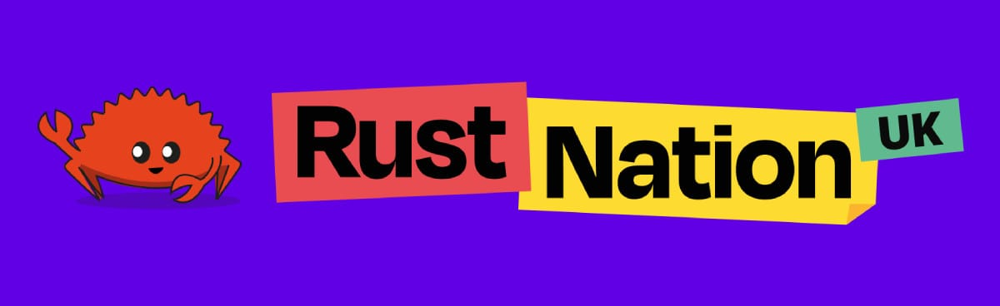
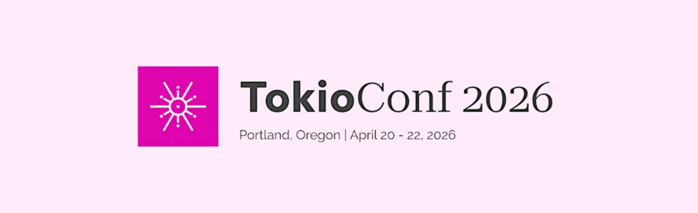
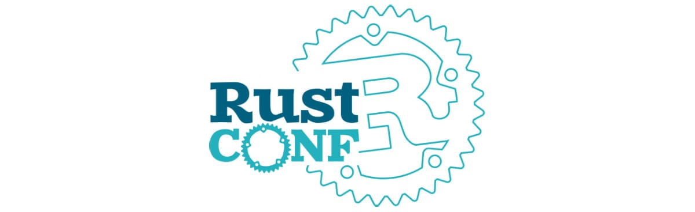
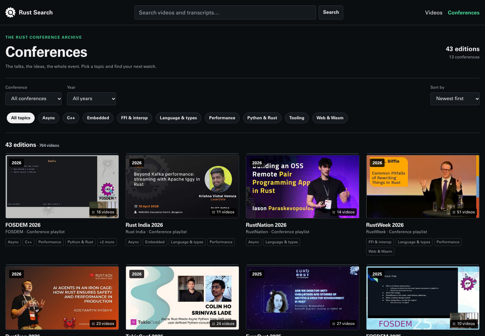

+++
title = "Rust Conferences 2027"
date = 2026-10-01
template = "article.html"
draft = false
[extra]
excerpt = "Plan your 2027 Rust conference trips with confirmed dates and locations for Rust Nation UK, TokioConf, RustWeek, and RustConf."
hero = "teaching.svg"
series = "Rust Insights"
+++

Planning your Rust conference trips for 2027? Here are the events with confirmed dates so far. We'll add more conferences, ticket prices, and call for proposals (CFP) deadlines as organizers announce them.

Come say hi if you see us at any of these events! (We'll bring [Rust in Production](/podcast) stickers.) For this year's events, see [Rust Conferences 2026](/blog/rust-conferences-2026/).

## Q1 2027

### Rust Nation UK (London, UK)

Rust Nation returns to London with a one-day, three-track conference at a new venue in the City of London. A separate workshop day is being planned for February 17, but is not yet confirmed.

- **When**: February 18, 2027
- **Where**: 1 Basinghall Avenue, London, UK
- **Format**: 1 day of talks across 3 tracks
- **Focus**: Rust developers of all experience levels
- **Links**: [Website](https://www.rustnationuk.com/)

## Q2 2027

### TokioConf (Portland, USA)

After its first edition in 2026, TokioConf returns to Portland. It's a conference for developers working with Tokio, async Rust, and high-performance network applications.

- **When**: April 26-27, 2027
- **Where**: Portland, Oregon, USA (venue to be announced)
- **Focus**: Async Rust and Tokio
- **Links**: [Website](https://www.tokioconf.com/) | [2027 Announcement](https://tokio.rs/blog/2026-05-29-tokioconf-2026-videos)

### RustWeek (Utrecht, Netherlands)

RustWeek brings the Rust community together in Utrecht for talks, workshops, a hackathon, and social activities. The week also includes the invitation-only Rust Project All Hands.

- **When**: May 24-29, 2027
- **Where**: Utrecht, Netherlands
- **Format**: 1 day of workshops, 2 days of talks, a hackathon, and social activities
- **Focus**: Broad, open to Rust developers of all levels
- **CFP**: [Open](https://sessionize.com/rustweek-2027) — closes January 10, 2027 at 23:59 CET. Workshop proposals are handled separately via [email](mailto:rustweek@rustnl.org).
- **Links**: [Website](https://2027.rustweek.org/) | [CFP Announcement](https://2027.rustweek.org/blog/2026-10-01-cfp-opened/)

## Q3 2027

### RustConf (Vancouver, Canada + Online)

Hosted by the Rust Foundation, RustConf heads to Vancouver in 2027, with online participation available too. More details about the program are still to come.

- **When**: September 7-10, 2027
- **Where**: Vancouver, Canada, and online
- **Focus**: Rust and its open-source ecosystem
- **Links**: [Website](https://rustconf.com/)

## More conferences to watch

We haven't found official 2027 dates for the following conferences yet. These are events to keep an eye on, not confirmed 2027 editions:

- [Rustikon](https://www.rustikon.dev/)
- [Rust in Paris](https://www.rustinparis.com/)
- [Rust India](https://rustindia.org/)
- [RUSTMEET](https://rustmeet.eu/en/)
- [Oxidize](https://oxidizeconf.com/)
- [EuroRust](https://eurorust.eu/)
- [RustLab](https://rustlab.it/)
- [RustForge](https://www.rustforgeconf.com/)

## Want to catch up on past events?

Browse our dedicated [Rust conference recordings page](https://search.corrode.dev/conferences) where you can filter by year, topic, and conference! 

---

Missing an event? Spot an error? Feel free to [edit this list directly](https://github.com/corrode/corrode.github.io/edit/master/content/blog/rust-conferences-2027/index.md) or let us know.

Check the organizers' websites for the latest details before booking travel. See you at the next conference! 🦀
