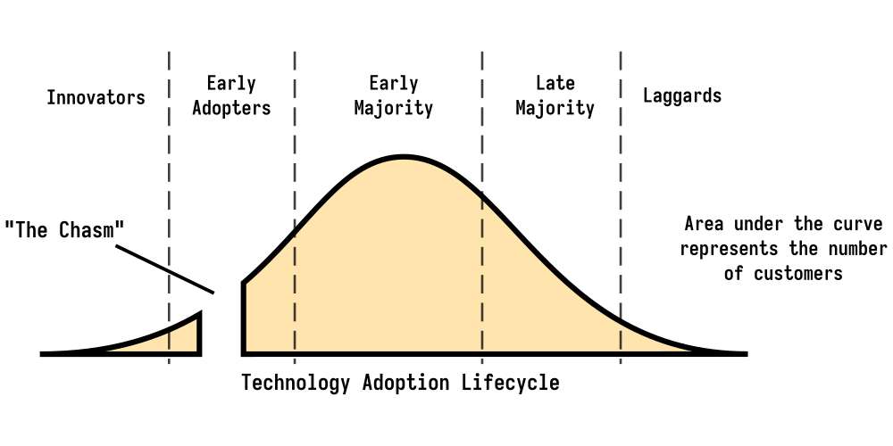
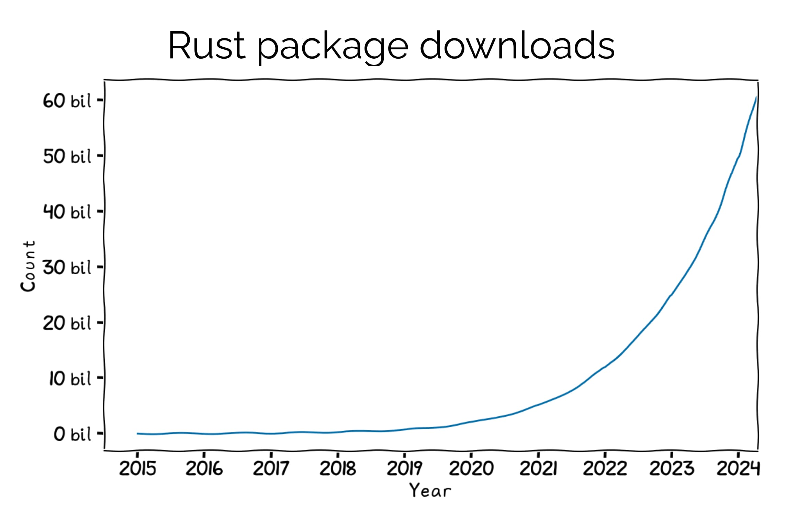

+++
title = "Will Rust be alive in 10 years?"
date = 2024-06-24
updated = 2024-07-10
template = "article.html"
draft = false
[extra]
series = "Rust Insights"
hero = "hero.svg"
hero_classes = "invert"
authors = [
  { name="Hugo van de Pol", url="https://tweedegolf.nl/en/about/9/hugo" },
  { name="Matthias Endler", url="https://corrode.dev/about/"}
]
+++



We’ve been asked this question multiple times in the last year. It is a fair question, as adopting any new technology requires an investment and comes with uncertainties, one of them being the durability of the technology. This article explains why we expect Rust to stand the test of time.

*This article is a friendly collaboration between Tweede golf (author: [Hugo](https://tweedegolf.nl/en/about/9/hugo)) and corrode Rust Consulting (author: [Matthias](https://corrode.dev/about/)). For more insights on Rust, also visit [the Tweede golf blog](https://tweedegolf.nl/en/blog).*



Wondering whether Rust will still be around is only relevant once you've determined that the language is technically the best solution for your project, so for the sake of this blog, we're assuming that you have indeed already made this assessment. If you are still wondering whether Rust is for you, or how this potentially costly tech switch can actually save you money, check out [this blog post](https://corrode.dev/why-rust/) instead.

In this article, we'll go over the current state of the language (how old or young is it, really?), what we consider the three markers of longevity (spoiler, Rust does well on all three), and an honest disclaimer (what might still go wrong?).

## Is it hype or is it real?

You might recognize the image below as the well-known  [Technology Adoption Lifecycle](https://en.wikipedia.org/wiki/Technology_adoption_life_cycle). It goes without saying that Rust is still in the early stages.

*Technology Adoption Lifecycle ([image credits](https://medium.com/@shivayogiks/what-is-technology-adoption-life-cycle-and-chasm-e07084e7991f))*

The question of Rust's exact adoption status is too broad to answer with any precision or validity. This is because Rust is being used in many different industries, for various purposes, and each of these industries and uses has its own timeline.

Broadly speaking, we can say that Rust is somewhere in the Early Adopters stage in most domains like [web/backend](https://www.theregister.com/2024/03/31/rust_google_c/) and systems programming, as companies like Google, Facebook, and Microsoft are heavily investing in Rust and have large systems written in it, powering their cloud offerings.  For instance, Mark Russinovich, CTO of Microsoft Azure, [stated](https://x.com/markrussinovich/status/1571995117233504257) that new projects should be written in Rust in preference to C or C++. Both the [Linux kernel](https://docs.kernel.org/rust/) as well as the [Windows kernel](https://x.com/markrussinovich/status/1656416376125538304) contain Rust code now.

In embedded development, we have to separate the various industries. For example, in automotive projects, thanks to [Ferrocene](https://ferrocene.dev) and [OxidOS](https://oxidos.io), Rust is past the Innovators stage and into the Early Adopters stage.  As for other industries like the aerospace, defense, and medical industries, Rust is still in the Innovators stage.

Some games like [Way of Rhea](https://store.steampowered.com/app/1110620/Way_of_Rhea/) have been written in Rust and are available on Steam, but the gaming industry as a whole is still in the Innovators stage.

We do think that [the broad penetration of Rust across industries](https://blog.rust-lang.org/images/2024-02-rust-survey-2023/technology-domain.png) is rather impressive for a language that saw its first stable release just 9 years ago.

For a technology to cross the chasm, or to become mainstream, it needs to be recognized for being [highly effective](https://youtu.be/4RFBdcJRdbA?feature=shared&t=299) in a very specific area or use case. 

And it is; Enter the relevance of memory safety in our digital infrastructure. It has been established (by [Google](https://security.googleblog.com/2019/05/queue-hardening-enhancements.html), [Microsoft](https://msrc.microsoft.com/blog/2019/07/we-need-a-safer-systems-programming-language/), [Apple](https://langui.sh/2019/07/23/apple-memory-safety/), a.o.) that [~70% of all security bugs in large C/C++ code bases are memory safety issues](https://www.chromium.org/Home/chromium-security/memory-safety/), which means that memory unsafety is a problem that needs to be addressed in all the software we rely on. [Rust has proven to eliminate this class of bugs](https://security.googleblog.com/2022/12/memory-safe-languages-in-android-13.html) and this is why it can now count organizations such as the [Internet Security Research Group](https://www.memorysafety.org/docs/memory-safety/), [The White House](https://www.whitehouse.gov/oncd/briefing-room/2024/02/26/press-release-technical-report/), and the German government-backed [Sovereign Tech Fund](https://www.sovereigntechfund.de/news/on-rust-memory-safety-open-source-infrastructure) among its advocates.

Having established that Rust is at least 'highly successful' in solving the memory safety issues prevalent in our critical infrastructure, and thus capable of growing beyond the chasm, the question remains: will Rust be alive in 10 years?

## Why Rust is here to stay

In order to answer The Question, we first have to consider what we mean, exactly, when we refer to a programming language as being 'alive'. What do we want from this language, 10 years down the line, that would make us feel confident in investing in it now?

We've narrowed our definition down to three criteria. A programming language is 'alive' if:
- there is significant usage by companies (and not just hobbyists);
- there is a stable and mature ecosystem;
- there is ongoing development not only in its core but also in peripheral tools and libraries.

We'll go into each of these criteria to describe the status quo of Rust, as we see it.

### Significant usage

For a language to remain in significant usage in the long run, it needs to be adopted by industry leaders and applied across diverse fields, which would speak to its reliability and versatility respectively. A strong job market, an active community, and solid educational resources underscore its widespread acceptance and vitality. At this point, Rustaceans (that's how Rust users are referred to in the community) are pointing at the screen, going 'that's us!'

Not all of these requirements are quantifiable, but let's look at the ones that we can actually address.

#### Investments by major corporations

Some major corporations (i.e. Google, Facebook, Microsoft, Amazon) are already betting big on Rust. Not only are they using the language in their code bases, they're also investing in its ecosystem. This company backing is important for the long-term sustainability of the language. 

Some examples of recent investments:
- [Google donated $1M](https://www.reddit.com/r/rust/comments/1ajm56w/google_donates_1m_to_the_rust_foundation_to/) to the Rust Foundation for the Interop Initiative, to improve the tooling for interoperability. 
- [Microsoft invested in Rust](https://x.com/dwizzzleMSFT/status/1720134540822520268/photo/2), including a $10M investment in Rust developer tooling and a $1M contribution to the Rust Foundation.

#### Commercial offerings and support

Several safety-aimed toolchains have been developed in and for Rust and they come with long-term commercial support.
- [Ferrocene](https://ferrous-systems.com/ferrocene/) is a Rust compiler for safety-critical use in the automotive industry and has been ISO 26262 certified.
- AdaCore developed [Gnat Pro for Rust](https://www.adacore.com/gnatpro-rust) and are targeting the aerospace industry.
- HighTec has developed an ISO 26262-certified Rust compiler development platform for Infineon AURIX, which is essential for the automotive industry.
- Just this month, [The Safety-Critical Rust Consortium](https://foundation.rust-lang.org/news/announcing-the-safety-critical-rust-consortium/) was founded by AdaCore, Arm, Woven by Toyota, and others, with the goal of supporting the responsible use of the Rust programming language in safety-critical software.

### Ecosystem maturity

The maturity of the Rust ecosystem is difficult to quantify, but it has been growing steadily since its inception. It has gained attention, use, and support from 'big tech', professionals, and hobbyists alike. Driven by the idealistic goal of making software great again, Rust continues to evolve and thrive.

#### Growth

Let's quantify what we can.

As is widely known, Rust has been Stack Overflows 'most loved language' since 2016, and [became 'most admired' in 2023](https://stackoverflow.blog/2024/03/04/in-rust-we-trust-white-house-office-urges-memory-safety/). In the same vein, Rust (together with Dart) was the fastest growing community (i.e. number of developers) in 2023, nearly doubling in size from 2022 to 2024:

> "Dart and Rust grew at an average annual rate of more than 30% in 2023."  
> &mdash; from [SlashData's State of the Developer Nation 25th Edition](https://research.slashdata.co/reports/65b90140343d024fbe70f369)

> "Rust has nearly doubled in size over the past two years, growing from 2M to 4M users."  
> &mdash; from [SlashData's Sizing Programming Languages Communities](https://research.slashdata.co/reports/66546c6a78c13bcad12eac6e)

In 2024 alone, there are 8 conferences dedicated to Rust: Rust Nation (London, UK), RustNL (Delft, the Netherlands), RustFest (Zürich, Switzerland), RustConf (Montreal, Canada), EuroRust (Vienna, Austria), RustLab (Florence, Italy), Oxidize (Berlin, Germany), Rust Summit (Belgrade, Serbia).

And the number of crates (libraries) downloaded from crates.io has grown exponentially:

*Slide from [Jakub Beránek's RustNL 2024 talk](https://tweedegolf.nl/images/jakub-beranek-rustnl2024-slides.pdf)*

As of today, there are [355k](https://github.com/search?q=language%3Arust&type=repositories) Rust projects on GitHub (including archived repositories).

#### Funding

Most programming languages are backed by a single big-tech giant. Consider Go, curated by Google, and Swift, supported by Apple. 

Rust is a different story, intentionally so. After the COVID pandemic had hit language creator Mozilla hard, they realized that the vulnerable position of the company (a quarter of its employees had to be fired) could directly affect the language. Mozilla joined forces with four(!) other big tech names (AWS, Huawei, Google and Microsoft) to create [the Rust Foundation](https://foundation.rust-lang.org/):

> "The Rust Foundation is an independent non-profit organization dedicated to stewarding the Rust programming language, nurturing the Rust ecosystem, and supporting the set of maintainers governing and developing the project."

This means that there isn't one company pulling all the strings. In addition, many of the volunteers who helped shape the language are now being employed by companies like Amazon and Huawei to work on the compiler full-time. The foundations that Rust is built on (both financial and technical) are thus much stronger and more diverse than those of most other languages.

#### Memory-safety

Rust is the only langauge that combines memory safety with C-like performance and the capabilities of a systems language. And we are seeing that the *need* for memory safety is becoming much more prevalent (dare we say, mainstream) in the software that we use and rely on on a daily basis. Consider the White House's call to action:

> "We, as a nation, have the ability – and the responsibility – to reduce the attack surface in cyberspace and prevent entire classes of security bugs from entering the digital ecosystem but that means we need to tackle the hard problem of moving to memory safe programming languages." - *[Harry Coker, US National Cyber Director](https://www.whitehouse.gov/oncd/briefing-room/2024/02/26/press-release-technical-report/)*

Cleary, memory safety is considered a national priority by the White House. (Of course, we'd like to argue that 'The Internet' and our digital infrastructure is never a mere national matter; the scope of this issue is far greater than that, but we understand that for the sake of politics, it sometimes must be reduced to a national issue.) It goes to show that awareness of the issue is no longer niche. It is a matter of time before the implications of it (actually writing memory safe software) will also become 'mainstream'. 

We're not the only ones who expect that Rust will continue to grow because of this:

 > The USA and its international partners have made the case in the last six months for adopting memory-safe languages. While Rust is not unique in this capability, its performance benefits alongside being memory-safe are likely to lead to further growth in this developer community. - *From [SlashData's Sizing Programming Languages Communities](https://research.slashdata.co/reports/66546c6a78c13bcad12eac6e)*

### Ongoing development

Rust is a language with a wide surface area; engineers use it for projects ranging from embedded devices over backend services to high-performance storage engines and even space projects. This is possible due to Rust's high adaptability. It can be integrated into existing codebases thanks to its excellent C/C++-compatible foreign function interface. It also has best-in-class WebAssembly support through multiple runtimes like Wasmtime and Cloudflare's wrangler. And as we're learning how to use the language to its full potential, new areas of Rust usage keep popping up, such as game development (e.g. [Bevy](https://bevyengine.org/)).

We previously noted that Rust package downloads are growing at an exponential rate, but creators are getting more productive too; The number of crates available [doubles](https://lib.rs/stats) each year! And traffic on crates.io is 2.8x higher on weekdays than over the weekend, which indicates that most Rust development takes place in work-related projects. 

Continuous development doesn't stop at the ecosystem level though. The language itself also keeps evolving. 

Rust’s approach to steady innovation is meant to ensure stability and it is achieved through its edition system. Editions are Rust releases, which are allowed to deprecate features and introduce breaking changes. Editions are rare, though. They happen roughly every three years (2018, 2021, and later this year).

## Challenges to Rust's longevity

While it seems obvious to us that Rust does well on all three 'markers of longevity' - there is significant usage, the ecosystem is growing and rests on a solid foundation, and there is structural and ongoing development - we can't predict the future. And 'things happen'. So what could go wrong?

- Sponsorship could dry up. As we've mentioned before, Rust's sponsorship doesn't rely on a single big tech company, but rather a consortium of them, so we don't think this scenario is a likely one, but it isn't impossible.
- The ecosystem could split. It's happened before to the Node ecosystem (and there already was a [Rust fork](https://github.com/crablang/crab)). This is certainly not something for us to make any predictions about.
- Something better comes around, weakening Rust's 'raison d'être'. but that would actually be great! It would improve the status quo of our digital world (which is really what we Rust developers want most of all) and a rising tide lifts all. It's highly unlikely that this would happen in the short term, as development of a language takes years. But we cannot guarantee that it won't happen, of course (and we wouldn't want to stop it if it did).
- Rust might become too complex. While we acknowledge the potential for Rust to increase in complexity as it evolves, we have the impression that the Rust community actively works to balance new features with maintainability and usability. In fact, except for async Rust, the language has reached a point of relative maturity.
- Hiring Rust devs is a challenge. This one, we have to cop to. The situation is getting better, there are solutions out there (train your own devs to use Rust, use educational materials like [Rust Edu](https://rust-edu.org/) and [teach-rs](https://github.com/tweedegolf/teach-rs)), and this is a growing market, underscoring the ecosystem maturity... But it still isn't easy.

## Conclusion

Rust is at an exciting point in its history. With large corporations investing heavily in Rust and engineers embracing the language, we believe Rust has a bright future ahead.

If your organization is considering migrating to Rust and is unsure about the language's long-term viability, we hope this information (be sure to check out some of the resources/links!) helps ease your decision-making process.

And if you need assistance along the way, why not reach out to [Tweede golf](https://tweedegolf.nl/en/expertise/rust-engineering) and [corrode](https://corrode.dev/about)?
