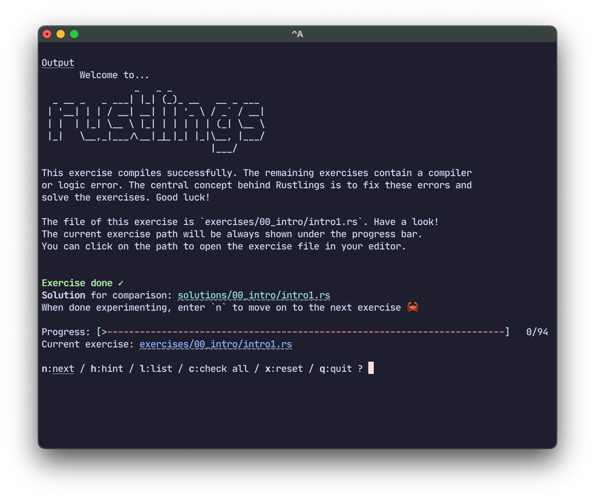
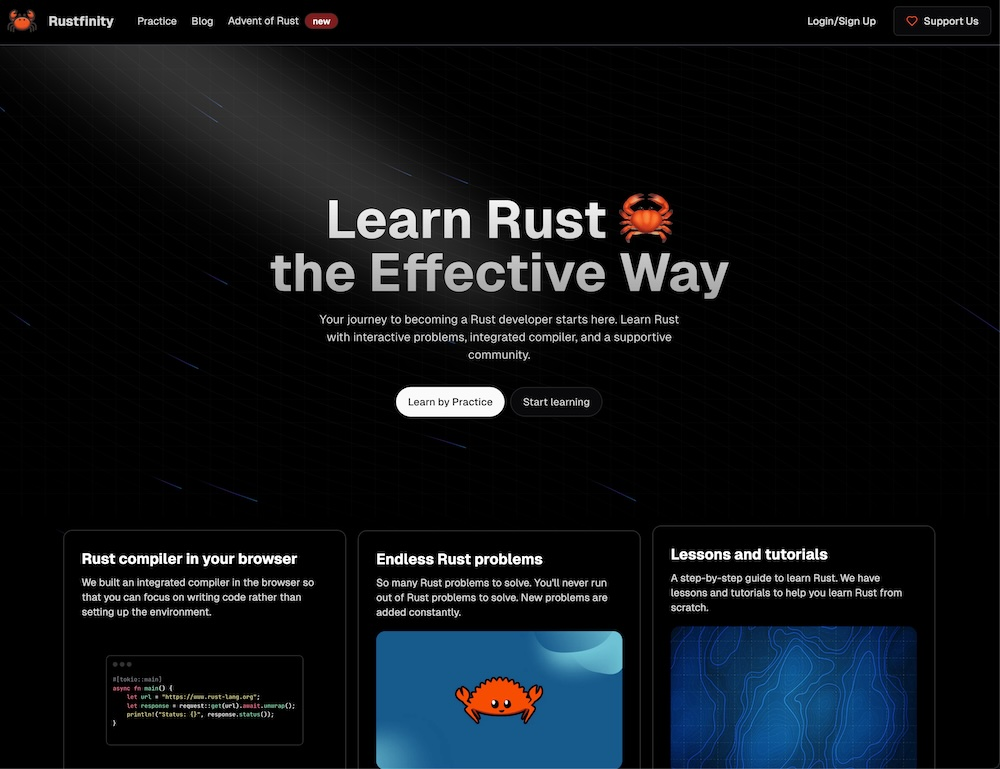
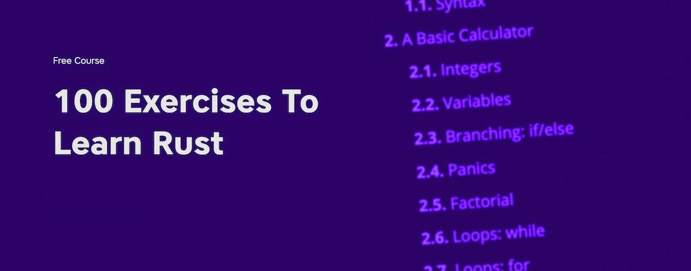
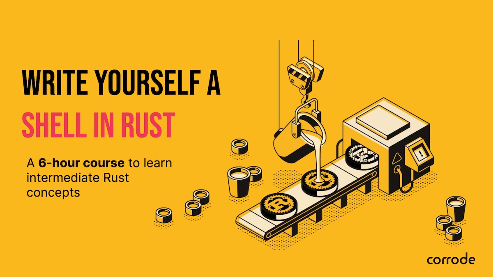

+++
title = "Rust Learning Resources 2026"
date = 2025-03-06
updated = 2026-01-01
template = "article.html"
[extra]
series = "Rust Insights"
resources = [
    "[Why Rust?](/blog/why-rust)",
    "[Making Your First Rust Real-World project A Success](/blog/successful-rust-business-adoption-checklist/)",
]
+++

Want to finally learn Rust?

When I ask developers what they look for in a Rust learning resource, I tend to get the same answers:

- They want **hands-on** learning experiences
- They need content that's **applicable to their work**
- They look for **up-to-date material** from **experienced developers**
- They prefer to use **their own development environment**

All of the above are valid points, especially for learning Rust, a language known for its notoriously [steep learning curve](/blog/flattening-rusts-learning-curve).

If you've been thinking about learning Rust for a while now and perhaps you've already started dabbling with it, now's the time to fully commit. I've put together my favorite Rust learning resources for 2026 to help you jumpstart your Rust journey. 
I made sure to include a healthy mix of self-paced resources, interactive exercises, and hands-on workshops.

## Rustlings



Key Points:

- **Level**: Beginner to Intermediate 
- **Focus**: Small exercises / Rust basics 
- **Time**: A few minutes to a few hours 

The classic Rust learning resource. If it was a cocktail, it would be an [Old Fashioned](https://en.wikipedia.org/wiki/Old_fashioned_(cocktail)). Rustlings works great for beginners and for anyone wanting a quick refresher on specific Rust concepts.

You can run Rustlings from your command line, and it guides you through a series of exercises.
All it takes is running a few commands in your terminal:

```sh
cargo install rustlings
rustlings init
cd rustlings/
rustlings
```

Go to the [official Rustlings repository](https://github.com/rust-lang/rustlings) to learn more.

## Rustfinity



Key Points:

- **Level**: Beginner to Intermediate 
- **Focus**: Small exercises / Rust basics 
- **Time**: A few minutes to a few hours 

Rustfinity is a bit like Rustlings, but more modern and structured. It gives you a browser interface that guides you through each exercise and runs tests to check your solutions. No need to set up anything locally, which makes it great for workshops or learning on the go.

You start with "Hello, World!" and work your way up to more complex exercises. It's a relatively new resource, but I've tried several exercises myself and enjoyed the experience.

They also host "Advent of Rust" events with some more challenging problems available [here](https://www.rustfinity.com/advent-of-rust).

Learn more at the [Rustfinity website](https://www.rustfinity.com/).

## 100 Exercises To Learn Rust



Key Points:
- **Level**: Beginner to Intermediate 
- **Focus**: Small exercises / Rust basics 
- **Time**: A few minutes to a few hours 

This is another relatively new resource by Luca Palmieri, who is the author of the popular ["Zero To Production"](https://www.zero2prod.com) book.
It's a collection of 100 exercises that help you learn Rust. The course is based on the "learning by doing" principle and designed to be interactive and hands-on.

You can work through the material in your browser, or download a PDF or buy a printed copy for offline reading. The course comes with a local CLI tool called `wr` that verifies your solutions.

You can learn more about the course [here](https://rust-exercises.com/100-exercises/).

## CodeCrafters

<div style="position: relative; padding-bottom: 56.25%; height: 0; overflow: hidden;">
  <iframe style="position: absolute; top: 0; left: 0; width: 100%; height: 100%;" src="https://www.youtube-nocookie.com/embed/aZ5sfhGmEVU" title="YouTube video player" frameborder="0" allow="accelerometer; autoplay; clipboard-write; encrypted-media; gyroscope; picture-in-picture; web-share" referrerpolicy="strict-origin-when-cross-origin" allowfullscreen></iframe>
</div>

Key Points:
- **Level**: Intermediate to Advanced
- **Focus**: Real-world projects / Systems programming 
- **Time**: A few days to a few weeks per project (depending on your experience)

If you already know how to code some Rust and want to take it one step further, CodeCrafters is currently the best resource for learning advanced Rust concepts in your own time. 
I like that they focus on real-world systems programming projects, which is where Rust is really strong.

You'll learn how to build your own shell, HTTP server, Redis, Kafka, Git, SQLite, or DNS server from scratch.

Most people work on the projects on evenings and weekends, and it takes a few days or weeks to complete a challenge, 
but the sense of accomplishment when you finish is incredible: you'll complete a project that teaches you both Rust and the inner workings of systems you use daily. 

If you got curious, the video above is my full walkthrough of the "Build your own HTTP server" challenge.



CodeCrafters is the platform I genuinely recommend to friends after they've learned the basics of Rust. 
It's the next best thing after a personal mentor or workshop.

You can [try CodeCrafters for free here](https://app.codecrafters.io/join?via=mre) and get 40% off if you upgrade to a paid plan later. Full disclosure: I receive a commission for new subscriptions, but I would recommend CodeCrafters even if I didn't.

On top of that, most companies will reimburse educational resources through their L&D budget, so check with your manager about getting reimbursed.



## Workshops



Key Points:
- **Level**: Beginner to Intermediate 
- **Focus**: Focused exercises and small projects 
- **Time**: A few days of focused effort 

I'm biased here, but nothing beats a hands-on workshop with a Rust expert.
Learning from experienced Rust developers is probably the quickest way to get up to speed with Rust
-- especially if you plan to use Rust at work.
That's because trainers can provide you with personalized feedback and guidance, and help you avoid common pitfalls.
It's like having a personal trainer for your Rust learning journey.

My workshops are designed to be hands-on and tailored to the needs of the participants.
I want people to walk away with a finished project they can extend.

All course material is open source and freely available on GitHub:

- [Write Yourself a CLI](https://github.com/corrode/write-yourself-a-cli) - Create a tool to find files on your system 
- [Write Yourself a Web App](https://github.com/corrode/write-yourself-a-web-app) - Build a small web app that shows weather data 
- [Write Yourself a Shell](https://github.com/corrode/write-yourself-a-shell) - Build a small but fully functional shell from scratch

You can go through the material on your own to see if it fits your needs.
Once you're ready, feel free to reach out about tailoring the content for you and your team.



Is your company considering a switch to Rust? 

Rust is known for its steep learning curve, but with the right resources and guidance, you can become proficient in a matter of weeks. I offer hands-on workshops and training for teams and individuals who want to accelerate their learning process. 

Check out my [services page](/services) or [send me an email](mailto:hi@corrode.dev?subject=Rust%20Workshops) to learn more.

