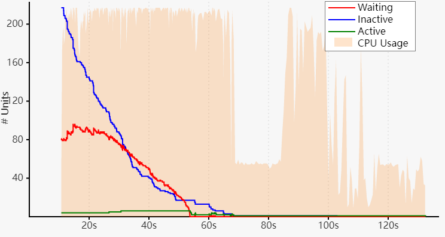

+++
title = "Tips For Faster Rust Compile Times"
date = 2024-01-10
draft = false
template = "article.html"
[extra]
series = "Insights"
+++

**Slow Rust Builds?**

Here are some tips to speed up your compile times.
This list was originally released on my [private blog](https://endler.dev/), but I decided to 
update it for 2024 and move it here.

## Table of Contents <!-- omit in toc -->

- [General](#general)
  - [Update The Rust Compiler And Toolchain](#update-the-rust-compiler-and-toolchain)
  - [Use cargo check Instead Of cargo build](#use-cargo-check-instead-of-cargo-build)
  - [Remove Unused Dependencies](#remove-unused-dependencies)
  - [Update Dependencies](#update-dependencies)
  - [Find the slow crate in your codebase](#find-the-slow-crate-in-your-codebase)
  - [Profile Compile Times](#profile-compile-times)
  - [Replace Heavy Dependencies](#replace-heavy-dependencies)
  - [Split Big Crates Into Smaller Ones Using Workspaces](#split-big-crates-into-smaller-ones-using-workspaces)
  - [Disable Unused Features Of Crate Dependencies](#disable-unused-features-of-crate-dependencies)
  - [Cache Dependencies With sccache](#cache-dependencies-with-sccache)
  - [Cranelift: The Alternative Rust Compiler](#cranelift-the-alternative-rust-compiler)
  - [Switch To A Faster Linker](#switch-to-a-faster-linker)
  - [macOS Only: Faster Incremental Debug Builds](#macos-only-faster-incremental-debug-builds)
  - [Tweak Codegen Options And Compiler Flags](#tweak-codegen-options-and-compiler-flags)
  - [Avoid Procedural Macro Crates](#avoid-procedural-macro-crates)
  - [Conditional Compilation for Procedural Macros](#conditional-compilation-for-procedural-macros)
  - [Invest In Better Hardware](#invest-in-better-hardware)
  - [Compile in the Cloud](#compile-in-the-cloud)
  - [Cache All Crates Locally](#cache-all-crates-locally)
- [Test Execution](#test-execution)
  - [Use Cargo Nextest Instead of `cargo test`](#use-cargo-nextest-instead-of-cargo-test)
  - [Combine All Integration Tests Into A Single Binary](#combine-all-integration-tests-into-a-single-binary)
  - [Put slow tests behind an environment variable](#put-slow-tests-behind-an-environment-variable)
- [CI Builds](#ci-builds)
  - [Use A Cache For Your Dependencies](#use-a-cache-for-your-dependencies)
  - [Split Up Compile And Test Steps](#split-up-compile-and-test-steps)
  - [Disable Incremental Compilation](#disable-incremental-compilation)
  - [Turn Off Debuginfo](#turn-off-debuginfo)
  - [Deny Warnings Through An Environment Variable](#deny-warnings-through-an-environment-variable)
- [Faster Docker Builds](#faster-docker-builds)
- [Further Reading](#further-reading)

## General

### Update The Rust Compiler And Toolchain

Make sure you use the latest Rust version:

```
rustup update
```

Making the Rust compiler faster is an [ongoing process](https://blog.mozilla.org/nnethercote/2020/04/24/how-to-speed-up-the-rust-compiler-in-2020/).
Thanks to their hard work, compiler speed has improved [30-40% across the board
year-to-date, with some projects seeing up to 45%+ improvements](https://www.reddit.com/r/rust/comments/cezxjn/compiler_speed_has_improved_3040_across_the_board/). It pays off to keep your toolchain up-to-date.

### Use cargo check Instead Of cargo build

```bash
# Slow 🐢
cargo build

# Fast 🐇 (2x-3x speedup)
cargo check
```

Most of the time, you don't even have to _compile_ your project at all; you just
want to know if you messed up somewhere. Whenever you can, **skip compilation
altogether**. What you need instead is laser-fast code linting, type- and
borrow-checking.

Use `cargo check` instead of `cargo build` whenever possible. 
It will only check your code for errors, but not produce an executable binary.

Consider the differences in the number of instructions between `cargo check` on
the left and `cargo debug` in the middle. (Pay attention to the different
scales.)


A sweet trick I use is to run it in the background with [`cargo watch`](https://github.com/passcod/cargo-watch). This way, it will `cargo check`
whenever you change a file.

**Bonus**: Use `cargo watch -c` to clear the screen before every run.

### Remove Unused Dependencies

```sh
cargo install cargo-machete && cargo machete
```

Dependencies sometimes become obsolete after refactoring. From time to time
it helps to check if you can remove any unused dependencies. 

This command will list all unused dependencies in your project.

```sh
Analyzing dependencies of crates in this directory...
cargo-machete found the following unused dependencies in <project>:
crate1 -- <project>/Cargo.toml:
        clap
crate2 -- <project>/crate2/Cargo.toml:
        anyhow
        async-once-cell
        dirs
        log
        tracing
        url
```

More info on the [cargo-machete project page](https://github.com/bnjbvr/cargo-machete).

### Update Dependencies

1. Run `cargo update` to update to the latest [semver](https://semver.org/)
   compatible version.
2. Run [`cargo outdated -wR`](https://github.com/kbknapp/cargo-outdated) to find newer, possibly incompatible dependencies.
   Update those and fix code as needed.
3. Run `cargo tree --duplicate` to find dependencies which come in multiple versions.  
   (Thanks to /u/dbdr for [pointing this out](https://www.reddit.com/r/rust/comments/hdb5m4/tips_for_faster_rust_compile_times/fvm1r2w/).)

(Instructions by [/u/oherrala on Reddit](https://www.reddit.com/r/rust/comments/gi7v2v/is_it_wrong_of_me_to_think_that_rust_crates_have/fqe848y).)

On top of that, use [`cargo audit`](https://github.com/RustSec/cargo-audit) to
get notified about any vulnerabilities which need to be addressed, or deprecated
crates which need a replacement.

### Find the slow crate in your codebase

```sh
cargo build --timings
```

This gives information about how long each crate takes to compile.



The red line in this diagram shows the number of units (crates) that are
currently waiting to be compiled (and are blocked by another crate).
If there are a large number of crates bottlenecked on a single crate, focus your
attention on improving that one crate to improve parallelism.

The meaning of the colors:

- *Waiting* (red) — Crates waiting for a CPU slot to open.
- *Inactive* (blue) — Crates that are waiting for their dependencies to finish.
- *Active* (green) — Crates currently being compiled.

More info [in the documentation](https://doc.rust-lang.org/cargo/reference/timings.html).

### Profile Compile Times

If you like to dig deeper than `cargo --timings`, Rust compilation can be profiled with [`cargo rustc -- -Zself-profile`](https://blog.rust-lang.org/inside-rust/2020/02/25/intro-rustc-self-profile.html#profiling-the-compiler).
The resulting trace file can be visualized with a flamegraph or the Chromium
profiler:


Another golden one is
[`cargo-llvm-lines`](https://github.com/dtolnay/cargo-llvm-lines), which shows
the number of lines generated and the number of copies of each generic function in the
final binary. This can help you identify which functions are the most expensive
to compile.

```
$ cargo llvm-lines | head -20

  Lines        Copies         Function name
  -----        ------         -------------
  30737 (100%)   1107 (100%)  (TOTAL)
   1395 (4.5%)     83 (7.5%)  core::ptr::drop_in_place
    760 (2.5%)      2 (0.2%)  alloc::slice::merge_sort
    734 (2.4%)      2 (0.2%)  alloc::raw_vec::RawVec<T,A>::reserve_internal
    666 (2.2%)      1 (0.1%)  cargo_llvm_lines::count_lines
    490 (1.6%)      1 (0.1%)  <std::process::Command as cargo_llvm_lines::PipeTo>::pipe_to
    476 (1.5%)      6 (0.5%)  core::result::Result<T,E>::map
    440 (1.4%)      1 (0.1%)  cargo_llvm_lines::read_llvm_ir
    422 (1.4%)      2 (0.2%)  alloc::slice::merge
    399 (1.3%)      4 (0.4%)  alloc::vec::Vec<T>::extend_desugared
    388 (1.3%)      2 (0.2%)  alloc::slice::insert_head
    366 (1.2%)      5 (0.5%)  core::option::Option<T>::map
    304 (1.0%)      6 (0.5%)  alloc::alloc::box_free
    296 (1.0%)      4 (0.4%)  core::result::Result<T,E>::map_err
    295 (1.0%)      1 (0.1%)  cargo_llvm_lines::wrap_args
    291 (0.9%)      1 (0.1%)  core::char::methods::<impl char>::encode_utf8
    286 (0.9%)      1 (0.1%)  cargo_llvm_lines::run_cargo_rustc
    284 (0.9%)      4 (0.4%)  core::option::Option<T>::ok_or_else
```

### Replace Heavy Dependencies

From time to time, it helps to shop around for more lightweight alternatives to
popular crates.

Again, `cargo tree` is your friend here to help you understand which of your
dependencies are quite _heavy_: they require many other crates, cause
excessive network I/O and slow down your build. Then search for lighter
alternatives.

Also, [`cargo-bloat`](https://github.com/RazrFalcon/cargo-bloat) has a `--time`
flag that shows you the per-crate build time. Very handy!

Here are a few examples:

| Crate | Alternative |
| :---- | :---------- |
| [serde](https://github.com/bnjbvr/cargo-machete) | [miniserde](https://github.com/dtolnay/miniserde), [nanoserde](https://github.com/not-fl3/nanoserde) |
| [reqwest](https://github.com/seanmonstar/reqwest) | [ureq](https://github.com/algesten/ureq) |
| [clap](https://github.com/clap-rs/clap) | [lexopt](https://github.com/blyxxyz/lexopt) |

Here's an example where switching crates reduced compile times [from 2:22min to
26
seconds](https://blog.kodewerx.org/2020/06/the-rust-compiler-isnt-slow-we-are.html).

### Split Big Crates Into Smaller Ones Using Workspaces

Cargo has that neat feature called [workspaces](https://doc.rust-lang.org/book/ch14-03-cargo-workspaces.html), which allow you to split one
big crate into multiple smaller ones. This code-splitting is great for avoiding
repetitive compilation because only crates with changes have to be recompiled.
Bigger projects like
[servo](https://github.com/servo/servo/blob/master/Cargo.toml) and
[vector](https://github.com/timberio/vector/blob/1629f7f82e459ae87f699e931ca2b89b9080cfde/Cargo.toml#L28-L34)
make heavy use of workspaces to reduce compile times.

### Disable Unused Features Of Crate Dependencies

[`cargo-features-manager`](https://github.com/ToBinio/cargo-features-manager) is a relatively new tool that helps you to disable unused features of your dependencies. 

```sh
cargo install cargo-features-manager
cargo features prune
```

From time to time, check the feature flags of your dependencies. A lot of
library maintainers take the effort to split their crate into separate features
that can be toggled off on demand. Maybe you don't need all the default
functionality from every crate?

For example, `tokio` has [a ton of
features](https://github.com/tokio-rs/tokio/blob/2bc6bc14a82dc4c8d447521005e044028ae199fe/tokio/Cargo.toml#L26-L91)
that you can disable if not needed.

Another example is `bindgen`, which enables `clap` support by default for its
binary usage. This isn't needed for library usage, which is the common use-case.
Disabling that feature [improved compile time of rust-rocksdb by ~13s and ~9s
for debug and release builds
respectively](https://github.com/rust-rocksdb/rust-rocksdb/pull/491). Thanks to
reader [Lilian Anatolie Moraru](https://github.com/lilianmoraru) for mentioning
this.


It seems that switching off features doesn't always improve
compile time. (See [tikv's experiences
here](https://github.com/tikv/tikv/pull/4453#issuecomment-481789292).)
It may still be a good idea for improving security by reducing the code's attack surface.
Furthermore, disabling features can help slim down the dependency tree.


You get a list of features of a crate when installing it with `cargo add`.

If you want to look up the feature flags of a crate, they are listed on
[docs.rs](https://docs.rs/). E.g. check out [tokio's feature
flags](https://docs.rs/crate/tokio/latest/features).

After you removed unused features, check the diff of your `Cargo.lock` file to
see all the unnecessary dependencies that got cleaned up.

### Cache Dependencies With sccache

Another neat project is [sccache](https://github.com/mozilla/sccache) by
Mozilla, which caches compiled crates to avoid repeated compilation.

I had this running on my laptop for a while, but the benefit was rather
negligible, to be honest. It works best if you work on a lot of independent
projects that share dependencies (in the same version). A common use-case is
shared build servers.

### Cranelift: The Alternative Rust Compiler

Did you know that the Rust project is using an alternative
compiler that runs in parallel with `rustc` for every CI build?

[rustc_codegen_cranelift](https://github.com/bjorn3/rustc_codegen_cranelift), 
also called `CG_CLIF`, is an experimental backend for the Rust compiler that
is based on the [Cranelift](https://cranelift.dev/) compiler framework.

Here is a comparison between `rustc` and Cranelift for some popular crates (blue
means better):


The compiler creates fully working executable binaries. They won't be optimized
as much, but they are great for local development.

A more detailed write-up is on [Jason Williams'
page](https://jason-williams.co.uk/a-possible-new-backend-for-rust), and the
project code is [on Github](https://github.com/bjorn3/rustc_codegen_cranelift).

### Switch To A Faster Linker


A [linker](<https://en.wikipedia.org/wiki/Linker_(computing)>) is a tool that 
combines multiple object files into a single executable.  
It's the last step in the compilation process.


You can check if your linker is a bottleneck by running:

```
cargo clean
cargo +nightly rustc --bin <your_binary_name> -- -Z time-passes
```

It will output the timings of each step, including link time:

```
...
time:   0.000   llvm_dump_timing_file
time:   0.001   serialize_work_products
time:   0.002   incr_comp_finalize_session_directory
time:   0.004   link_binary_check_files_are_writeable
time:   0.614   run_linker
time:   0.000   link_binary_remove_temps
time:   0.620   link_binary
time:   0.622   link_crate
time:   0.757   link
time:   3.836   total
    Finished dev [unoptimized + debuginfo] target(s) in 42.75s
```

If the `link` step is slow, you can try to switch to a faster alternative:

| Linker | Platform      | Production Ready  | Description                                 |
| :----- | :------------ | :---------------- | :-------------------------------------------|
| [`lld`]  | Linux/macOS | Yes               | Drop-in replacement for system linkers      |
| [`mold`] | Linux       | [Yes]             | Optimized for Linux                         |
| [`zld`]  | macOS       | No (deprecated)   | Drop-in replacement for Apple's `ld` linker |

[`lld`]: https://lld.llvm.org/
[`mold`]: https://github.com/rui314/mold
[Yes]: https://github.com/bluewhalesystems/sold
[`zld`]: https://github.com/michaeleisel/zld

### macOS Only: Faster Incremental Debug Builds

Rust 1.51 added a flag for faster incremental debug builds on
macOS. It can make debug builds multiple seconds faster (depending on your use-case).
Some engineers [report](https://jakedeichert.com/blog/reducing-rust-incremental-compilation-times-on-macos-by-70-percent/) that this flag alone reduces compilation times on macOS by **70%**.

Add this to your `Cargo.toml`:

```toml
[profile.dev]
split-debuginfo = "unpacked"
```

The flag might become the standard for macOS soon. It is already the [default
on nightly](https://github.com/rust-lang/cargo/pull/9298).

### Tweak Codegen Options And Compiler Flags

Rust comes with a huge set of [settings for code
generation](https://doc.rust-lang.org/rustc/codegen-options). It can help to
look through the list and tweak the parameters for your project.

There are **many** gems in the [full list of codegen
options](https://doc.rust-lang.org/rustc/codegen-options). For inspiration,
here's [bevy's config for faster
compilation](https://github.com/bevyengine/bevy/blob/3a2a68852c0a1298c0678a47adc59adebe259a6f/.cargo/config_fast_builds).

### Avoid Procedural Macro Crates

If you heavily use procedural macros in your project (e.g., if you use serde),
it might be worth it to play around with opt-levels in your `Cargo.toml`.

```toml
[profile.dev.build-override]
opt-level = 3
```

As reader [jfmontanaro](https://github.com/jfmontanaro) mentioned on
[Github](https://github.com/mre/endler.dev/issues/53):

> I think the reason it helps with build times is because it only applies to
> build scripts and proc-macros. Build scripts and proc-macros are unique because
> during a normal build, they are not only compiled but also executed (and in the
> case of proc-macros, they can be executed repeatedly). When your project uses a
> lot of proc-macros, optimizing the macros themselves can in theory save a lot of
> time.

Another approach is to try and sidestep the macro impact on compile times with
[watt](https://github.com/dtolnay/watt), a tool that offloads macro compilation
to Webassembly.

From the docs:

> By compiling macros ahead-of-time to Wasm, we save all downstream users of the
> macro from having to compile the macro logic or its dependencies themselves.
>
> Instead, what they compile is a small self-contained Wasm runtime (~3 seconds,
> shared by all macros) and a tiny proc macro shim for each macro crate to hand
> off Wasm bytecode into the Watt runtime (~0.3 seconds per proc-macro crate you
> depend on). This is much less than the 20+ seconds it can take to compile
> complex procedural macros and their dependencies.

Note that this crate is still experimental.

### Conditional Compilation for Procedural Macros

Procedural macros need to parse Rust code, and that is a relatively complex
task. Crates that depend on procedural macros will have to wait for the
procedural macro to compile before they can compile. For example, `serde` can be
a bottleneck in compilation times and can limit CPU utilization.

To improve Rust compile times, consider a strategic approach to handling
serialization with Serde, especially in projects with a shared crate structure.
Instead of placing Serde directly in a shared crate used across different parts
of the project, you can make Serde an optional dependency through Cargo
features.

Use the `cfg` or `cfg_attr` attributes to make Serde usage and `derive` in the
shared crate feature-gated. This way, it becomes an optional dependency that is
only enabled in leaf crates which actually perform
serialization/deserialization. 

This approach prevents the entire project from waiting on the compilation of
Serde dependencies, which would be the case if Serde were a non-optional, direct
dependency of the shared crate. 

Let's illustrate this with a simplified example. Imagine you have a Rust project
with a shared library crate and a few other crates that depend on it. You don't
want to compile Serde unnecessarily when building parts of the project that
don't need it.

Here's how you can structure your project to use optional features in Cargo:

In your `Cargo.toml` for the shared crate, declare serde as an optional dependency:

```toml
[package]
name = "shared"
version = "0.1.0"
edition = "2021"

[dependencies]
serde = { version = "1.0", optional = true }
```

In this crate, use conditional compilation to include serde only when the feature is enabled:

```rust
#[cfg(feature = "serde")]
use serde::{Serialize, Deserialize};

#[cfg_attr(feature = "serde", derive(Serialize, Deserialize))]
pub struct MySharedStruct {
    // Your struct fields
}
```

In the other crates, enable the `serde` feature for the shared crate if needed:

```toml
[package]
name = "other"
version = "0.1.0"
edition = "2021"

[dependencies]
shared = { path = "../shared", features = ["serde"] }
```

You can now use `MySharedStruct` with Serde's functionality enabled
without bloating the compilation of crates that don't need it.

### Invest In Better Hardware

If you reached this point, the easiest way to improve compile times even more is
probably to spend money on top-of-the-line hardware.

As for laptops, the `M-series` of Apple's new Macbooks perform really well.

[](https://twitter.com/rikarends/status/1328598935380910082)

The [benchmarks](https://www.reddit.com/r/rust/comments/qgi421/doing_m1_macbook_pro_m1_max_64gb_compile/) for the new Macbook Pro with M1 Max are absolutely _ridiculous_ &mdash; even in comparison to the already fast M1:

| Project                                                   | M1 Max | M1 Air |
| :-------------------------------------------------------- | :----- | :----- |
| [Deno](https://github.com/denoland)                       | 6m11s  | 11m15s |
| [MeiliSearch](https://github.com/meilisearch/MeiliSearch) | 1m28s  | 3m36s  |
| [bat](https://github.com/sharkdp/bat)                     | 43s    | 1m23s  |
| [hyperfine](https://github.com/sharkdp/hyperfine)         | 23s    | 42s    |
| [ripgrep](https://github.com/BurntSushi/ripgrep)          | 16s    | 37s    |

That's a solid 2x performance improvement.

But if you rather like to stick to Linux, people also had great success with a multicore CPU like an [AMD Ryzen
Threadripper and 32 GB of RAM](https://www.reddit.com/r/rust/comments/chqu4c/building_a_computer_for_fastest_possible_rust/).

On portable devices, compiling can drain your battery and be slow. To avoid
that, I'm using my machine at home, a 6-core AMD FX 6300 with 12GB RAM, as a
build machine. I can use it in combination with [Visual Studio Code Remote
Development](https://code.visualstudio.com/docs/remote/remote-overview).

### Compile in the Cloud

If you don't have a dedicated machine yourself, you can offload the compilation
process to the cloud instead.  
[Gitpod.io](https://gitpod.io/) is superb for testing a cloud build as they
provide you with a beefy machine (currently 16 core Intel Xeon 2.80GHz, 60GB
RAM) for free during a limited period. Simply add `https://gitpod.io/#` in
front of any Github URL.
[Here is an example](https://gitpod.io/#https://github.com/hello-rust/show/tree/master/episode/9) for one of my [Hello Rust](https://hello-rust.show/) episodes.

Gitpod has a neat feature called [prebuilds](https://www.gitpod.io/docs/prebuilds). From their docs:

> Whenever your code changes (e.g. when new commits are pushed to your
> repository), Gitpod can prebuild workspaces.
> Then, when you do create a new workspace on a branch, or Pull/Merge Request,
> for which a prebuild exists, this workspace will load much faster, because **all
> dependencies will have been already downloaded ahead of time, and your code
> will be already compiled**.

Especially when reviewing pull requests, this could give you a nice speedup.
Prebuilds are quite customizable; take a look at the [`.gitpod.yml` config of
nushell](https://github.com/nushell/nushell/blob/d744cf8437614cc6b95a4bb22731269a17fe9c80/.gitpod.yml) to get an
idea.

### Cache All Crates Locally

If you have a slow internet connection, a big part of the initial build
process is fetching all those shiny crates from crates.io. To mitigate that,
you can download **all** crates in advance to have them cached locally.
[criner](https://github.com/the-lean-crate/criner) does just that:

```
git clone https://github.com/the-lean-crate/criner
cd criner
cargo run --release -- mine
```

The archive size is surprisingly reasonable, with roughly **50GB of required disk
space** (as of today).

## Test Execution

### Use Cargo Nextest Instead of `cargo test`

```sh
cargo install cargo-nextest
cargo nextest run
```

It's nice that `cargo` comes with its own little test runner, but especially if
you have to build multiple test binaries, [`cargo nextest`](https://nexte.st/)
can be up to 60% faster than `cargo test` thanks to its parallel execution
model.
Here are some quick [benchmarks](https://nexte.st/book/benchmarks.html):

| Project     | Revision     | Test count | cargo test (s) | nextest (s) | Improvement |
| ----------- | ------------ | ---------: | -------------: | ----------: | ----------: |
| crucible    | `cb228c2b` |        483 |           5.14 |        1.52 |       3.38× |
| guppy       | `2cc51b41` |        271 |           6.42 |        2.80 |       2.29× |
| mdBook      | `0079184c` |        199 |           3.85 |        1.66 |       2.31× |
| meilisearch | `bfb1f927` |        721 |          57.04 |       28.99 |       1.96× |
| omicron     | `e7949cd1` |        619 |         444.08 |      202.50 |       2.19× |
| penumbra    | `4ecd94cc` |        144 |         125.38 |       90.96 |       1.37× |
| reqwest     | `3459b894` |        113 |           5.57 |        2.26 |       2.48× |
| ring        | `450ada28` |        179 |          13.12 |        9.40 |       1.39× |
| tokio       | `1f50c571` |       1138 |          24.27 |       11.60 |       2.09× |

### Combine All Integration Tests Into A Single Binary

Have any [integration tests](https://doc.rust-lang.org/rust-by-example/testing/integration_testing.html)? (These are the ones in your `tests`
folder.)
Did you know that the Rust compiler will create a binary for every single one of them?
And every binary will have to be linked individually.
This can take most of your build time because linking is slooow. 🐢
The reason is that many system linkers (like `ld`) are [single
threaded](https://stackoverflow.com/questions/5142753/can-gcc-use-multiple-cores-when-linking).

To make the linker's job a little easier, you can put all your tests in one
crate. (Basically create a `main.rs` in your test folder and add your
test files as `mod` in there.)

Then the linker will go ahead and build a single binary only. Sounds nice, but
careful: it's still a trade-off as you'll need to expose your internal types and
functions (i.e. make them `pub`).

If you have a lot of integration tests, this can [result in a 50% speedup](https://azriel.im/will/2019/10/08/dev-time-optimization-part-1-1.9x-speedup-65-less-disk-usage/).

_This tip was brought to you by [Luca Palmieri](https://twitter.com/algo_luca),
[Lucio Franco](https://twitter.com/lucio_d_franco), and [Azriel
Hoh](https://twitter.com/im_azriel). Thanks!_

### Put slow tests behind an environment variable

```rust
#[test]
fn completion_works_with_real_standard_library() {
  if std::env::var("RUN_SLOW_TESTS").is_err() {
    return;
  }
  ...
}
```

If you have slow tests, you can put them behind an environment variable to
disable them by default. This way, you can skip them locally and only run them
on CI.

(A nice trick I learned from [matklad's (Alex Kladov) post](https://matklad.github.io/2021/05/31/how-to-test.html).)

## CI Builds

### Use A Cache For Your Dependencies

For GitHub actions in particular you can also use [Swatinem/rust-cache](https://github.com/Swatinem/rust-cache).

It is as simple as adding a single step to your workflow:

```yaml
jobs:
  test:
    runs-on: ubuntu-latest
    steps:
      - uses: actions/checkout@v4
      - uses: dtolnay/rust-toolchain@stable
      - uses: Swatinem/rust-cache@v2
      - run: cargo test --all
```

With that, your dependencies will be cached between builds, and you can expect
a significant speedup.

### Split Up Compile And Test Steps

```yaml
- name: Compile
  run: cargo test --no-run --locked

- name: Test
  run: cargo test -- --nocapture --quiet
```

This makes it easier to find out how much time is spent on compilation and how
much on running the tests.

### Disable Incremental Compilation

[Disable incremental compilation](https://github.com/rust-analyzer/rust-analyzer/blob/25368d24308d6a94ffe8b99f0122bcf5a2175322/.github/workflows/ci.yaml#L11) in CI.

```yaml
env:
  CARGO_INCREMENTAL: 0
```

Since CI builds are more akin to from-scratch builds, incremental compilation adds unnecessary dependency-tracking and IO overhead, reducing caching effectiveness.

### Turn Off Debuginfo

```toml
[profile.dev]
debug = 0
```

[Disable debuginfo](https://github.com/rust-analyzer/rust-analyzer/blob/48f84a7b60bcbd7ec5fa6434d92d9e7a8eb9731b/Cargo.toml#L6-L10) to shrink the size of `./target`, improving caching efficiency. Consider disabling it unconditionally for benefits in local builds too.

### Deny Warnings Through An Environment Variable

Avoid using `#![deny(warnings)]` in your code to prevent repetitive declarations.
Furthermore, it is fine to get warnings during local development.

Instead, [add `-D warnings` to `RUSTFLAGS`](https://github.com/rust-analyzer/rust-analyzer/blob/3dae94bf2b3e496adb049da589c7efef272a39b8/.github/workflows/ci.yaml#L15) to globally deny warnings in all crates on CI.

```yaml
env:
  RUSTFLAGS: -D warnings
```

## Faster Docker Builds

Building Docker images from your Rust code?
These can be notoriously slow, because cargo doesn't support building only a
project's dependencies yet, invalidating the Docker cache with every build if you
don't pay attention.
[`cargo-chef`](https://www.lpalmieri.com/posts/fast-rust-docker-builds/) to the
rescue! ⚡

> `cargo-chef` can be used to fully leverage Docker layer caching, therefore
> massively speeding up Docker builds for Rust projects. On our commercial
> codebase (~14k lines of code, ~500 dependencies) we measured a **5x speed-up**: we
> cut Docker build times from **~10 minutes to ~2 minutes.**

Here is an example `Dockerfile` if you're interested:

```Dockerfile
# Step 1: Compute a recipe file
FROM rust as planner
WORKDIR app
RUN cargo install cargo-chef
COPY . .
RUN cargo chef prepare --recipe-path recipe.json

# Step 2: Cache project dependencies
FROM rust as cacher
WORKDIR app
RUN cargo install cargo-chef
COPY --from=planner /app/recipe.json recipe.json
RUN cargo chef cook --release --recipe-path recipe.json

# Step 3: Build the binary
FROM rust as builder
WORKDIR app
COPY . .
# Copy over the cached dependencies from above
COPY --from=cacher /app/target target
COPY --from=cacher /usr/local/cargo /usr/local/cargo
RUN cargo build --release --bin app

# Step 4:
# Create a tiny output image.
# It only contains our final binary.
FROM rust as runtime
WORKDIR app
COPY --from=builder /app/target/release/app /usr/local/bin
ENTRYPOINT ["/usr/local/bin/app"]
```

[`cargo-chef`](https://github.com/LukeMathWalker/cargo-chef) can help speed up
your continuous integration with Github Actions or your deployment process to Google
Cloud.


## Further Reading

- [The Rust Perf
  Book](https://nnethercote.github.io/perf-book/compile-times.html) has a
  section on compile times.
- List of [articles on performance on Read
  Rust](https://readrust.net/performance).
- [8 Solutions for Troubleshooting Your Rust Build
  Times](https://medium.com/@jondot/8-steps-for-troubleshooting-your-rust-build-times-2ffc965fd13e)
  is a great article by Dotan Nahum that I fully agree with.
- Improving the build times of a bigger Rust project (lemmy) [by
  30%](https://lemmy.ml/post/50089).
- [arewefastyet](http://web.archive.org/web/20210510182416/https://arewefastyet.rs/) (offline) measures how long the Rust compiler
  takes to compile common Rust programs.


I can help you with performance problems and reducing your build times.
[Get in contact.](/about)

