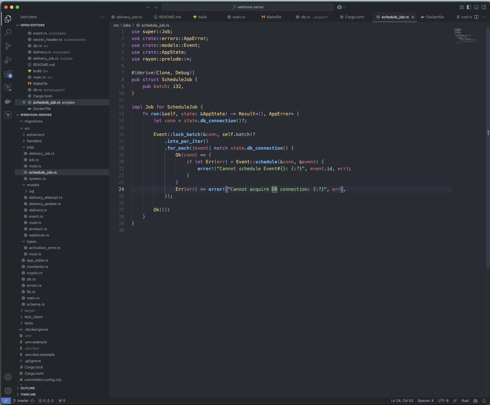

+++
title = "Hubstaff - From Rails to Rust"
date = 2025-01-21
template = "article.html"
draft = false
[extra]
hero = "hubstaff.png"
series = "Case Studies"
+++

It's 2019, and [Hubstaff](https://hubstaff.com/)'s engineering team is sketching out plans for their new webhook system.
The new system needs to handle millions of events and work reliably at scale.
The safe choice would be to stick with their trusty Ruby on Rails stack – after all, it had served them well so far.
But that's not the path they chose.


Hubstaff helps distributed teams track time and manage their workforce. With 500,000+ active users across 112,000+ businesses, they needed their systems to scale reliably. As a remote-first company with 90 employees themselves, they understand the importance of robust, efficient software.


## Why Hubstaff Chose Rust When Rails Was Working Fine

When I sat down with Alex, Hubstaff's CTO, he painted a vivid picture of that moment. "Our entire application stack was powered by Ruby and JavaScript," he told me. "It worked, but we knew we needed something different for this new challenge."

The team stood at a crossroads. Go, with its simplicity and familiar patterns, felt like as a safe harbor.
But there was another path – one less traveled at the time:

> "We chose to proceed with Rust," Alex recalled. "Not just because it was efficient, but because it would push us to **think in fundamentally different ways**."

## How They Convinced the Team to Try Rust

Of course, there were moments of doubt.
Adding a new language to an already complex tech stack isn't a decision teams make lightly.

"There was skepticism," Artur Jakubiec, their Desktop Tech Lead, admitted. "Not about Rust itself, but about balancing our ecosystem."

But instead of letting doubt win, Artur took action. He spent weeks building [prototypes](/blog/prototyping), gathering data, and crafting a vision of what could be. It wasn't just about convincing management – it was about showing his team a glimpse of the future they could build together.

## A Webhook System That Scaled 10x

Fast forward to today.

The webhook system is processing ten times the initial load without breaking a sweat.
Of course, the team had to make adjustments along the way, but not to their Rust code, but to their SQL queries.

> "Since its launch, we've had to optimize SQL queries multiple times to keep up with demand," Alex shared, "but we've never faced any issues with the app's memory or CPU consumption. Not once."

<figure>
  
  <figcaption>A screenshot of Hubstaff's Webhook System</figcaption>
</figure>

Over time, more and more microservices got ported to Rust.

What helped was that the team had prior experience with lower-level concepts from C++.

> I believe the team's strong C++ background made the transition to Rust almost seamless. Many of Rust’s more challenging low-level concepts have parallels in C++, such as the memory model, RAII, move semantics, pointers, references, and even aspects of ADTs (achievable in C++ with tools like `std::optional` and `std::variant`). Similarly, Rust’s ownership system and concepts like lifetimes echo patterns familiar to anyone experienced in managing resources in C++.

## When to Use Rust And When to Stick With Rails

Instead of going all-in on Rust, Hubstaff found wisdom in balance.

Here's their reasoning:

1. High-Load Operations → Rust
2. Lightweight APIs and Dashboard Backend → Rails
3. Communication through standardized APIs and message queues

But what about Rust's infamous learning curve?

"Once developers are up to speed," Alex noted, "there's no noticeable slowdown in development. The Rust ecosystem has matured to the point where we're not constantly reinventing the wheel."

...and Artur added:

"So far, onboarding hasn’t been an issue at all. Honestly, there’s no secret sauce—it’s -- all about getting new team members working on the code as soon as possible."

## From Server to Desktop

Once the team gained enough confidence in Rust, they started rewriting their desktop application.
The easy path would have been Electron – the tried-and-true choice for web companies.
But Hubstaff had learned to trust that Rust would get the job done.

> "**Electron simply wasn't an option,**" Artur stated firmly. "We needed something lightweight, something that could bridge our future with our past. That's why we chose [Tauri](https://tauri.app/)."

> "It’s still early days for this approach, as we’re currently in the process of migrating our desktop app. However, we’re already envisioning some compelling synergies emerging from this setup. For example, many of the APIs used by our desktop and mobile apps are high-load systems, and following our strategy, they’re slated to be migrated to Rust soon. With the desktop team already familiarizing themselves with Rust during this transition, they’ll be better equipped to make contributions or changes to these APIs, which will reduce reliance on the server team." added Alex.

## Was It All Flowers And Sunshine?

Of course not. Artur mentioned:

> One thing I really wish existed when we started was better C++-Rust integration, not just at the language level but especially in the **build systems**. Oddly enough, integrating Rust into CMake/C++ workflows (using tools like [Corrosion](https://github.com/corrosion-rs/corrosion)) was relatively straightforward, but going the other way — **embedding C++ into Rust—proved much more challenging**. A more seamless and standardized approach for bidirectional integration would have saved us a lot of time and effort.

Alex adds:

> Of course, challenges remain, particularly in ensuring **seamless knowledge transfer and establishing best practices across teams**. But the potential for closer collaboration and a unified stack makes this an exciting step forward.

## Was It All Worth It?

> The transition to Rust was surprisingly smooth. I think a big reason for that was the collective frustration with our existing C++ codebase. Rust felt like a breath of fresh air, and the idea naturally resonated with the team. (Artur)

Let's look at the facts:

- Desktop developers now contribute to backend services, breaking down old silos.
- Five years without a single memory-related issue in production.
- Their C++ developers are on-board with Rust's safety guarantees as well .
- Infrastructure costs stayed flat despite 10x growth.

But perhaps the biggest change is **confidence in the codebase**:

> "With C++, there's a constant sense of paranoia about every line you write," Artur revealed. "**Rust transformed that fear into confidence**. It changed not just how we code, but how we feel about coding." [...] "it’s like stepping into a world where you can trust your tools"

On top of that, Alex added that using Rust across the stack has also opened up new collaboration opportunities across the teams.

<figure>
  
  <figcaption>Parts of the Hubstaff Team at their 2022 team offsite in Punta Cana</figcaption>
</figure>

## Where They Are Today

Today, Hubstaff's journey continues.
Their Rust footprint grows steadily: 4,200 lines of mission-critical server code, 2,000 lines in their desktop app, and a team of passionate Rustaceans that's still growing.

But when I asked Alex and Artur what they're most proud of, it wasn't the technical achievements that topped their list. It was how they got there: thoughtfully, methodically, and together as a team.

- **2019**: First steps into Rust - Webhook system prototype. 🌱
- **2020**: Webhook system processes first million events. 🌿
- **2024**: Started desktop app migration to Rust/Tauri. 🪴
- **2025**: Expanding Rust across their entire stack. Public release of new Rust-powered desktop app. 🌳

## Key Lessons for Teams Considering Rust

What would Alex and Artur recommend to teams standing at their own crossroads?  
Here's what they shared:

1. Start with a clear mission, not just a technical preference
2. Invest in your team's journey through learning and support
3. Make data-driven decisions
4. Build bridges between the old and the new
5. Look for opportunities for collaboration and knowledge sharing

## Thanks

Special thanks to [Alex Yarotsky](https://www.linkedin.com/in/ayarotsky/), CTO
and [Artur Jakubiec](https://www.linkedin.com/in/artur-jakubiec/), Technical Lead at Hubstaff for sharing their journey with Rust.

Want to learn more about Hubstaff? [Check out their website](https://hubstaff.com/).
