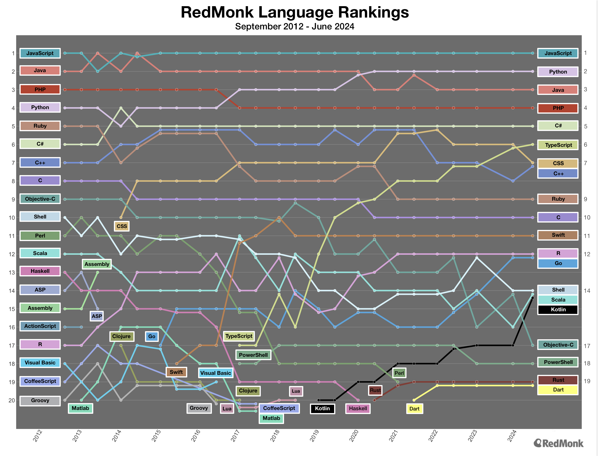

+++
title = "Migrating from Scala to Rust"
date = 2024-12-09
template = "article.html"
draft = false
[extra]
series = "Migration Guides"
resources = [
    "[Rust: A Scala Engineer's Perspective by Lloyd Chan](https://beachape.com/blog/2017/05/24/rust-from-scala/)",
    "[Scala Resurrection by John A De Goes](https://degoes.net/articles/scala-resurrection)",
]
+++

There's been increasing [discussion about companies moving from Scala to Rust](https://degoes.net/articles/scala-resurrection)). The Scala ecosystem faces, and while solutions are proposed, many organizations are evaluating Rust as an alternative path forward.

Even former Scala advocates like Twitter or LinkedIn have [expressed concerns about their choice of Scala](https://news.ycombinator.com/item?id=13478361): 

> "We've recently made the decision to minimize our dependence on Scala in our next generation front end infrastructure which is rolling out this year." — LinkedIn's SVP of Eng Kevin Scott

People are looking for guidance on how to navigate this transition, which is why I've written this guide for organizations considering migrating from Scala or Clojure to Rust. We will take a cold hard look at the benefits and challenges of moving to Rust, and provide practical advice for making the switch.

## Why Consider Rust?

### Industry Adoption and Momentum

The most striking difference between Rust and JVM functional languages is the **pace of adoption**. Rust has seen extraordinary growth, with over 2.8 million developers using it professionally. [Major tech companies including Microsoft, Google, and Meta have embraced Rust](/blog/why-rust), particularly for performance-critical systems. This widespread adoption has created a virtuous cycle: the larger talent pool makes hiring easier, which encourages more companies to adopt Rust, which in turn drives more developers to learn the language. The ecosystem grows more robust by the day, with new tools and libraries constantly emerging to solve real-world problems.

In comparison, Scala and Clojure have seen slower growth and more limited industry adoption. While both languages have passionate communities and are well-suited to certain domains like data processing and Spark applications, they lack the broad appeal and momentum that Rust has achieved. This difference in adoption rates can affect your organization's ability to hire and retain talent, which is a risk factor for any company.

In fairness, the RedMonk rankings show that Scala has maintained a consistent position in the top 20 languages, while Rust has just recently broken into the top 20.

### Stability and Backward Compatibility

One of Rust's strongest selling points is its commitment to stability. Since its 1.0 release in 2015, Rust has maintained backward compatibility across [**more than 105 releases**](https://releases.rs/). 

Releases are cut every six weeks and roughly every 3 years a new edition is released, which allows the language to evolve while preserving compatibility with existing code. This stability is a significant advantage for organizations that need to maintain long-lived codebases or have strict requirements around backward compatibility.

**Rust's stability is a fundamental business advantage.**

Code written in Rust 1.0 continues to compile and run today, protecting your investment in both code and developer training. Documentation and learning resources remain relevant for years, significantly reducing the ongoing cost of maintaining expertise in your organization. This stands in stark contrast to the breaking changes that have characterized many language ecosystems, including Scala's transition from 2.x to 3.x.

### Superior Tooling Experience

Rust's tooling ecosystem, centered around Cargo, provides a remarkably smooth developer experience. Cargo unifies building, testing, and dependency management into a single, coherent tool that just works. The compiler's error messages are legendary for their clarity and helpfulness, often telling developers exactly how to fix issues. IDE support through rust-analyzer and RustRover is rock-solid, providing a reliable development experience that boosts productivity. This tooling excellence isn't an accident — it's the result of deliberate design decisions and years of community investment.

In Scala, build tools like sbt and dependency management tools like Maven can be complex and error-prone. IDE support, while improving, can be inconsistent across different editors and might not support all language features. [The overall developer experience in Rust is more polished and consistent.](https://users.scala-lang.org/t/what-are-some-of-the-advantages-of-using-scala-over-rust-c-and-other-native-languages/2556/10)

### Performance with Safety

While Scala and Clojure offer good performance for JVM languages, Rust provides performance comparable to C/C++ while guaranteeing memory safety at compile time. This combination is particularly valuable in an era of cloud computing, where every millisecond of latency and every megabyte of memory directly affects operating costs. However, Scala developers should note that writing truly immutable code can actually be more challenging in Rust than in Scala.

Rust's predictable resource usage and lack of garbage collection pauses make it ideal for systems that require consistent performance. Organizations often find that moving performance-critical components to [Rust can significantly reduce their infrastructure costs](https://corrode.dev/blog/why-rust/#cost-savings).

## Making the Business Case

The business case for Rust extends beyond technical merits.

- **Infrastructure costs often decrease** due to better performance and resource utilization.
- **Maintenance becomes more predictable** thanks to superior tooling and compile-time guarantees.
- **The risk of production issues decreases** due to Rust's strong type system and ownership model catching many common bugs at compile time.

Scala and Clojure developers typically transition well to Rust because the languages share many fundamental concepts. The emphasis on strong type systems, functional programming patterns, and correctness creates a natural bridge. While Rust's ownership system presents a learning curve, developers coming from functional programming backgrounds often find they already think in ways that align well with Rust's model.

## Migration Strategy

A successful migration to Rust typically starts small and grows organically. New microservices or standalone components are excellent candidates for initial Rust projects. Performance-critical systems that would benefit from lower latency or reduced resource usage are another natural starting point. Command-line tools and utilities offer low-risk opportunities to build team expertise.

The key to successful migration is maintaining optionality. Rust's excellent interop capabilities mean you can gradually introduce it alongside existing JVM services. This allows teams to learn and validate Rust's benefits in your specific context without committing to a wholesale rewrite.

## Addressing Challenges

The transition to Rust does present challenges. The ownership and borrowing concepts take time to master, though the compiler's excellent error messages help guide developers through the learning process. The ecosystem, while growing rapidly, may not yet have direct equivalents for all specialized JVM libraries. Some internal tooling may need to be rebuilt or adapted.

However, these challenges should be viewed in context. The learning curve, while steep, is finite — developers
with a strong functional programming background typically become productive in Rust within a few months. The ecosystem limitations often push teams toward simpler, more maintainable solutions. And the need to rebuild tools can be an opportunity to improve and modernize development workflows.

## Conclusion

The decision to migrate from Scala/Clojure to Rust should be driven by specific business needs rather than following trends. 

**Consider Rust when performance and resource efficiency are crucial, when you need predictable latency and memory usage, when your team is ready for a new technical challenge, or when long-term stability and maintenance are priorities.**

The transition requires investment, but Rust's growing ecosystem, excellent tooling, and strong industry adoption make it an increasingly attractive option for organizations looking to move beyond the JVM while maintaining the benefits of strong typing and functional programming paradigms.



I can help you evaluate your current systems, design a migration strategy, and
help you make an informed decision about moving to Rust. I offer consulting
services to help you assess the technical and business implications of a
migration, and I can train your developers to succeed with Rust.
[Get in touch for a free consultation](/about).

