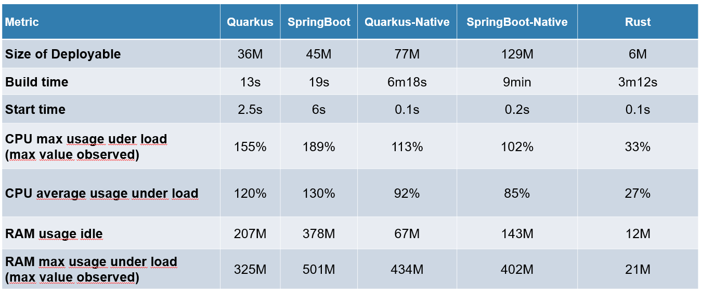

+++
title = "Migrating from Java to Rust"
date = 2024-12-09
template = "article.html"
draft = false
[extra]
series = "Guides"
resources = [
  "[Comparing Rust and Java - Andre Bogus](https://llogiq.github.io/2016/02/28/java-rust.html)",
]
+++



This article is aimed at technical product managers and CTOs who are considering migrating a production Java application — or part of it — to Rust.
I will give an **honest overview** of the challenges and benefits of such a migration, as well as practical tips to make it successful
based on years of experience and successful transitions.



Java is an amazing language.
It's a true workhorse, powering some of the world’s most critical systems.
Even so, large organizations are increasingly looking to Rust as a way to improve reliability, resource usage, and reduce costs.
Decision makers need to weigh the benefits and risks of migrating to Rust, and it’s not always an easy choice.

In this article, you'll learn:
- How to plan and execute a successful Java-to-Rust migration
- Common pitfalls to avoid during the transition
- Practical strategies for managing mixed Java/Rust codebases
- How to measure success and maintain productivity during migration

By the end, you’ll have a clear idea if Rust is the right choice for your organization and if so, how to make the transition as smooth as possible.

## Differences Between Java and Rust 

Before diving into migration tips, let's look at key differences between Java and Rust:

| Aspect             | Java                                                   | Rust                                              |
| ------------------ | ------------------------------------------------------ | ------------------------------------------------- |
| Memory Management  | Garbage collector; possible memory leaks and GC pauses | Borrow checker at compile time; no GC pauses      |
| Performance        | JVM bytecode, requires runtime                         | Native machine code via LLVM                      |
| Default Mutability | Mutable by default                                     | Immutable by default, requires `mut`              |
| Null Safety        | Allows null pointers                                   | No null pointers, uses `Option<T>`                |
| Code Organization  | Classes with inheritance                               | Structs with traits (composition)                 |
| Package Management | Gradle/Maven                                           | Cargo (integrated build + deps)                   |
| Concurrency        | Thread-based with synchronized blocks                  | Built-in safety via ownership system; async/await |
| Error Handling     | Checked exceptions                                     | Result and Option types                           |
| Compilation Speed  | Fast to medium                                         | Slow                                              |
| Learning Curve     | Moderate                                               | Steep                                             |
| Deployment         | Requires JVM runtime                                   | Small, self-contained binaries                    |

These differences highlight why organizations might consider migrating to Rust, particularly for performance-critical or resource-constrained applications. However, migration isn't just about technical differences - it requires careful planning and execution. Let's look at how to make this transition successful.

## Tip 1: Flatten The Learning Curve 

Migrating to a new language is always tough at first, and Rust is no exception.
It has a famously steep learning curve and requires a different mindset from Java.
Plan 4-6 months for your engineers to get comfortable with Rust, and expect a few bumps along the way.

That said, there’s plenty of material to help your team get up to speed.
Resources like [Rustlings](https://github.com/rust-lang/rustlings), [Rust By Example](https://doc.rust-lang.org/rust-by-example/),
[100 Exercises To Learn Rust](https://github.com/mainmatter/100-exercises-to-learn-rust), and 
[Rustfinity](https://www.rustfinity.com/) are all great for self-learning. 

If you’re looking for a more structured approach, [consider hiring a Rust consultant or trainer](/about).
Bringing in experts can make the transition even faster and smoother.
Your team will not only learn Rust but also feel more confident working with it in production.

## Tip 2: Have A Clear Migration Plan 

Migrating to Rust comes with some risks, but careful planning will minimize them. Here’s how to ensure success:

1. **Start Small**  
Pick a small, non-critical part of your application for the first Rust implementation. This lets your team experiment and build confidence without affecting core systems. Expand gradually as you see results.

2. **Prepare Your Team**  
Don’t just decide this for your developers—decide together. Get the team ready with training or external expertise, and focus on integration with your existing Java system. Rust will likely need new dependencies, so research the ecosystem and be ready to roll up your sleeves to contribute if necessary.
Take a look at [blessed.rs](https://blessed.rs), [lib.rs](https://lib.rs/std), and [awesome-rust](https://github.com/rust-unofficial/awesome-rust) for a curated list of libraries. 

3. **Evaluate Dependencies Upfront**  
Consider potential constraints like proprietary tools or databases that may complicate integration with Rust. Make sure the libraries you need are available, or be prepared to write your own.

4. **Have a Plan B**  
Rust migration doesn’t need to be all-or-nothing. Keep Java components running while testing and migrating. If issues arise, you can scale back or swap components as needed.

5. **Set Clear KPIs**  
Establish your own definition of success—don’t just follow industry benchmarks. Whether it’s performance, resource savings, or developer experience, make sure you know what you want from Rust and measure it.

6. **Training Pays Off**  
Even if you eventually decide against Rust, the training will improve your team's programming skills. It’s an investment that pays dividends in the long run.

7. **Monitor and Test**  
Use monitoring and automated tests throughout the migration. Rust’s safety guarantees help, but you still need to test thoroughly and catch any issues early.

## Tip 3: Choose The Right Migration Strategy 

Initially, you will likely be dealing with a mix of Java and Rust.
Where should you start?
**Look at the boundaries in your application—network layers, APIs, or microservices.**
These natural seams are perfect places to migrate first.

For Java-to-Rust migration, you have a few options:

1. Set up inter-process communication (IPC) via [gRPC](https://grpc.io/) between Java and Rust services. 
2. Use a message broker like [Kafka](https://kafka.apache.org/) or [NATS](https://nats.io/) in between the two languages.
3. Use a REST API as the communication layer.
4. Use [JNI](https://docs.rs/jni/latest/jni/) to call Rust functions from Java.

Each approach has its pros and cons, so choose the one that fits your use case best.
How do you decide?
This is something you should discuss with your team and possibly a Rust consultant.
They can help you weigh the trade-offs and make the right choice.

If you'd like to get a primer on Java-to-Rust interop, check out [this talk](https://www.youtube.com/watch?v=fYaaBoKbDQs) 
from Rust Nation UK 2024 by Konstantin Grechishchev.

## Tip 4: Partial Migration Might Be Enough

Big organizations often have large, complex Java codebases.
A full rewrite is not feasible and can be risky.

**Consider rewriting the most CPU- or memory-hungry parts of your application in Rust while leaving the rest untouched.**

Perhaps you find that you only need to migrate a tiny portion, say 10-20%, to Rust for a significant performance boost.
In that case, you can keep the rest of the application in Java and gradually migrate more parts over time if you see benefits.
This incremental approach ensures that your team can slowly adapt to Rust and share some quick wins along the way, which is great for morale.

A good way to test the waters is with isolated components — CLI tools or monitoring sidecars. These smaller parts let your team gain experience with Rust without affecting critical system functions.

## Tip 5: Evaluate The Ecosystem 

When migrating to a different language, the new tooling is just as important as the language itself.
However, it’s often overlooked in the decision-making process.

Rust's tooling is excellent, and among the most loved advantages of the language.
The tooling is best in class, mature and easy to adopt. Here's how it stacks up:

- **Package Management**: Rust’s package manager, cargo, simplifies dependencies and builds. No more convoluted Gradle configurations. 
- **IDEs**: Rust's integration with VS Code and IntelliJ (via rust-analyzer) is seamless, making it easy for your developers to dive right in.
- **CI/CD**: GitHub Actions and other CI tools work beautifully with Rust, with dedicated actions for testing and deployment.
- **Debugging**: Debugging tools work out of the box, and IDE integrations are robust by now. 
- **Linting and Formatting**: [Rustfmt](https://rust-lang.github.io/rust-clippy/) and [clippy](https://rust-lang.github.io/rust-clippy/stable/index.html) ensure consistent code style and catch common errors early. They actively help your team write better code.

However, also consider the constraints and risks your project might face—proprietary tools, unusual databases, or special dependencies.
Do the research upfront to avoid surprises.
And if you need new libraries, be prepared to get your hands dirty and write your own. 

For example, if you’re building a web application, Rust has several frameworks to choose from, with the most popular being [axum](https://github.com/tokio-rs/axum), but none as mature as Spring Boot. Projects like [Pavex](https://github.com/LukeMathWalker/pavex) or [Loco](https://loco.rs/) could fill this gap, but they’re still in early stages.

## Tip 6: Simplify Your Deployment Pipeline

Rust shines when it comes to cross-platform builds. Unlike Java, where you often need to install a runtime (like the JVM) on every machine, Rust’s binaries are small, self-contained, and ready to run anywhere.

Rust compiles directly to machine code, which means you don’t need to worry about dependencies that are typically required by dynamic runtimes. The only consideration might be system libraries (like OpenSSL), but this is manageable with established solutions. [^1]

[^1]: For example, you can [vendor OpenSSL to build it statically](https://docs.rs/openssl/latest/openssl/#vendored).

In containerized environments, Docker works just as well with Rust as with any other language, and it’s easier to scale because of Rust’s low overhead. Whether you’re running on AWS, Cloud Run, or any other platform, the experience is reliable and consistent.

Rust supports a [wide variety of platforms](https://doc.rust-lang.org/nightly/rustc/platform-support.html), including ARM and x64, and can be used seamlessly across development machines, servers, and the cloud. 

## Tip 7: Don't Focus On Raw Performance Alone

[Yes, Rust has awesome runtime performance.](https://www.sergetoro.com/microbench-go-java-rust-js-python/) But you shouldn’t focus on raw numbers alone.
Thanks to technologies like [GraalVM](https://www.graalvm.org/), Java can be
very fast as well, especially for long-running applications.

The image above shows a comparison between Rust, Quarkus-Native, and Spring-Native.
In terms of raw performance, Rust is the clear winner.
Rust uses 12 MB RAM and less than a third of the CPU power of both Quarkus-Native and Spring-Native. 

When you migrate to Rust, also consider the secondary effects of improved performance: 

- **Lower Latency**: Rust doesn’t have the pauses or unpredictability that garbage collection introduces in Java. This makes it easier to predict system performance, especially during peak load.
- **Higher Throughput**: Rust’s memory model and zero-cost abstractions make it ideal for handling high-volume, high-concurrency applications. Expect performance boosts, often between 2x and 3x, depending on the workload.
- **Lower Resource Usage**: After migrating to Rust, you’ll likely need fewer CPUs or instances to handle the same load. This means less infrastructure to manage and lower costs in production.
- **Fast Scalability**: Rust’s low overhead means you can scale up or down quickly. Whether you’re running on Kubernetes or a traditional VM, Rust’s efficiency makes it easier to manage your infrastructure. In contrast, this is a common pain point for Java applications in the cloud. It can take 30 seconds or more until a new JVM instance [JIT-compiles](https://www.ibm.com/docs/en/sdk-java-technology/8?topic=reference-jit-compiler) your code, which can lead to cold start issues.

Based on my experience helping teams migrate to Rust, here are some ballpark improvements you might see:

- **Memory Usage**: For data-heavy applications, expect to see 30-50% reduction in heap size for most services.
 This is a very conservative estimate. Depending on your workload, you might see even more significant improvements.

- **Startup Time**: While Java services often need 20-30 seconds to warm up in production, equivalent Rust services typically start in under a second. This makes a big difference for scaling containerized deployments.

- **Latency**: The exact numbers vary widely, but you'll often see P95 latency improve by 40-60%. The biggest win is usually in tail latencies (P99.9) due to the lack of GC pauses.

- **Throughput**: Again, this depends heavily on your workload, but teams I've worked with typically see:
  - CPU-bound tasks: 2-3x improvement
  - I/O-bound tasks with high concurrency: 1.5-2x improvement
  - Most importantly, throughput becomes more consistent and predictable

- **Resource Costs**: Several teams have managed to cut their cloud costs by 40-60% after migration, mainly due to lower CPU and memory requirements.

These are rough numbers from my consulting experience, and your results may vary significantly depending on your specific use case. The key takeaway isn't the exact numbers, but rather that teams consistently see meaningful improvements across different metrics.

Rust helps you get more done with less, making it easier to scale and manage your infrastructure.

## Tip 8: Fearless Concurrency 

Rust’s concurrency model is a major advantage.
Traditional Java applications tend to be thread-heavy, and while this works on modern Linux systems, Rust offers more flexibility.
On top of that, concurrency in Java can be tricky to get right and is therefore often avoided.

Rust gives you both thread-based concurrency and async execution. With libraries like Tokio, you can use async/await without worrying about the underlying mechanics. It scales incredibly well, often in ways that Java simply can’t match due to its reliance on threads.

What’s powerful about Rust’s concurrency is how it's baked into the language itself. It’s not something your team has to think about too much. The libraries handle most of the heavy lifting, and once you structure your code properly, Rust's runtime handles the rest—efficiently and safely.

Rust’s memory management ensures that concurrency is safe, so you won’t need to worry about thread synchronization issues like you would in Java.

## Tip 9: Reliable Production Environments 

One of Rust’s underrated strengths is developer ergonomics.

With Rust’s strict compiler checks, a lot of potential bugs are caught during development, meaning fewer bugs in production. This leads to fewer code reviews and a smoother development process overall. You can move faster with more confidence.

Over time, this leads to **more reliable code in production**. Rust’s emphasis on memory safety and strict typing means that, once your system is built, you’re less likely to face random crashes or bugs.
This saves on-call costs and reduces the risk of downtime.

There are no garbage collector pauses to worry about, and the code has a predictable performance profile. 
You’ll have a “boring” production environment in the best way possible — things will work consistently and predictably.

Rust is committed to stability. While some core libraries haven’t reached a stable 1.0 version yet, the 0.x versions are highly reliable, with breaking changes becoming less frequent over time. When Rust releases new versions, they follow **semantic versioning**, so updates are usually predictable and don’t introduce surprises.

If you’re worried about future-proofing your application, Rust’s ecosystem is built with long-term support in mind. If you do encounter missing functionality, you’ll often need to contribute back to the community—this is part of the Rust philosophy.

Training your team in Rust isn’t just about the immediate migration. Even if you eventually decide to stick with Java, Rust's focus on good practices will make your developers better overall.

## Tip 10: Make The Decision Together

Adopting Rust is a big commitment.
Don’t make the decision in a vacuum — involve your team in the process.
They’re the ones who will be working with Rust day in and day out, so their input is crucial.

If you’re considering a migration, start by discussing the benefits and challenges of Rust.
What are your hopes for Rust? What are the alternatives considered? What are your key KPIs for success?
What is the skill level of your team, and how can you support them in learning Rust?
It helps to put your thoughts into writing and share them with the team.

On that note, hiring Rust developers can be challenging. It's a relatively new language, and most Rust developers 
don't have any production experience yet. Instead, consider upskilling your existing Java developers.
They already know your systems and can learn Rust with the right training and support.

## Conclusion

At the end of the day, Rust’s investment pays off. Even if you don’t go full Rust, the knowledge gained will make your developers better programmers.

If you'd like to discuss this further, feel free to book a call with me.
I offer consulting services to help you make the right decisions for your project -- even if that means sticking with Java.



Is your company considering to migrate from Java to Rust? 
I offer consulting services to get you up to speed with your Rust projects, from training your team to code reviews and architecture consulting. 
[Get in touch for a free consultation](/about).

