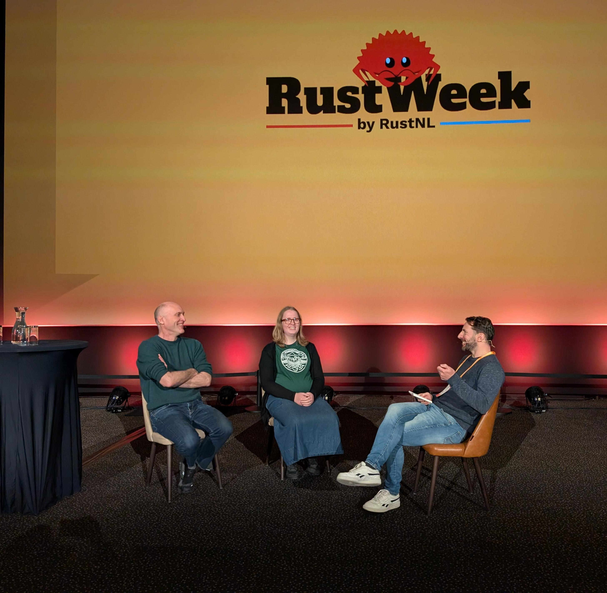

+++
title = "Rust for Linux Live"
date = 2026-05-21
template = "episode.html"
draft = false
aliases = ["/p/s06e04"]
[extra]
guest = "Alice Ryhl and Greg Kroah-Hartman"
role = "Linux Kernel Maintainers"
season = "06"
episode = "04"
series = "Podcast"
+++

Hot off the press: this episode is a live recording from [Rust Week](https://2026.rustweek.org/) in Utrecht, just two days ago. On stage with me are two people who hardly need an introduction in the Linux world: [Greg Kroah-Hartman](http://www.kroah.com/linux/), Linux Foundation Fellow, stable kernel maintainer and an embassador for the kernel, and [Alice Ryhl](https://www.ryhl.io/), core maintainer of [Tokio](https://tokio.rs/) and one of the driving forces behind Rust for Linux at Google.

I have to admit a bit of personal history here: I first wrote about Greg more than 20 years ago for the German online newspaper [Pro-Linux](https://www.pro-linux.de/). Getting to sit down with him, and with Alice, in front of a live audience to talk about how Rust is reshaping the most important piece of infrastructure on the planet, was a genuine career highlight.

We get into the big questions: Why does Alice believe that interop, not rewrites, is how Rust wins inside Linux? How do you carefully weave in Rust while maintaining a 35-million-line C codebase? And what does it actually feel like, day to day, to write kernel code in Rust?

> "Rust is gonna save the Linux kernel." &mdash; Greg Kroah-Hartman

{{ codecrafters() }}

## Show Notes

### About Rust for Linux

[Rust for Linux](https://rust-for-linux.com/) is the project bringing the Rust programming language into the Linux kernel. After years of patches, proposals, and heated mailing list threads, Rust is now an [officially supported](https://www.phoronix.com/news/Rust-To-Stay-Linux-Kernel) language inside the kernel tree, no longer an experiment. The work spans everything from the build system and the `kernel` crate to drivers, abstractions over core subsystems and brand-new pieces of infrastructure written entirely in Rust.

### About Greg Kroah-Hartman

Greg Kroah-Hartman is a Linux Foundation Fellow, the maintainer of the stable Linux kernel branch, and the maintainer of, among many other things, the [USB subsystem](https://docs.kernel.org/process/maintainers.html#usb-subsystem), the driver core, sysfs, debugfs, kobject, TTY layer and staging tree. He has been a central figure in Linux for over two decades, has written several books about kernel development, and is convinced Rust belongs in the kernel.

### About Alice Ryhl

Alice Ryhl is a software engineer at Google working on Android and Rust for Linux, and a core maintainer of [Tokio](https://tokio.rs/), the asynchronous runtime that over 50% of all crates on crates.io directly depends on. Inside the kernel she works on Binder, on async abstractions, and on the bindings that allow Rust drivers to talk safely to the rest of the kernel.

### About Rust Week

Rust Week is an annual conference organized by RustNL. The 2026 edition took place in Utrecht, the Netherlands, from May 18 to May 23. It features talks, workshops, the Rust All Hands, and expert sessions on a wide variety of topics revolving around Rust. This episode was recorded live on stage during the conference. [Thanks to the Rust Week team who made this recording possible!](https://2026.rustweek.org/about/)
Learn more about Rust Week on their [website](https://rustweek.org/).

### Links From The Episode

- [Linux Docs: USB Subsystem Maintainer](https://docs.kernel.org/process/maintainers.html?highlight=Greg%20Kroah-Hartman#usb-subsystem) - Greg's first contribution led to him maintaining the USB subsystem, and much more
- [The Register: Happy birthday, Linux: From a bedroom project to billions of devices in 30 years](https://www.theregister.com/software/2021/08/25/happy-birthday-linux-from-a-bedroom-project-to-billions-of-devices-in-30-years/1295876) - An interview with Greg celebrating the 30 year anniversary of the Linux kernel
- [Tokio](https://tokio.rs/) - Another big project maintained by Alice
- [RustWeek: Untrusted data in Linux — How Rust is going to save us](https://2026.rustweek.org/talks/greg) - Greg's talk at RustWeek; Rust is gonna save Linux?!
- [Rust in Production: Rust for Linux](https://corrode.dev/podcast/s05e06-rust4linux/) - With Danilo, one of the co-maintainers with Greg on the Driver Core subsystem and others
- [Phoronix: New Linux Patch Confirms: Rust Experiment Is Done, Rust Is Here To Stay](https://www.phoronix.com/news/Rust-To-Stay-Linux-Kernel) - The official end of experimental Rust
- [Linux Plumbers Conference](https://lpc.events/) - A big conference for all levels of kernel developers
- [std::boxed](https://doc.rust-lang.org/std/boxed/index.html) - The most basic kind of pointer in Rust
- [kernel::list::List](https://rust.docs.kernel.org/kernel/list/struct.List.html) - Linux' linked list Rust binding
- [core lib](https://doc.rust-lang.org/core/) - The most fundamental parts of the Rust libraries
- [alloc lib](https://doc.rust-lang.org/alloc/) - All things in the standard library that only require an allocator, not used by the kernel anymore
- [std lib](https://doc.rust-lang.org/std/index.html) - The thing most people think of as the standard library, containing things like file access which requires running on a kernel
- [QR code generator for kernel crashes](https://git.kernel.org/pub/scm/linux/kernel/git/torvalds/linux.git/tree/drivers/gpu/drm/drm_panic_qr.rs) - First Rust code added to the kernel
- [Linux Rust Architecture support](https://origin.kernel.org/doc/html/latest/rust/arch-support.html) - Missing some big platforms like S390 (IBM Mainframes) and MIPS (a lot of consumer networking hardware)
- [sched_ext Schedulers written in Rust](https://sched-ext.com/docs/scheds/rust) - sched_lavd shows promise for video game performance, and servers?
- [Aya](https://aya-rs.dev/) - Build eBPF programs with nothing more than Rust and the Linux kernel
- [RustWeek: Completion-based IO](https://2026.rustweek.org/talks/alice) - Alice's talk at RustWeek about IO
- [WE DO NOT BREAK USERSPACE](https://linuxreviews.org/WE_DO_NOT_BREAK_USERSPACE) - An e-mail from Linus explaining the mantra in typical Linus fashion
- [Linux clippy config](https://git.kernel.org/pub/scm/linux/kernel/git/torvalds/linux.git/tree/.clippy.toml) - It's not pedantic!
- [Rust code style](https://origin.kernel.org/doc/html/latest/rust/coding-guidelines.html) - Coding guidelines of the Linux project for Rust code
- [rustfmt config](https://git.kernel.org/pub/scm/linux/kernel/git/torvalds/linux.git/tree/.rustfmt.toml) - Almost vanilla with some ideas for the future
- [clang-format config](https://git.kernel.org/pub/scm/linux/kernel/git/torvalds/linux.git/tree/.clang-format#n805) - Added in 2018 and tabs won!
- [Coccinelle](https://www.kernel.org/doc/html/latest/dev-tools/coccinelle.html) - Semantic code transformation and the reason Greg lives in Europe
- [klint](https://github.com/Rust-for-Linux/klint) - Custom kernel specific lints, basically a repository of clippy lints for kernel code

### Official Links

- [Rust for Linux](https://rust-for-linux.com/)
- [Greg Kroah-Hartman on Wikipedia](https://en.wikipedia.org/wiki/Greg_Kroah-Hartman)
- [Greg Kroah-Hartman's homepage (momentarily offline)](https://web.archive.org/web/20260226054256/http://www.kroah.com/linux/)
- [Greg Kroah-Hartman on Mastodon](https://social.kernel.org/gregkh)
- [Alice Ryhl's website](https://www.ryhl.io/)
- [Alice Ryhl on GitHub](https://github.com/Darksonn)
